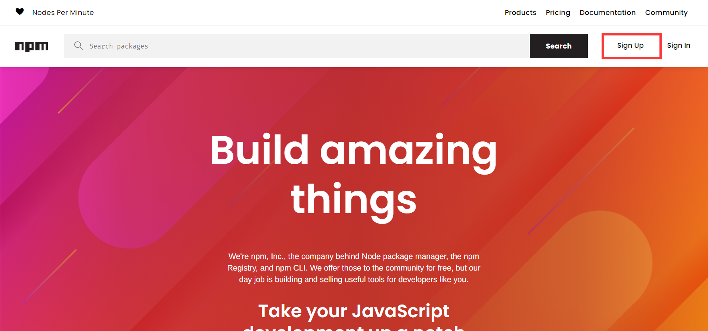

前面已经可以写一个sdoc的包了，并且我们通过npm publish将其发布到了npm仓库，这一节，来深入了解一下npm的发布与管理。

<!-- more -->

## <font size=3>一、npm 简介</font>

### <font size=3>1. 什么是npm？</font>

前面其实已经了解过了，但是这里再来回顾一下，直接看官网：[About npm | npm Docs](https://docs.npmjs.com/about-npm)

`npm is the world's largest software registry. Open source developers from every continent use npm to share and borrow packages, and many organizations use npm to manage private development as well.`

官网是这样介绍`npm`的，翻译过来就是，`npm`是世界上最大的软件注册中心。来自各个大洲的开源开发者都使用`npm`来共享和借用包，许多组织也使用`npm`来管理私人开发。简单来说，`npm`就是`javascript`的包管理工具，类似`python`的`pip`。`npm`是和`Node.js`一起发布的，只要安装了`Node.js`，`npm`也默认会被安装。

### <font size=3>2. 它有什么用？</font>

那么`npm`可以用用来干什么呢？还是直接看官网：[About npm | npm Docs](https://docs.npmjs.com/about-npm#use-npm-to---)

- 为你的应用调整代码包，或者合并它们。
- 下载可以立即使用的独立工具。
- 运行包而不使用<a href="https://www.npmjs.com/package/npx" target="_blank">`npx`</a>下载。
- 与任何地方的任何`npm`用户共享代码。
- 将代码限制给特定的开发人员。
- 创建组织来协调包维护、编码和开发人员。
- 使用组织形式组建虚拟团队。
- 管理多个版本的代码和代码依赖关系。
- 当底层代码更新时，可以轻松地更新应用程序。
- 发现解决同一难题的多种方法。
- 找到其他正在处理类似问题和项目的开发人员。

> Tips：
>
> - [npm 中文网](https://npm.nodejs.cn/)
> - [npm Docs](https://docs.npmjs.com/)
>
> <table>
>     <tr>
>         <td align="left">
>         npm主页
>         </td>
>         <td align="left">
>         <a href="https://www.npmjs.com/" target="_blank">https://www.npmjs.com/</a>
>         </td>
>     </tr>
>     <tr>
>         <td align="left">
>         npm说明文档(英文)
>         </td>
>         <td align="left">
>         <a href="https://docs.npmjs.com/" target="_blank">https://docs.npmjs.com/</a>
>         </td>
>     </tr>
>     <tr>
>         <td align="left">
>         npm说明文档(中文)
>         </td>
>         <td align="left">
>         <a href="https://www.npmjs.cn/" target="_blank">https://www.npmjs.cn/</a>
>         </td>
>     </tr>
>     <tr>
>         <td align="left">
>         node主页
>         </td>
>         <td align="left">
>         <a href="https://nodejs.dev/" target="_blank">https://nodejs.dev/</a>
>         </td>
>     </tr>
>     <tr>
>         <td align="left">
>         node说明文档(英文)
>         </td>
>         <td align="left">
>         <a href="https://nodejs.dev/learn" target="_blank">https://nodejs.dev/learn</a>
>         </td>
>     </tr>
>     <tr>
>         <td align="left">
>         node说明文档（中文）
>         </td>
>         <td align="left">
>         <a href="http://nodejs.cn/learn" target="_blank">http://nodejs.cn/learn</a>
>         </td>
>     </tr>
> </table>

## <font size=3>二、基本应用</font>

### <font size=3>1. 注册账号</font>

这个没什么可写的，进入官网，点击`Sign Up`按照提示进行注册即可，注册还是很简单的，注册完毕之后要记得会提示验证邮箱，这个时候注意验证就好了，不验证的话可能会有问题。



### <font size=3>2. `npm`安装与更新</font>

上边已经有所提及，`npm`和`Node.js`是一起发布的，只要安装了`Node.js`，`npm`也是自动安装了的。

- 查看`npm`和`Node.js`版本

```shell shell
node -v  # 查看node版本
npm -v   # 查看npm版本
```

- 更新`npm`版本

```shell shell
npm install npm@latest -g
```

### <font size=3>3. `npm`管理依赖包</font>

#### <font size=3>3.1 安装依赖包</font>

```shell shell
npm install packageName            # 本地安装，安装到项目目录下，不在package.json中写入依赖
npm install packageName -g         # 全局安装，安装在Node安装目录下的node_modules下
npm install packageName --save     # 安装到项目目录下，并在package.json文件的dependencies中写入依赖，简写为-S
npm install packageName --save-dev # 安装到项目目录下，并在package.json文件的devDependencies中写入依赖，简写为-D
npm install packageName@version --save # 安装指定版本
```

可以通过以上命令来对插件进行安装，还有一种就是自己按照相应的语法写一个`package.json`文件，然后在该文件所在目录执行`npm install`即可安装`package.json`文件中的所有插件。`npm 5`之后版本默认会修改`package.json`，不再需要`--save`参数，也就是说，就算现在去掉该参数，再通过`npm install`命令可以安装相应依赖包并自动修改`package.json`。更多内容可以这里：<a href="https://docs.npmjs.com/cli/v7/commands/npm-install" target="_blank">`npm-install`</a>

#### <font size=3>3.2 卸载依赖</font>

```shell shell
npm uninstall packageName      # 删除packageName模块
npm uninstall -g packageName   # 删除全局模块packageName
```

#### <font size=3>3.3 更新依赖</font>

```shell shell
# 更新一个或多个模块，加上-g参数，表示更新全局的模块
npm update packageName
npm update packageName -g

# 更新时同时修改package.json文件,不要--save也没有问题
npm update packageName --save-dev  # 在package.json文件的devDependencies中写入依赖
npm update packageName --save
```

### <font size=3>4. `npm`项目初始化</font>

由于我是针对`hexo`插件来使用`npm`，所以文件夹命名按照`hexo`的插件要求命名，`hexo`要求插件文件夹名称开头必须为 `hexo-`，如此一来` hexo`才会在启动时载入否则 `hexo`将会忽略它。

#### <font size=3>4.1 创建文件夹</font>

```shell shell
# 进入自己相应的文件夹，并创建npm项目文件夹
mkdir hexo-npm-test
# 进入创建的文件夹
cd hexo-npm-test
```

#### <font size=3>4.2 初始化文件夹</font>

```shell shell
npm init
```

使用该命令初始化时，会打开项目初始化向导，在命令行窗口会提示让自己输入各个参数，所有显示信息如下所示：

```shell shell
$ npm init
This utility will walk you through creating a package.json file.
It only covers the most common items, and tries to guess sensible defaults.

See `npm help init` for definitive documentation on these fields
and exactly what they do.

Use `npm install <pkg>` afterwards to install a package and
save it as a dependency in the package.json file.

Press ^C at any time to quit.
package name: (hexo-npm-test)
version: (1.0.0)
description:
entry point: (index.js)
test command:
git repository:
keywords:
author:
license: (ISC)
About to write to E:\MyStudy\VScode\hexofiles\hexo-npm-test\package.json:

{
  "name": "hexo-npm-test",
  "version": "1.0.0",
  "description": "",
  "main": "index.js",
  "scripts": {
    "test": "echo \"Error: no test specified\" && exit 1"
  },
  "author": "",
  "license": "ISC"
}


Is this OK? (yes) yes
```

该命令有一个参数`--yes`，若使用以下命令，则创建默认`package.json`文件，不需要自己在命令行输入，后续直接修改该文件即可。

```shell shell
npm init --yes
```

创建的文件信息如下，内容与不带参数创建的一致，看个人喜好选择要不要带参数吧。

```json json
{
  "name": "hexo-npm-test",
  "version": "1.0.0",
  "description": "",
  "main": "index.js",
  "scripts": {
    "test": "echo \"Error: no test specified\" && exit 1"
  },
  "keywords": [],
  "author": "",
  "license": "ISC"
}
```

#### <font size=3>4.3 `package.json`参数解读</font>

> Tips：
>
> - [package.json | npm 中文网](https://npm.nodejs.cn/cli/v11/configuring-npm/package-json)
> - [package.json | npm Docs](https://docs.npmjs.com/cli/v7/configuring-npm/package-json)
> - [package.json文件 -- JavaScript 标准参考教程（alpha）](https://javascript.ruanyifeng.com/nodejs/packagejson.html)

常见的一些参数如下：

<table>
    <tr>
        <td align="center">
            参数
        </td>
        <td align="center">
            说明
        </td>
    </tr>
    <tr>
        <td align="center">
            name
        </td>
        <td align="left">
            项目的名称。
        </td>
    </tr>
    <tr>
        <td align="center">
            version
        </td>
        <td align="left">
            项目的版本，默认是从V1.0.0开始，可以自己修改，遵守“大版本.次要版本.小版本”的格式。
        </td>
    </tr>
    <tr>
        <td align="center">
            scripts
        </td>
        <td align="left">
            指定了运行脚本命令的npm命令行缩写；<br>
            例如："test": "tap test/*.js" 就表示执行npm run test的时候所要执行的命令为 tap test/*.js 。
        </td>
    </tr>
    <tr>
        <td align="center">
            bin
        </td>
        <td align="left">
            指定各个内部命令对应的可执行文件的位置。<br>
        </td>
    </tr>
    <tr>
        <td align="center">
            main
        </td>
        <td align="left">
            指定加载的入口文件，require('moduleName')就会加载这个文件。这个字段的默认值是模块根目录下面的index.js。
        </td>
    </tr>
    <tr>
        <td align="center">
            author
        </td>
        <td align="left">
            项目的作者。
        </td>
    </tr>
    <tr>
        <td align="center">
            repository
        </td>
        <td align="left">
            项目代码存放地方类型，如：git或svn。
        </td>
    </tr>
    <tr>
        <td align="center">
            keywords
        </td>
        <td align="left">
            项目关键字。
        </td>
    </tr>
    <tr>
        <td align="center">
            description
        </td>
        <td align="left">
            项目简介，字符串，方便在npm search中搜索。
        </td>
    </tr>
    <tr>
        <td align="center">
            license
        </td>
        <td align="left">
            许可证。
        </td>
    </tr>
    <tr>
        <td align="center">
            dependencies
        </td>
        <td align="left" rowspan="2">
            dependencies字段指定了项目运行所依赖的模块;devDependencies指定项目开发所需要的模块。<br>
            它们都指向一个对象,该对象的各个成员，分别由模块名和对应的版本要求组成，表示依赖的模块及其版本范围。<br>
        </td>
        </tr>
        <tr>
            <td align="center">
                devDependencies
            </td>
        </tr>
</table>

`dependencies`和`devDependencies`对应的版本可以加上各种限定，主要有以下几种：

- **指定版本**：比如`1.2.2`，遵循“大版本.次要版本.小版本”的格式规定，安装时只安装指定版本。

- **波浪号（tilde）+指定版本**：比如`~1.2.2`，表示安装1.2.x的最新版本（不低于1.2.2），但是不安装1.3.x，也就是说安装时不改变大版本号和次要版本号。

- **插入号（caret）+指定版本**：比如ˆ1.2.2，表示安装1.x.x的最新版本（不低于1.2.2），但是不安装2.x.x，也就是说安装时不改变大版本号。需要注意的是，如果大版本号为0，则插入号的行为与波浪号相同，这是因为此时处于开发阶段，即使是次要版本号变动，也可能带来程序的不兼容。

- **latest**：安装最新版本。

### <font size=3>5.`npm`项目发布与管理</font>

#### <font size=3>5.1 检查`npm`源</font>

这里为什么需要这一步呢，是因为有的时候自己可能为了让下载速度更快，就把源给换成了`taobao`，这个源在首次登录的时候可能会有问题，需要处理一下。

```shell shell
# 检查npm源
npm config get registry

# 配置npm源
# 原始下载源：https://registry.npmjs.org/
# 更换下载源：
npm config set registry http://registry.npmmirror.com
```

常见的镜像源：

```txt
# npm 官方原始镜像网址是：https://registry.npmjs.org/
# 淘宝 NPM 镜像：http://registry.npmmirror.com
# 阿里云 NPM 镜像：https://npm.aliyun.com
# 腾讯云 NPM 镜像：https://mirrors.cloud.tencent.com/npm/
# 华为云 NPM 镜像：https://mirrors.huaweicloud.com/repository/npm/
# 网易 NPM 镜像：https://mirrors.163.com/npm/
# 中国科学技术大学开源镜像站：http://mirrors.ustc.edu.cn/
# 清华大学开源镜像站：https://mirrors.tuna.tsinghua.edu.cn/
```

淘宝，阿里云，腾讯云，华为云在国内是比较完整的，下载速度会快一点。

#### <font size=3>5.2 本地登录`npm`</font>

首次发布项目，需要登陆`npm`，使用以下命令登录，输入命令之后，填写自己的用户名，密码和注册的邮箱即可，这里要注意淘宝镜像只是提供下载，如果要登陆发布自己的项目， 必须要切换到官方`npm`源。

```shell shell
# 更换npm源为官方源
npm config set registry https://registry.npmjs.org/
# 本地登录npm
npm login
```

如果不换回官方`npm`源的话，登陆的时候就会一直卡死，更换后我出现过因为网络问题导致报错了的，这种的问题不大，出现以下提示说明登陆成功。

```shell shell
Logged in as qidaink on https://registry.npmjs.org/.
```

#### <font size=3>5.3 发布项目</font>

若项目已经编写完成，那我们就可以发布自己的项目啦，版本发布命令如下。

```shell shell
npm publish
```

出现以下提示内容代表发布成功，之前验证完邮箱，这里还会有发布成功的邮件提醒。

```shell shell
npm notice 
npm notice package: hexo-npm-test@1.0.0
npm notice === Tarball Contents ===
npm notice 288B package.json
npm notice === Tarball Details ===
npm notice name:          hexo-npm-test
npm notice version:       1.0.0
npm notice package size:  285 B
npm notice unpacked size: 288 B
npm notice shasum:        6ec63a53a3c7461ab49dd287e01fa04127cca207
npm notice integrity:     sha512-a46dY8gsp1b2h[...]yf9NfS5tmr7dg==
npm notice total files:   1
npm notice
+ hexo-npm-test@1.0.0
```

#### <font size=3>5.4 更新本地项目版本并发布</font>

- 手动修改

手动修改`package.json`文件中的版本号。

```shell shell
"version": "1.0.0"
```

- 命令修改

```shell shell
npm version patch
```

以上命令可以在之前的版本上自动加`1`，运行完毕后，会出现更新版本的版本号。

- 发布新版本

```shell shell
npm publish
```

通过该命令就可以发布新的版本到自己的`npm`仓库中去，而且之前的版本也存在，也可以通过`npm`进行安装。

#### <font size=3>5.5 撤销版本的发布</font>

若是我们版本发布错误，我们应该如何撤回已经发布的版本呢？可以通过以下命令进行项目的删除或者某一版本的删除。

```shell shell 
npm unpublish packageName --force   # 强制撤销,可以删除整个项目
npm unpublish packageName@version   # 可以撤销发布自己发布过的某个版本
```

如下例子，输入版本撤销命令后，会显示撤销的版本，前边会有一个`-`，说明撤销成功，此时查看`npm`会发现，该版本已经消失。不过这样的话，若撤销的版本是新版本，通过命令更新版本的时候，会跳过撤销的版本直接进入下一个版本。

```shell shell 
$ npm unpublish hexo-npm-test@1.0.1 
- hexo-npm-test@1.0.1adv. 2	为aS下ADCEW执行4R5WEDRESAXCZ
```

#### <font size=3>5.6 查看版本信息</font>

```shell shell 
npm view packageName versions         # 查看历史版本信息(最多只能显示100条)        
npm view packageName versions --json  # 查看所有版本信息
npm view packageName version          # 查看最新版本信息
```

## <font size=3>三、带有@的包名？</font>

在使用nodejs的过程中，可能会遇到这种包：`@types/node`，像后面学习typescript的时候的包[typescript-demo/package.json](https://github.com/docs-site/typescript-demo/blob/master/package.json#L21)，就含有这个包：

```shell
@types
├── estree
├── json-schema
└── node

3 directories, 0 files
```

另外会发现，安装后，@type其实是一个目录，目录下还会有其他的包，这是什么情况？

### <font size=3>1. 包的命名空间</font>

> Tips：[创建和发布范围公共包 | npm 中文网](https://npm.nodejs.cn/creating-and-publishing-scoped-public-packages)