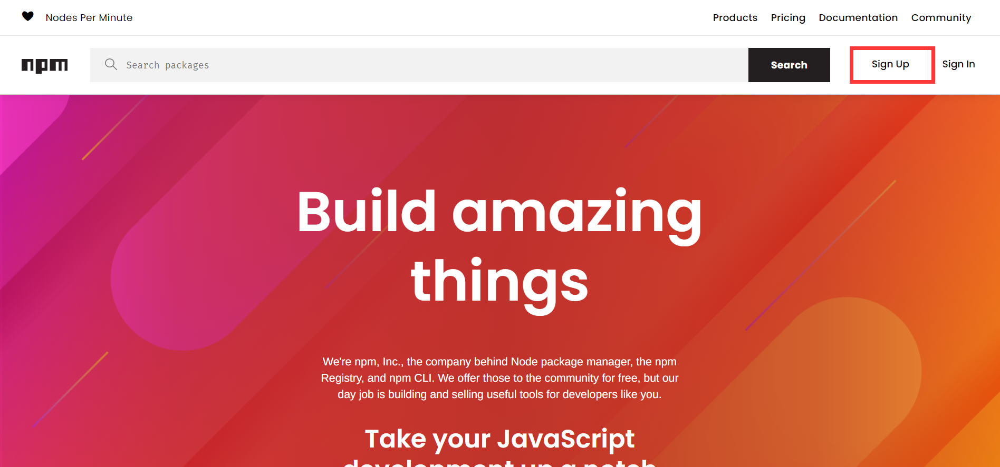
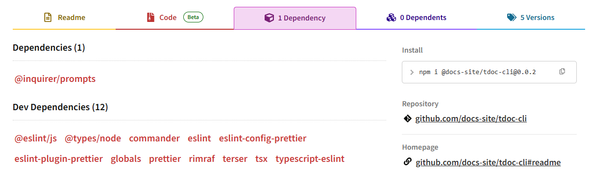
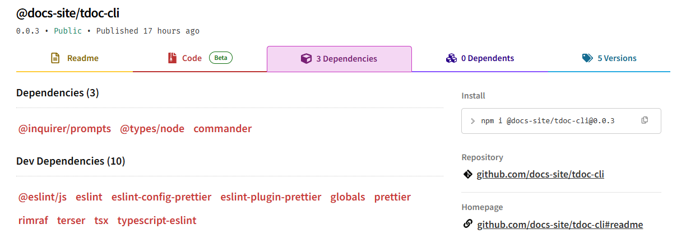
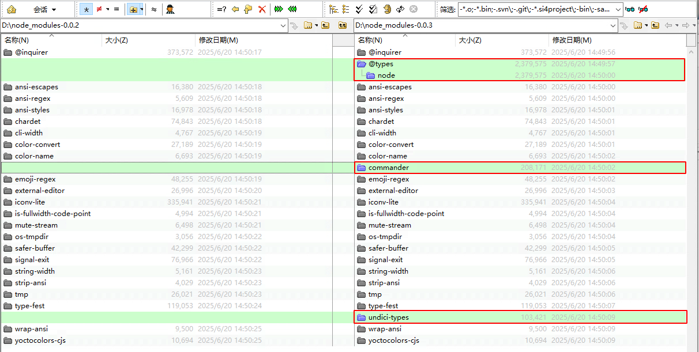
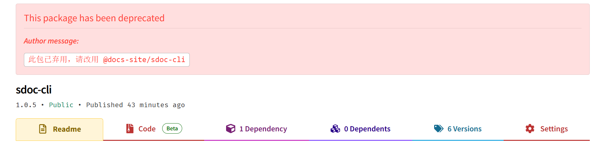
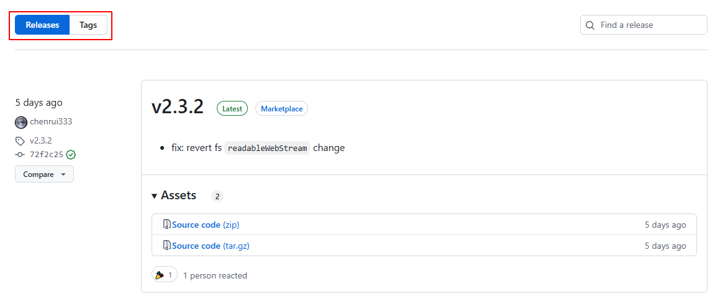

前面已经可以写一个sdoc的包了，并且我们通过npm publish将其发布到了npm仓库，这一节，来深入了解一下npm的发布与管理。

<!-- more -->

## 一、npm 简介

### 1. 什么是npm？

前面其实已经了解过了，但是这里再来回顾一下，直接看官网：[About npm | npm Docs](https://docs.npmjs.com/about-npm)

`npm is the world's largest software registry. Open source developers from every continent use npm to share and borrow packages, and many organizations use npm to manage private development as well.`

官网是这样介绍`npm`的，翻译过来就是，`npm`是世界上最大的软件注册中心。来自各个大洲的开源开发者都使用`npm`来共享和借用包，许多组织也使用`npm`来管理私人开发。简单来说，`npm`就是`javascript`的包管理工具，类似`python`的`pip`。`npm`是和`Node.js`一起发布的，只要安装了`Node.js`，`npm`也默认会被安装。

npm由3个独立的部分组成：

- 网站：开发者查找包，设置参数以及管理npm使用体验的途径
- 注册表（registry）：是一个巨大的数据库，保存了每个包的信息
- 命令行工具（CLI）：终端，使用者通过cli操作npm

### 2. 它有什么用？

那么`npm`可以用用来干什么呢？还是直接看官网：[About npm | npm Docs](https://docs.npmjs.com/about-npm#use-npm-to---)

- 为你的应用调整代码包，或者合并它们。
- 下载可以立即使用的独立工具。
- 运行包而不使用<a href="https://www.npmjs.com/package/npx" target="_blank">`npx`</a>下载。
- 与任何地方的任何`npm`用户共享代码。
- 将代码限制给特定的开发人员。
- 创建组织来协调包维护、编码和开发人员。
- 使用组织形式组建虚拟团队。
- 管理多个版本的代码和代码依赖关系。
- 当底层代码更新时，可以轻松地更新应用程序。
- 发现解决同一难题的多种方法。
- 找到其他正在处理类似问题和项目的开发人员。

> Tips：
>
> - [npm 中文网](https://npm.nodejs.cn/)
> - [npm Docs](https://docs.npmjs.com/)
>

## 二、基本应用

### 1. 账号注册

这个没什么可写的，进入官网，点击`Sign Up`按照提示进行注册即可，注册还是很简单的，注册完毕之后要记得会提示验证邮箱，这个时候注意验证就好了，不验证的话可能会有问题。



### 2. `npm`的安装与更新

上边已经有所提及，`npm`和`Node.js`是一起发布的，只要安装了`Node.js`，`npm`也是自动安装了的。

- 查看`npm`和`Node.js`版本

```shell shell
node -v  # 查看node版本
npm -v   # 查看npm版本
```

- 更新`npm`版本

```shell shell
npm install npm@latest -g
```

### 3. 管理依赖包

#### 3.1 安装依赖包

```shell shell
npm install packageName            # 本地安装，安装到项目目录下，不在package.json中写入依赖
npm install packageName -g         # 全局安装，安装在Node安装目录下的node_modules下
npm install packageName --save     # 安装到项目目录下，并在package.json文件的dependencies中写入依赖，简写为-S
npm install packageName --save-dev # 安装到项目目录下，并在package.json文件的devDependencies中写入依赖，简写为-D
npm install packageName@version --save # 安装指定版本
```

可以通过以上命令来对插件进行安装，还有一种就是自己按照相应的语法写一个`package.json`文件，然后在该文件所在目录执行`npm install`即可安装`package.json`文件中的所有插件。`npm 5`之后版本默认会修改`package.json`，不再需要`--save`参数，也就是说，就算现在去掉该参数，再通过`npm install`命令可以安装相应依赖包并自动修改`package.json`。更多内容可以这里：<a href="https://docs.npmjs.com/cli/v7/commands/npm-install" target="_blank">`npm-install`</a>

#### 3.2 卸载依赖

```shell shell
npm uninstall packageName      # 删除packageName模块
npm uninstall -g packageName   # 删除全局模块packageName
```

#### 3.3 更新依赖

```shell shell
# 更新一个或多个模块，加上-g参数，表示更新全局的模块
npm update packageName
npm update packageName -g

# 更新时同时修改package.json文件,不要--save也没有问题
npm update packageName --save-dev  # 在package.json文件的devDependencies中写入依赖
npm update packageName --save
```

### 4. 项目初始化

由于我是针对`hexo`插件来使用`npm`，所以文件夹命名按照`hexo`的插件要求命名，`hexo`要求插件文件夹名称开头必须为 `hexo-`，如此一来` hexo`才会在启动时载入否则 `hexo`将会忽略它。

#### 4.1 创建文件夹

```shell shell
# 进入自己相应的文件夹，并创建npm项目文件夹
mkdir hexo-npm-test
# 进入创建的文件夹
cd hexo-npm-test
```

#### 4.2 初始化文件夹

```shell shell
npm init
```

使用该命令初始化时，会打开项目初始化向导，在命令行窗口会提示让自己输入各个参数，所有显示信息如下所示：

```shell shell
$ npm init
This utility will walk you through creating a package.json file.
It only covers the most common items, and tries to guess sensible defaults.

See `npm help init` for definitive documentation on these fields
and exactly what they do.

Use `npm install <pkg>` afterwards to install a package and
save it as a dependency in the package.json file.

Press ^C at any time to quit.
package name: (hexo-npm-test)
version: (1.0.0)
description:
entry point: (index.js)
test command:
git repository:
keywords:
author:
license: (ISC)
About to write to E:\MyStudy\VScode\hexofiles\hexo-npm-test\package.json:

{
  "name": "hexo-npm-test",
  "version": "1.0.0",
  "description": "",
  "main": "index.js",
  "scripts": {
    "test": "echo \"Error: no test specified\" && exit 1"
  },
  "author": "",
  "license": "ISC"
}


Is this OK? (yes) yes
```

该命令有一个参数`--yes`，若使用以下命令，则创建默认`package.json`文件，不需要自己在命令行输入，后续直接修改该文件即可。

```shell shell
npm init --yes
```

创建的文件信息如下，内容与不带参数创建的一致，看个人喜好选择要不要带参数吧。

```json json
{
  "name": "hexo-npm-test",
  "version": "1.0.0",
  "description": "",
  "main": "index.js",
  "scripts": {
    "test": "echo \"Error: no test specified\" && exit 1"
  },
  "keywords": [],
  "author": "",
  "license": "ISC"
}
```

#### 4.3 `package.json`参数解读

> Tips：
>
> - [package.json | npm 中文网](https://npm.nodejs.cn/cli/v11/configuring-npm/package-json#描述)
> - [package.json | npm Docs](https://docs.npmjs.com/cli/v7/configuring-npm/package-json)
> - [package.json文件 -- JavaScript 标准参考教程（alpha）](https://javascript.ruanyifeng.com/nodejs/packagejson.html)

常见的一些参数如下：

<table>
	<tbody>
    <tr>
        <td align="center">
            参数
        </td>
        <td align="center">
            说明
        </td>
    </tr>
    <tr>
        <td align="center">
            name
        </td>
        <td align="left">
            项目的名称。
        </td>
    </tr>
    <tr>
        <td align="center">
            version
        </td>
        <td align="left">
            项目的版本，默认是从V1.0.0开始，可以自己修改，遵守“大版本.次要版本.小版本”的格式。
        </td>
    </tr>
    <tr>
        <td align="center">
            scripts
        </td>
        <td align="left">
            指定了运行脚本命令的npm命令行缩写；<br>
            例如："test": "tap test/*.js" 就表示执行npm run test的时候所要执行的命令为 tap test/*.js 。
        </td>
    </tr>
    <tr>
        <td align="center">
            bin
        </td>
        <td align="left">
            指定各个内部命令对应的可执行文件的位置。<br>
        </td>
    </tr>
    <tr>
        <td align="center">
            main
        </td>
        <td align="left">
            指定加载的入口文件，require('moduleName')就会加载这个文件。这个字段的默认值是模块根目录下面的index.js。
        </td>
    </tr>
    <tr>
        <td align="center">
            author
        </td>
        <td align="left">
            项目的作者。
        </td>
    </tr>
    <tr>
        <td align="center">
            repository
        </td>
        <td align="left">
            项目代码存放地方类型，如：git或svn。
        </td>
    </tr>
    <tr>
        <td align="center">
            keywords
        </td>
        <td align="left">
            项目关键字。
        </td>
    </tr>
    <tr>
        <td align="center">
            description
        </td>
        <td align="left">
            项目简介，字符串，方便在npm search中搜索。
        </td>
    </tr>
    <tr>
        <td align="center">
            license
        </td>
        <td align="left">
            许可证。
        </td>
    </tr>
    <tr>
        <td align="center">
            dependencies
        </td>
        <td align="left" rowspan="2">
            dependencies字段指定了项目运行所依赖的模块;devDependencies指定项目开发所需要的模块。<br>
            它们都指向一个对象,该对象的各个成员，分别由模块名和对应的版本要求组成，表示依赖的模块及其版本范围。<br>
        </td>
    </tr>
    <tr>
        <td align="center">
           devDependencies
        </td>
    </tr>
	</tbody>
</table>

##### 4.3.1 [main](https://npm.nodejs.cn/cli/v11/configuring-npm/package-json#main)

main字段是模块 ID，它是程序的主要入口点。也就是说，如果包名为 `foo`，并且用户安装了它，然后执行 `require("foo")`，那么foo包的主模块的导出对象将被返回。如果未设置 `main`，则默认为包根文件夹中的 `index.js`。

##### 4.3.2 [bin](https://npm.nodejs.cn/cli/v11/configuring-npm/package-json#bin)

许多包都有一个或多个可执行文件，他们希望将它们安装到 PATH 中。npm 使这非常容易（事实上，它使用此功能来安装 "npm" 可执行文件。）

要使用它，要在 package.json 中提供一个 `bin` 字段，它是命令名称到本地文件名的映射。全局安装此软件包时，该文件将链接到全局 bins 目录中，或者将创建一个 cmd（Windows 命令文件）来执行 `bin` 字段中的指定文件，因此它可以由 `name` 或 `name.cmd` 运行（在 Windows PowerShell 上）。

当此包作为依赖安装在另一个包中时，该文件将被链接到该包可以直接通过 `npm exec` 或通过 `npm run` 调用它们时在其他脚本中的名称可用的位置。

例如， myapp 可能有这个：

```json
{
  "bin": {
    "myapp": "bin/cli.js"
  }
}
```

因此，当安装 myapp 时，如果是类 unix 的操作系统，它会创建一个从 `cli.js` 脚本到 `/usr/local/bin/myapp` 的符号链接，如果是 Windows，它通常会在 `C:\Users\{Username}\AppData\Roaming\npm\myapp.cmd` 创建一个运行 `cli.js` 脚本的 cmd 文件。这个时候我们就可以在终端执行`myapp`来运行这个`cli.js`。

如果有一个可执行文件，并且它的名称应该是包的名称，那么可以将其作为字符串提供。例如：

```json
{
  "name": "my-program",
  "version": "1.2.5",
  "bin": "path/to/program"
}
```

将与此相同：

```json
{
  "name": "my-program",
  "version": "1.2.5",
  "bin": {
    "my-program": "path/to/program"
  }
}
```

请确保在 `bin` 中引用的文件以 `#!/usr/bin/env node` 开头，否则脚本将在没有 node 可执行文件的情况下启动！

> Tips：还可以使用 [directories.bin](https://npm.nodejs.cn/cli/v11/configuring-npm/package-json#directoriesbin) 设置可执行文件。

##### 4.3.3 [dependencies](https://npm.nodejs.cn/cli/v11/configuring-npm/package-json#dependencies)和[devDependencies](https://npm.nodejs.cn/cli/v11/configuring-npm/package-json#devdependencies)

这两个字段都是拿来记录项目所使用的依赖的，但是如果有其他人计划在他们的程序中下载和使用我们的模块，那么他们可能不想或不需要下载和构建我们使用的外部测试或文档框架。例如eslint(代码检查)、terser(代码压缩混淆)以及prettier(代码格式化)等依赖包，我们开发的时候是有用的，但是发布之后，其他人导入我们的模块的时候，这些依赖就没有什么必要了。在这种情况下，最好将这些附加项映射到 `devDependencies` 对象中。

有什么区别？`devDependencies` 和 `dependencies`的区别核心体现在 **npm包** 中。只要开发的项目是**发npm包**提供给外部、其他业务项目使用的，需要非常注意依赖的安装地方，因为搞不好很容易在业务使用中会出现bug。而如果只是自己项目用，**不需要发npm包**的话，把依赖安装到 `devDependencies` 或者 `dependencies` 中，实质上是没有任何区别的。

平时在本地开发的时候就可以看到，我们执行`npm install`之后，所有的`devDependencies` 和 `dependencies`都会被安装，那么，发布npm包之后呢？我们来看着两个版本：

- [@docs-site/tdoc-cli - npm@0.0.2](https://www.npmjs.com/package/@docs-site/tdoc-cli/v/0.0.2?activeTab=dependencies)



- [@docs-site/tdoc-cli - npm@0.0.3](https://www.npmjs.com/package/@docs-site/tdoc-cli/v/0.0.3?activeTab=dependencies)



可以看到这两个版本吧    @types/node、commander这两个包从`devDependencies` 移到了 `dependencies`，原因是我们的cli工具运行依赖于这两个包，我们可以通过`npm i -g @docs-site/tdoc-cli@version`安装一下这两个版本，然后对比以下node_modules目录：



可以发现，0.0.3版本比0.0.2版本多了三个包，其中两个就是上面移到dependencies的，第三个应该是这两个包中所依赖的，就一起安装了。所以很明显，当我们发布npm包之后，通过npm install安装的时候，就不会安装devDependencies中的依赖，但是在本地项目中的话，npm install会安装所有依赖。

对于`dependencies`和`devDependencies`对应的版本可以加上各种限定，主要有以下几种：

- **指定版本**：比如`1.2.2`，遵循“大版本.次要版本.小版本”的格式规定，安装时只安装指定版本。
- **波浪号（tilde）+指定版本**：比如`~1.2.2`，表示安装1.2.x的最新版本（不低于1.2.2），但是不安装1.3.x，也就是说安装时不改变大版本号和次要版本号。
- **插入号（caret）+指定版本**：比如`ˆ1.2.2`，表示安装1.x.x的最新版本（不低于1.2.2），但是不安装2.x.x，也就是说安装时不改变大版本号。需要注意的是，如果大版本号为0，则插入号的行为与波浪号相同，这是因为此时处于开发阶段，即使是次要版本号变动，也可能带来程序的不兼容。
- **latest**：安装最新版本。

### 5.`npm`项目发布与管理

#### 5.1 本地登录`npm`

##### 5.1.1 npm login

首次发布项目，需要登陆`npm`，使用以下命令登录，输入命令之后，填写自己的用户名，密码和注册的邮箱即可，这里要注意淘宝镜像只是提供下载，如果要登陆发布自己的项目， 必须要切换到官方`npm`源。

```shell shell
# 更换npm源为官方源
npm config set registry https://registry.npmjs.org/
# 本地登录npm
npm login
```

如果不换回官方`npm`源的话，登陆的时候就可能会一直卡死，更换后我出现过因为网络问题导致报错了的，这种的问题不大，出现以下提示说明登陆成功。

```shell shell
Logged in as sumumm on https://registry.npmjs.org/.
```

##### 5.1.2 更换npm源

这里为什么需要这一步呢，是因为有的时候自己可能为了让下载速度更快，就把源给换成了`taobao`镜像，这个源在首次登录的时候可能会有问题，需要处理一下。

```shell shell
# 检查npm源
npm config get registry

# 配置npm源
# 原始下载源：https://registry.npmjs.org/
# 更换下载源：
npm config set registry http://registry.npmmirror.com
```

常见的镜像源：

```txt
# npm 官方原始镜像网址是：https://registry.npmjs.org/
# 淘宝 NPM 镜像 ：http://registry.npmmirror.com
# 阿里云 NPM 镜像：https://npm.aliyun.com
# 腾讯云 NPM 镜像：https://mirrors.cloud.tencent.com/npm/
# 华为云 NPM 镜像：https://mirrors.huaweicloud.com/repository/npm/
# 网易 NPM 镜像  ：https://mirrors.163.com/npm/
# 中国科学技术大学开源镜像站：http://mirrors.ustc.edu.cn/
# 清华大学开源镜像站：https://mirrors.tuna.tsinghua.edu.cn/
```

淘宝，阿里云，腾讯云，华为云在国内是比较完整的，下载速度会快一点。

#### 5.2 发布项目到npm

##### 5.2.1 npm pubilsh

若项目已经编写完成，那我们就可以发布自己的项目啦，版本发布命令如下。

```shell shell
npm publish
```

例如，出现以下提示内容代表发布成功，之前验证完邮箱，这里还会有发布成功的邮件提醒。

```shell shell
npm notice 
npm notice package: hexo-npm-test@1.0.0
npm notice === Tarball Contents ===
npm notice 288B package.json
npm notice === Tarball Details ===
npm notice name:          hexo-npm-test
npm notice version:       1.0.0
npm notice package size:  285 B
npm notice unpacked size: 288 B
npm notice shasum:        6ec63a53a3c7461ab49dd287e01fa04127cca207
npm notice integrity:     sha512-a46dY8gsp1b2h[...]yf9NfS5tmr7dg==
npm notice total files:   1
npm notice
+ hexo-npm-test@1.0.0
```

##### 5.2.2 [包中包含的文件](https://npm.nodejs.cn/cli/v11/commands/npm-publish#包中包含的文件)

要查看将包含在我们的包中的内容，可以运行 `npm pack --dry-run`。但是以下情况除外：

- 始终包含与包安装和分发相关的某些文件。例如，`package.json`、`README.md`、`LICENSE` 等。
- 如果 [`package.json`](https://npm.nodejs.cn/cli/v11/configuring-npm/package-json) 中有 "files" 列表，则仅包含指定的文件。（如果指定了目录，那么它们将被递归遍历并包含它们的内容，遵循相同的忽略规则。）
- 如果有 `.gitignore` 或 `.npmignore` 文件，则其中被忽略的文件和所有子目录都将从包中排除。如果两个文件都存在，则忽略 `.gitignore`，只使用 `.npmignore`。`.npmignore` 文件跟随 [相同的模式规则](https://git-scm.com/book/en/v2/Git-Basics-Recording-Changes-to-the-Repository#_ignoring) 为 `.gitignore` 文件
- 如果文件与某些模式匹配，则永远不会包含它，除非明确添加到 `package.json` 中的 `"files"` 列表中，或者在 `.npmignore` 或 `.gitignore` 文件中使用 `!` 规则取消忽略。
- 符号链接从不包含在 npm 包中。

> 一般还是使用 .npmignore 来指定忽略的文件，个人感觉这样更清晰明了一点。

#### 5.3 更新本地项目版本

##### 5.3.1 手动修改

手动修改`package.json`文件中的版本号。

```shell shell
"version": "1.0.0"
```

##### 5.3.2 命令修改

可以看一下官网的说明：[npm-version | npm 中文网](https://npm.nodejs.cn/cli/v11/commands/npm-version)

```shell shell
npm version [<newversion> | major | minor | patch | premajor | preminor | prepatch | prerelease | from-git]

alias: verison
```

在包目录中运行此命令以提升版本并将新数据写回 `package.json`、`package-lock.json` 和 `npm-shrinkwrap.json`（如果存在）。

`newversion` 参数应该是有效的 semver 字符串、[semver.inc](https://github.com/npm/node-semver#functions) 的有效第二个参数（`patch`、`minor`、`major`、`prepatch`、`preminor`、`premajor`、`prerelease` 之一）或 `from-git`。在第二种情况下，现有版本将在指定字段中增加 1。`from-git` 将尝试读取最新的 git 标签，并将其用作新的 npm 版本。

#### 5.4 撤销版本的发布

若是我们版本发布错误，我们应该如何撤回已经发布的版本呢？可以通过以下命令进行项目的删除或者某一版本的删除。

```shell shell 
npm unpublish packageName --force   # 强制撤销,可以删除整个项目
npm unpublish packageName@version   # 可以撤销发布自己发布过的某个版本
```

如下例子，输入版本撤销命令后，会显示撤销的版本，前边会有一个`-`，说明撤销成功，此时查看`npm`会发现，该版本已经消失，例如：

```shell shell 
$ npm unpublish hexo-npm-test@1.0.1 
- hexo-npm-test@1.0.1adv. 2	为aS下ADCEW执行4R5WEDRESAXCZ
```

不过这样的话，若撤销的版本是新版本，通过命令更新版本的时候，会跳过撤销的版本直接进入下一个版本。

#### 5.5 查看版本信息

```shell shell 
npm view packageName versions         # 查看历史版本信息(最多只能显示100条)        
npm view packageName versions --json  # 查看所有版本信息
npm view packageName version          # 查看最新版本信息
```

## 三、带有@的包名？

在使用nodejs的过程中，可能会遇到这种包：`@types/node`，像后面学习typescript的时候的包[typescript-demo/package.json](https://github.com/docs-site/typescript-demo/blob/master/package.json#L21)，就含有这个包：

```shell
@types
├── estree
├── json-schema
└── node

3 directories, 0 files
```

另外会发现，安装后，@type其实是一个目录，目录下还会有其他的包，这是什么情况？

### 1. 包的命名空间

#### 1.1 这是什么？

> Tips：
>
> - [创建和发布范围公共包 | npm 中文网](https://npm.nodejs.cn/creating-and-publishing-scoped-public-packages)
>
> - [scope | npm 中文网](https://npm.nodejs.cn/cli/v11/using-npm/scope)

npm 包的命名空间是一个重要的概念，用于组织和管理相关的包。通过命名空间，开发者可以避免命名冲突、增强包的可读性和可维护性。命名空间的格式为 `@scope/package-name`：

- **`@scope`**: 这是命名空间，通常代表一个团队、组织或个人。
- **`package-name`**: 这是具体的包名称。

#### 1.2 有什么好处？

- 避免命名冲突: 多个开发者可以发布具有相同名称的包，只要它们在不同的命名空间下。例如，@myorg/my-package 和 @anotherorg/my-package。
- 组织和管理: 相关的包可以被聚集在一起，便于开发者查找和使用。例如，[@typescript-eslint](https://github.com/typescript-eslint/typescript-eslint/tree/main/packages) 下的所有包都是围绕 TypeScript 和 ESLint 相关的工具和插件。
- 访问控制: 命名空间允许对包的访问进行细粒度的管理，确保只有特定团队或人员可以访问和发布包。
- 团队协作: 在组织内，可以通过 npm 组织功能管理团队成员，赋予不同的权限。

> 范围包可以从 `npm@2` 开始发布和安装，并且受主 npm 注册表支持。无范围包可以依赖于范围包，反之亦然。npm 客户端向后兼容无范围注册表，因此它可以同时用于作用域和无范围注册表。

### 2. npm的组织

#### 2.1 需要一个组织？

[scope | npm 中文网](https://npm.nodejs.cn/cli/v11/using-npm/scope#发布范围包)有提到，将公共范围的包发布到主 npm 注册表，也就是带有命名空间的包发布到范围，我们有两种选择：

- 发布到我们的用户范围（例如：`@username/module`）
- 发布到组织范围（示例：`@org/module`）

如果将公共模块发布到组织范围，我们必须首先使用我们要发布到的范围的名称创建一个组织，或者将其添加到具有适当权限的现有组织。例如，如果我们想发布到 `@org`，则需要在尝试发布之前在 npmjs.com 上创建 `org` 组织。

#### 2.2 组织是什么？

直接看官网：[组织 | npm 中文网](https://npm.nodejs.cn/organizations)

>Organizations allow teams of contributors to read and write public and private packages. Organizations are free when they publish public packages. When organizations publish private packages, an npm Teams subscription is required. 

翻译一下就是：组织允许贡献者团队读取和编写公共和私有包。组织在发布公共软件包时是免费的。当组织发布私有包时，需要订阅npm Teams。另外我还找deepseek问了下：

npm官网中的**组织（Organizations）功能**主要用于**团队协作和私有包管理**，尤其适合企业或开源团队。这里写几点用途：

（1）团队协作管理

- 成员权限控制：为不同成员分配角色（如管理员、开发者、只读成员），精细化控制包的管理权限。
- 集中管理包：团队所有成员可共享、更新同一组私有或公共包，避免重复发布。

（2）私有包支持

- 免费账号的私有包限制：个人免费账号仅支持发布公共包，**私有包需付费订阅**。
- 组织账号支持私有包：通过付费订阅，组织可发布私有包（仅组织成员可见），适合企业内部使用。

（3）统一命名空间

- 包命名规范：组织下的包使用统一命名空间（如 `@myorg/package-name`），避免与公共包命名冲突。
- 品牌标识：增强包的辨识度，例如 `@google/cloud-functions`。

#### 2.3 怎么创建一个组织

还是直接看官网：[创建组织 | npm 中文网](https://npm.nodejs.cn/creating-an-organization)，这里就不详细说明了。这里我创建了一个组织：[npm | Profile](https://www.npmjs.com/org/docs-site)，后续用于发布我使用hexo或者vitepress的站点过程中所用到的一些自己的npm包。

### 3. 带有命名空间的项目

我们去[npm-init | npm 中文网](https://npm.nodejs.cn/cli/v11/commands/npm-init)可以看一下`npm init`命令：

```shell
npm init <package-spec> (same as `npx create-<package-spec>`)
npm init <@scope> (same as `npx <@scope>/create`)

aliases: create, innit
```

它是一个选项是@scpoe的，我们来看一下这个选项：[npm-init scope](https://npm.nodejs.cn/cli/v11/commands/npm-init#scope)

```shell
npm init --scope=<our_org_name>
```

和默认的npm init命令一样，经过一些配置，就可以创建一个带有范围的包啦，我们可以加上 -y 选项，这样，对 npm 可能在命令行上打印的任何提示自动回答 "yes"。默认创建的package.json如下：

```json
{
  "name": "@docs-site/scope-demo",
  "version": "1.0.0",
  "main": "index.js",
  "scripts": {
    "test": "echo \"Error: no test specified\" && exit 1"
  },
  "keywords": [],
  "author": "",
  "license": "ISC",
  "description": ""
}
```

其实就跟默认创建的一样，只是包名以@开头了。我们之前已经存在的包，其实就很简单，直接吧name字段改掉就行了，比如之前是`"name": "scope-demo",`直接改为`"name": "@docs-site/scope-demo",`其他的都不用动。那我们要是将原来的项目改为了带命名空间的项目，之前的怎么办？

### 4. 发布scoped package

怎么发布这种scoped package？我们和之前一样，cd到相关的package.json目录下如果未登录的话，输入命令npm login回车，然后按照提示输入账号密码（可能会提示输入邮箱）。然后执行：

```shell
npm publish --access public
```

默认情况下，scoped package是私有的，想发布私有依赖包的话，需要充值成为尊贵的私有依赖包用户，哈哈。

### 5. 旧的版本？

那我们要是将原来的项目改为了带命名空间的项目，之前的怎么办？例如上面说的，原来依赖包的名称为`"name": "scope-demo"`直接改为`"name": "@docs-site/scope-demo"`，那么对于原来的已发布到 npm的版本，我们可以：

- 弃用旧包（推荐）：

```shell
npm deprecate scope-demo "此包已弃用，请改用 @our-scope/scope-demo"
```

这样在原来的包的主页就会有提示，如：



- 或直接删除：

```shell
npm unpublish ts-demo --force
```


## 四、本地调试

有的时候，我们编写了一个npm依赖包，但是并没有发布到npm上去，我们可以在本地安装吗？当然也可以了。

### 1. 创建全局链接

我们进入本地开发的npm项目，以上面的`@docs-site/scope-demo`为例，我们进入开发目录后，执行：

```shell
npm link
```

会有如下打印信息：

```shell
D:\sumu_blog\scope-demo> npm link

added 1 package, and audited 3 packages in 2s

found 0 vulnerabilities
```

然后我们进入npm的全局目录，在安装node的时候应该配置过，我的是在这里 `%APPDATA%/npm/node_modules` ：


### 2. 在项目中链接该包

然后，我们去要用到`@docs-site/scope-demo`包的项目中，执行：

```shell
npm link your-local-package-name  # 使用package.json中的包名
```

这里就是：

```shell
npm link [-D] @docs-site/scope-demo
```

然后就可以像其他的包一样正常使用了。

### 3. 解除链接

```shell
# 主项目中解除
npm unlink our-local-package-name

# 本地包中解除全局链接
npm unlink -g our-local-package-name
```

## 五、Github Action自动发布

### 1. GitHub Action 简介

#### 1. 它是什么？

GitHub Action 是一个持续集成和持续交付平台，可帮助我们自动化软件开发生命周期中的各种任务。它可以与 GitHub、Docker、Kubernetes 和 Slack 等众多工具和服务无缝集成。详细的可以去看[GitHub Actions 文档 - GitHub 文档](https://docs.github.com/zh/actions)

#### 1.2 开启Actions功能

对于新创建的项目，默认是开启 Actions 功能的，如果没有开启，需要手动在 Settings 里的 【Actions】 &rarr; 【General】&rarr;【Actions permissions】 选项开启。

### 2. 创建个人令牌

#### 2.1 NPM个人令牌

像这个，官网已经写的很详细了，我们直接看官网：[创建和查看访问令牌 | npm 中文网](https://npm.nodejs.cn/creating-and-viewing-access-tokens)

> 注意保存生成的 token，之后不会再显示

#### 2.2 Github个人令牌

后面还会把一些相关资源发布到github的release页面，发布的时候还需要一个github的个人令牌，可以按这个步骤创建：【头像】&rarr;【Settings】&rarr;【Developer settings】&rarr;【Personal access tokens】&rarr;【Tokens】&rarr;【Generate new token (clasic)】

### 3. 发布到npm的工作流

#### 3.1 配置 Secrets

想要不登录就发布到npm，我们需要去github仓库添加npm创建的个人令牌，可以按这个步骤添加：【Settings】&rarr;【 Secrets and variables】 &rarr;【 Actions】&rarr;【 Repository secrets】 &rarr; 【New repository secret】 ，然后， 在Name输入框输入 NPM_PERNEL_TOKEN，在Secret输入框输入刚才生成的 token，最后点击 【Add secret】 按钮保存。

#### 3.2 工作流编写

然后我们编写工作流文件：

[tdoc-cli/.github/workflows/npm-publish.yaml at master · docs-site/tdoc-cli · GitHub](https://github.com/docs-site/tdoc-cli/blob/master/.github/workflows/npm-publish.yaml)

### 4. 发布到仓库release页面

#### 4.1 release页面

github仓库会有一个release页面，如下图：



怎么实现上传资源到这里呢？可以用下面的两个Action实现：

- [GitHub - actions/create-release: An Action to create releases via the GitHub Release API](https://github.com/actions/create-release): 用于创建 release
- [GitHub - actions/upload-release-asset: An Action to upload a release asset via the GitHub Release API](https://github.com/actions/upload-release-asset): 用于上传资源到对应的 release 中

但是这两个官方 `Action` 目前已经归档，停止维护了。我们可以用这个社区的 action：[GitHub - softprops/action-gh-release: 📦 GitHub Action for creating GitHub Releases](https://github.com/softprops/action-gh-release) 。

#### 4.2 配置 Secrets

这里同样需要再github仓库添加在github创建的个人令牌，可以按这个步骤添加：【Settings】&rarr;【 Secrets and variables】 &rarr;【 Actions】&rarr;【 Repository secrets】 &rarr; 【New repository secret】 ，然后， 在Name输入框输入 PERSONAL_ACCESS_TOKENS_GITHUB，在Secret输入框输入对应的 token，最后点击 【Add secret】 按钮保存。

#### 4.3 工作流编写

[tdoc-cli/.github/workflows/release-page.yaml at master · docs-site/tdoc-cli · GitHub](https://github.com/docs-site/tdoc-cli/blob/master/.github/workflows/release-page.yaml)
