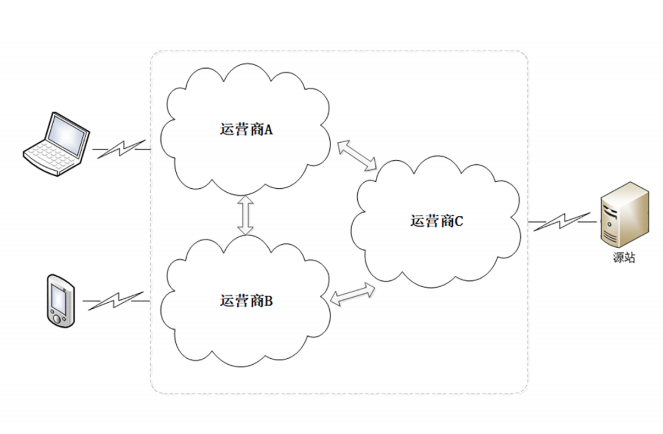
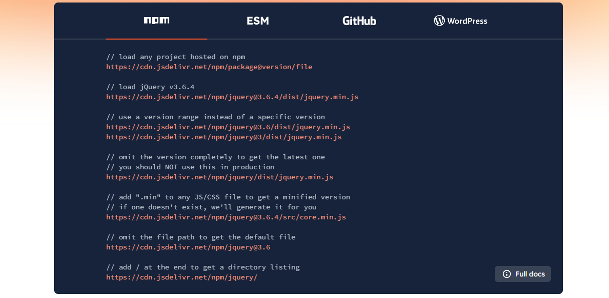
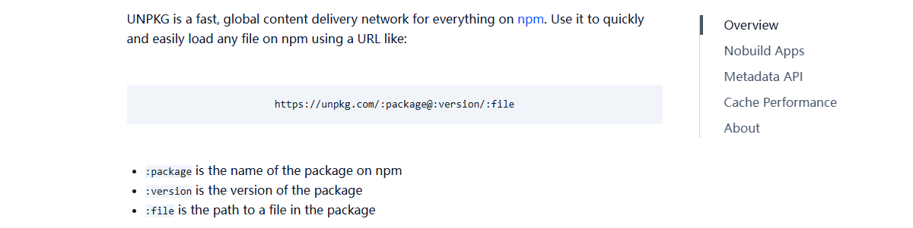

CDN是什么？有什么用？怎么用？

<!-- more -->

## 一、CDN简介

### 1. 网络加速

互联网从逻辑上看是一张大网，但实际上是由许多小网络组成的，这其中就有小网络“互连互通”的问题，典型的就是各个电信运营商的网络，比如国内的电信、联通、移动三大家。



这些小网络内部的沟通很顺畅，但网络之间却只有很少的联通点。如果我们在 A 网络，而网站在 C 网络，那么就必须“跨网”传输，和成千上万的其他用户一起去“挤”连接点 的“独木桥”。而带宽终究是有限的，能抢到多少只能看我们的运气。

另外，网络中还存在许多的路由器、网关，数据每经过一个节点，都要停顿一下，在二层、 三层解析转发，这也会消耗一定的时间，带来延迟。

最终结果就是，如果仅用现有的 HTTP 传输方式，大多数网站都会访问速度缓慢、用户体验糟糕。

放到全球来看，物理距离非常大，我们在北京，现在要访问旧金山的网站，要**跨越半个地球，地理位置距离远**、运营商网络、路由转发的影响就会成倍增加。

### 2. 什么是CDN

CDN（Content Delivery Network）的缩写，是一种利用分布式节点技术，在全球部署服务器，即时地将网站、应用视频、音频等静态或动态资源内容分发到用户所在的最近节点，提高用户访问这些内容的速度和稳定性，降低网络拥塞和延迟，同时也能减轻源站的压力。提高网络或应用的可用性和安全型。

CDN 的关键技术主要有内容存储和分发技术，简单来讲，CDN就是根据用户位置分配最近的资源，于是，用户在上网的时候不用直接访问源站，而是访问离他“最近的”一个 CDN 节点(也叫做“边缘节点”、edge node)，其实就是缓存了源站内容的代理服务器。

### 3. CDN的特点

CDN 的最核心原则是“就近访问”，如果用户能够在本地几十公里的距离之内获取到数据，那么时延就基本上变成 0 了。**所以 CDN 厂商 投入了大笔资金，在全国、乃至全球的各个大枢纽城市都建立了机房，部署了大量拥有高存储高带宽的节点，构建了一个专用网络**。

有了这个高速专用网，CDN就要分发源站的内容，利用缓存代理技术，把源站内容逐级缓存到网络的每一个节点上，**这样用户上网就不用直接访问源站，而是访问离他“最近的”一个 CDN 节点**，其实就是缓存了源站内容的代理服务器，这样一来就省去了“长途跋涉”的时间成本，实现了“网络加速”。

### 4. 可以分发哪些互联网内容？

先来了解两种互联网内容：静态内容和动态内容。

- 静态内容

静态内容是不会因用户而异的网站数据。网站标题图像、徽标和字体样式对于所有用户都保持不变，并且企业不会经常更改它们。静态数据无需修改、处理或生成，非常适合存储在 CDN 上。

- 动态内容

诸如社交媒体新闻推送、天气报告、登录状态和聊天消息等动态内容因网站用户而异。这些数据会根据用户的位置、登录时间或用户首选项而“动态变化”，并且网站必须为每个用户和每次用户交互生成数据，在每一次访问的时候可能都不一样。

CDN 都能加速什么样的“内容”呢？ 静态资源，而不是动态资源。在 CDN 领域里，“内容”其实就是 HTTP 协议里的“静态资源”，比如超文本、图片、视频、应用程序安装包等等。

## 二、基本原理

这里我就没有详细去了解了。

## 三、怎么使用CDN？

### 1. [jsDelivr](https://www.jsdelivr.com/)

#### 1.1 [jsDelivr](https://www.jsdelivr.com/)是什么？

我们直接来到官网的[About - jsDelivr](https://www.jsdelivr.com/about)，这里有以下说明：

>jsDelivr is a free CDN (Content Delivery Network) for open source files.  We are tightly integrated with GitHub and NPM, allowing us to automatically provide a reliable CDN service to almost every open source project out there.
>
>jsdeliver是一个免费的开源文件CDN（内容分发网络）。我们与GitHub和NPM紧密集成，使我们能够自动为几乎每个开源项目提供可靠的CDN服务。
>
>We offer a stable CDN that can be used in production on popular websites with huge amounts of traffic.  There are no bandwidth limits or premium features and its completely free to use by anybody.
>
>我们提供了一个稳定的CDN，可以在生产中使用的热门网站与大量的流量。没有带宽限制或高级功能，任何人都可以完全免费使用。

#### 1.2 怎么使用？

其实主页已经告诉我们了：



#### 1.3 使用实例

##### 1.3.1 github

我之前的sdoc-cli模块，github仓库为[docs-site/sdoc-cli](https://github.com/docs-site/sdoc-cli)，其中[index.js](https://github.com/docs-site/sdoc-cli/blob/master/index.js)源文件链接为：

```shell
https://github.com/docs-site/sdoc-cli/blob/master/index.js
```

我就可以通过下面的链接来加速访问这个文件：

```shell
https://cdn.jsdelivr.net/gh/docs-site/sdoc-cli/index.js
```

##### 1.3.2 npm

我这个模块是发布到了npm的，在npm的仓库为[sdoc-cli - npm](https://www.npmjs.com/package/sdoc-cli)，我们就可以通过下面的链接访问这个npm包的整个目录：

```shell
https://cdn.jsdelivr.net/npm/sdoc-cli/
```

### 2. [UNPKG](https://unpkg.com/)

#### 2.1 [UNPKG](https://unpkg.com/)是什么？

我们直接来到官网[UNPKG](https://unpkg.com/)，这里有以下说明：

>UNPKG is a fast, global content delivery network for everything on [npm](https://www.npmjs.com/). 
>
>UNPKG是npm上所有内容的快速全球内容分发网络。

从官网主页就可以知道，这个CDN主要是托管npm包的内容的。

#### 2.2 怎么使用？

其实主页已经告诉我们了：



#### 2.3 使用实例

在npm的仓库为[sdoc-cli - npm](https://www.npmjs.com/package/sdoc-cli)，我们可以通过下面的链接访问这个npm包的整个目录：

```shell
https://app.unpkg.com/sdoc-cli@latest
```
