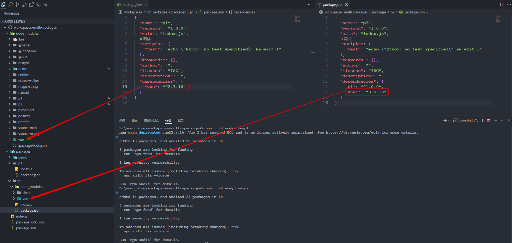

这部分来了解一下npm的[workspaces](https://npm.nodejs.cn/cli/v11/using-npm/workspaces)。

<!-- more -->

## 一、概述

### 1. 为什么要用workspaces 

本地化开发 `npm package` 的时候不可能每次改了代码，都发布到 `npm` 官网，所以 `npm` 提供给我们 `npm link` 命令用来进行本地化开发。使用 `npm-link` 调试代码，我们要开两个编辑器，一个编辑器改开发 `package` 的代码，另一个编辑器用来调试。

如果我们开发组件库几十个组件，总不能几十个窗口把。`npm` 的新特性 `workspaces` 可以帮助我们来进行多包管理，它可以让多个 `npm` 包在同一个项目中进行开发和管理变得非常方便：

- 它会将子包中所有的依赖包都提升到根目录中进行安装，提升包安装的速度；
- 它初始化后会自动将子包之间的依赖进行关联（软链接）；
- 因为同一个项目的关系，从而可以让各个子包共享一些流程，比如：`eslint`、`stylelint`、`git hooks`、`publish flow` 等；

`workspaces` 是一个用来在本地项目下面管理多个包的 `npm` 功能。（yarn 很早就支持了，`npm` 在 `7.x` 中开始支持，也就是 Node@15.0.0 新增的功能）。

这个功能让我们在本地开发包，尤其是多个互相依赖的包时，避免手动的去执行 `npm link` 命令，而是在 `npm install` 的时候，会自动把 `workspaces` 下面的合法包，自动创建符号链接到当前的 `node_modules` 文件夹里。

### 2. 什么是workspaces

工作区是一个通用术语，指的是 npm cli 中的一组功能，它支持在单个顶层根包中管理本地文件系统中的多个包。

这组功能弥补了从本地文件系统处理链接包的更加简化的工作流程。它作为 `npm install` 的一部分自动执行链接过程，并且无需手动使用 `npm link` 来添加对应符号链接到当前 `node_modules` 文件夹中的包的引用。

我们还将 `npm install` 期间自动符号链接的这些包称为单个工作区，这意味着它是在 [`package.json`](https://npm.nodejs.cn/cli/v11/configuring-npm/package-json#workspaces) `workspaces` 配置中显式定义的当前本地文件系统中的嵌套包。

## 二、在npm项目中使用工作区

### 1. [定义工作区](https://npm.nodejs.cn/cli/v11/using-npm/workspaces#定义工作区)

工作区通常通过 [`package.json`](https://npm.nodejs.cn/cli/v11/configuring-npm/package-json#workspaces) 文件的 `workspaces` 属性定义，例如：

```json
{
  "name": "my-workspaces-powered-project",
  "workspaces": ["packages/a"]
}
```

鉴于上述 `package.json` 示例位于当前工作目录 `.` 中，该目录包含一个名为 `packages/a` 的文件夹，该文件夹本身包含一个 `package.json`，定义了一个 Node.js 包，例如：

```bash
.
+-- package.json
`-- packages
   +-- a
   |   `-- package.json
```

在当前工作目录 `.` 中运行 `npm install` 后，预期的结果是文件夹 `packages/a` 将符号链接到当前工作目录的 `node_modules` 文件夹。下面是一个帖子 `npm install` 示例，假设文件和文件夹的先前示例结构相同：

```bash
.
+-- node_modules
|  `-- a -> ../packages/a
+-- package-lock.json
+-- package.json
`-- packages
   +-- a
   |   `-- package.json
```

### 2. [工作区入门](https://npm.nodejs.cn/cli/v11/using-npm/workspaces#工作区入门)

我们可以使用 [npm init](https://npm.nodejs.cn/cli/v11/commands/npm-init) 自动执行定义新工作区所需的步骤。例如，在已经定义了 `package.json` 的项目中，我们可以运行：

```
npm init -w ./packages/a
```

此命令将创建丢失的文件夹和新的 `package.json` 文件（如果需要），同时确保正确配置根项目 `package.json` 的 `"workspaces"` 属性。

### 3. [将依赖添加到工作区](https://npm.nodejs.cn/cli/v11/using-npm/workspaces#将依赖添加到工作区)

可以使用 [`workspace` 配置](https://npm.nodejs.cn/cli/v11/using-npm/config#workspace)直接添加/删除/更新工作区的依赖。例如，假设以下结构：

```bash
.
+-- package.json
`-- packages
   +-- a
   |   `-- package.json
   `-- b
       `-- package.json
```

如果想从注册表添加名为 `abbrev` 的依赖作为工作区 a 的依赖，可以使用工作区配置告诉 npm 安装程序应将包添加为所提供工作区的依赖：

```bash
npm install abbrev -w a
```

注意：`uninstall`、`ci` 等其他安装命令也将遵循提供的 `workspace` 配置。另外，`-w`后面的是包名而非目录名。

### 4. [使用工作区](https://npm.nodejs.cn/cli/v11/using-npm/workspaces#使用工作区)

给定 [Node.js 如何处理模块解析的细节](https://nodejs.cn/dist/latest-v14.x/docs/api/modules.html#modules_all_together)，可以通过其声明的 `package.json` `name` 使用任何定义的工作区。继续上面定义的示例，让我们还创建一个需要工作区 `a` 示例模块的 Node.js 脚本，例如：

```bash
// ./packages/a/index.jsmodule.exports = 'a'
// ./lib/index.jsconst moduleA = require('a')console.log(moduleA) // -> a
```

运行时：

```
node lib/index.js
```

这演示了 `node_modules` 解析的本质如何允许工作区启用可移植的工作流程，以便要求每个工作区以同样易于 [发布](https://npm.nodejs.cn/cli/v11/commands/npm-publish) 这些嵌套工作区在其他地方使用的方式。

### 5. [在工作区上下文中运行命令](https://npm.nodejs.cn/cli/v11/using-npm/workspaces#在工作区上下文中运行命令)

可以使用 `workspace` 配置选项在已配置工作区的上下文中运行命令。此外，如果当前目录位于工作区中，则会隐式设置 `workspace` 配置，并将 `prefix` 设置为根工作区。

下面是一个关于如何在嵌套工作区的上下文中使用 `npm run` 命令的快速示例。对于包含多个工作区的项目，例如：

```bash
.
+-- package.json
`-- packages
   +-- a
   |   `-- package.json
   `-- b
       `-- package.json
```

通过使用 `workspace` 选项运行命令，可以在该特定工作区的上下文中运行给定的命令。例如：

```bash
npm run test --workspace=a
```

还可以在工作区中运行该命令。

```bash
cd packages/a && npm run test
```

两者都将运行在 `./packages/a/package.json` 文件中定义的 `test` 脚本。

请注意，还可以在命令行中多次指定此参数以针对多个工作区，例如：

```bash
npm run test --workspace=a --workspace=b
```

或者为 'packages' 文件夹中的每个工作区运行命令：

```bash
npm run test --workspace=packages
```

还可以使用 `workspaces`（复数）配置选项来启用相同的行为，但在所有配置的工作区的上下文中运行该命令。例如：

```bash
npm run test --workspaces
```

将在 `./packages/a` 和 `./packages/b` 中运行 `test` 脚本。

命令将按照它们在 `package.json` 中出现的顺序在每个工作区中运行

```bash
{
  "workspaces": [ "packages/a", "packages/b" ]
}
```

运行顺序与以下不同：

```bash
{
  "workspaces": [ "packages/b", "packages/a" ]
}
```

### 6. [忽略丢失的脚本](https://npm.nodejs.cn/cli/v11/using-npm/workspaces#忽略丢失的脚本)

并非所有工作区都需要实现使用 `npm run` 命令运行的脚本。

通过运行带有 `--if-present` 标志的命令，npm 将忽略缺少目标脚本的工作区。

```
npm run test --workspaces --if-present
```

### 7. 总结

在`workspaces`项目中，一个很核心的参数就是`--workspace`，和传统的安装包一样，都是使用`npm i -S 包名`或者`npm i -D 包名`，不同的仅仅是末尾加了`--workspace`。对于其它的命令，比如`run`、`version`、`publish`等也是同样的使用方式。

另外，如果我们子包的`package.json`中`scprits`全都有一个叫`test`的命令，我们想一次性运行所有子包的这个命令，可以使用`npm run test --workspaces`即可。

## 三、使用实例

### 1. 多包管理

> 参考资料：[前端 - workspaces - monorepo实战 - 岁月是把杀猪刀 - SegmentFault 思否](https://segmentfault.com/a/1190000041264204)

#### 1.1 创建项目

创建一个目录：

```bash
mkdir workspaces-multi-packages
```

然后执行下面的命令初始化npm项目：

```bash
npm init -y
```

然后会得到下面的目录结构：

```bash
workspaces-multi-packages
└── package.json

0 directories, 1 files
```

初始默认的package.json内容如下：

```json
{
  "name": "workspaces-multi-packages",
  "version": "1.0.0",
  "main": "index.js",
  "scripts": {
    "test": "echo \"Error: no test specified\" && exit 1"
  },
  "keywords": [],
  "author": "",
  "license": "ISC",
  "description": ""
}
```

#### 1.2 添加workspaces

我们在package.json中添加一个workspaces属性：

```json
"workspaces": [
  "packages/*"
],
```

这里的`packages/*`表示我们的子包都在`packages`文件夹下。

- 我们要是通过`npm init -w packages/package-name -y`这种方式来创建子包的话，会自动添加的。
- 若是直接手动添加的包，这里就需要加上这个参数来指定子包的位置，然后执行`npm install`，就会自动将手动添加的包链接到node_modules目录中。

#### 1.3 初始化子包

##### 1.3.1 子包p1

我们可以执行以下命令创建子包p1：

```bash
npm init -w packages/p1 -y
```

会看到以下打印信息：

```bash
Wrote to D:\sumu_blog\workspaces-multi-packages\packages\p1\package.json:

{
  "name": "p1",
  "version": "1.0.0",
  "main": "index.js",
  "scripts": {
    "test": "echo \"Error: no test specified\" && exit 1"
  },
  "keywords": [],
  "author": "",
  "license": "ISC",
  "description": ""
}
added 1 package in 1s
```

我们的目录结构变成如下的样子：

```bash
workspaces-multi-packages
├── node_modules
│   ├── .package-lock.json
│   └── p1
│       └── package.json
├── package-lock.json
├── package.json
└── packages
    └── p1
        └── package.json

4 directories, 5 files
```

我们为p1创建主文件`index.js`并添加以下内容：

```javascript
var p1_message = 'p1'
console.log(`Hello, this is ${p1_message} package`);

module.exports = {
  p1_message
};
```

##### 1.3.2 子包p2

我们可以执行以下命令创建子包p2：

```bash
npm init -w packages/p2 -y
```

我们为p2创建主文件`index.js`并添加以下内容：

```javascript
const { p1_message } = require('p1');

var p2_message = `${p1_message}_p2`;

console.log(`Hello,this is ${p2_message}. Imported message from p1: ${p1_message}`);

module.exports = {
  p2_message
};
```

因为这里`require('p1')`，所以需要添加`p1`依赖到`p2`的`package.json`中：

```bash
npm i -S p1 --workspace=p2
```

- `npm i` - 这是 `npm install` 的简写，用于安装包

- `-S` - 这是 `--save` 的简写，表示将安装的包添加到 package.json 的 dependencies 中

- `p1` - 这是要安装的包的名称

- `--workspace=p2` - 这指定了在 p2 工作区中进行安装操作

整个命令的意思是：在 p2 工作区中安装 p1 包，并将其保存为依赖项。这个时候p2目录中的packages.json就会变成：

```json
{
  //......
  "dependencies": {
    "p1": "^1.0.0"
  }
}
```

##### 1.3.3 子包demo

为了方便我们看到效果，再创建一个`demo`文件夹（这里的demo子包进行整体效果测试）。我们可以执行以下命令创建子包demo：

```bash
npm init -w packages/demo -y
```

我们为demo创建主文件`index.js`并添加以下内容：

```javascript
const { demo_message } = require('p2');

console.log(`Imported message from p2: ${demo_message}`);
```

因为这里`require('p2')`，所以需要添加`p2`依赖到`demo`的`package.json`中：

```bash
npm i -S p2 --workspace=demo
```

##### 1.3.4 目录结构

现在项目的目录结构如下：

```bash
workspaces-multi-packages
├── node_modules
│   ├── .package-lock.json
│   ├── demo
│   │   ├── index.js
│   │   └── package.json
│   ├── p1
│   │   ├── index.js
│   │   └── package.json
│   └── p2
│       ├── index.js
│       └── package.json
├── package-lock.json
├── package.json
└── packages
    ├── demo
    │   ├── index.js
    │   └── package.json
    ├── p1
    │   ├── index.js
    │   └── package.json
    └── p2
        ├── index.js
        └── package.json

8 directories, 15 files
```

其实node_modules中的都是软链接，链接的指向就是`packages`文件夹下的各子包。我们执行dir命令看一下：

```bash
D:\sumu_blog\workspaces-multi-packages\node_modules> dir


    目录: D:\sumu_blog\workspaces-multi-packages\node_modules


Mode                 LastWriteTime         Length Name
----                 -------------         ------ ----
d----l          2025/8/6      9:36                demo
d----l          2025/8/6      9:17                p1
d----l          2025/8/6      9:24                p2
-a----          2025/8/6      9:37            758 .package-lock.json
```

这里的 "d" = 目录（directory），"l" = 符号链接（symbolic link）或连接点（junction）。这个其实看的不够明显，要是装了什么其他bash的工具(像MobaXterm)，我们执行`ls -alh`就可以看到：

```bash
$ ls -alh
total 2
dr-xr-x---    1 user_name UsersGrp       0 Aug  6 09:36 .
dr-xr-x---    1 user_name UsersGrp       0 Aug  6 09:17 ..
-r-xr-x---    1 user_name UsersGrp     758 Aug  6 09:37 .package-lock.json
lrwxrwxrwx    1 user_name UsersGrp      59 Aug  6 09:36 demo -> /drives/d/sumu_blog/workspaces-multi-packages/packages/demo
lrwxrwxrwx    1 user_name UsersGrp      57 Aug  6 09:17 p1 -> /drives/d/sumu_blog/workspaces-multi-packages/packages/p1
lrwxrwxrwx    1 user_name UsersGrp      57 Aug  6 09:24 p2 -> /drives/d/sumu_blog/workspaces-multi-packages/packages/p2

```

##### 1.3.5 运行demo

我们执行以下命令：

```bash
node .\packages\demo\index.js
```

会看到下面的输出：

```bash
Hello, this is p1 package
Hello,this is p1_p2. Imported message from p1: p1
Imported message from p2: undefined
```

因为模块顶层直接使用console.log，所以三个文件中的打印都显示了。

#### 1.4 顶层使用子包

刚才的都是子包之间互相依赖使用，那么我想在顶层package.json中使用这几个子包怎么办？我们在顶层创建index.js，和前面一样，直接使用就可以了：

```bash
// Main entry point for the project
const { p1_message } = require('p1');

console.log(`Using p1 package from root: ${p1_message}`);

```

#### 1.5 同一个包的不同版本？

因为我们的包都会被提升到根目录进行安装，那么不同版本的`vue`它会怎么处理呢？

```bash
# -w 就是 --workspace
npm i -S vue@2 -w p1
npm i -S vue@3 -w p2
```

可以看到，其实npm会自动处理好，并不会出现冲突的问题：



### 2. 多项目搭建

#### 2.1 准备工作

这里以vite项目为例，使用npm作为包管理工具，我们先创建一个目录：

```bash
mkdir workspaces-multi-packages
```

然后执行下面的命令初始化npm项目：

```bash
npm init -y
```

> 参考资料：[Monorepo多项目管理不再难！从零开始：pnpm workspace 手把手教你打造灵活、可扩展的开发环境 - 掘金](https://juejin.cn/post/7454035377106599963)

#### 2.2 添加子项目

##### 2.2.1 创建两个vite项目

我们要构建一个 Vite + Vue 项目，运行:

```bash
npm create vite@latest packages/app-first --template vue
npm create vite@latest packages/app-second --template vue
```

会让选框架和用的语言：

```bash
D:\sumu_blog\workspaces-multi-project> npm create vite@latest app-first --template vue
Need to install the following packages:
create-vite@7.0.3
Ok to proceed? (y) y

> npx
> create-vite app-first vue
│
◇  Select a framework:
│  Vue
│
◇  Select a variant:
│  TypeScript
│
◇  Scaffolding project in D:\sumu_blog\workspaces-multi-project\app-first...
│
└  Done. Now run:
#......
```

我选的vue和TypeScript。创建完毕，目录结构如下：

```bash
workspaces-multi-project
├── package.json
└── packages
    ├── app-first
    │   ├── package.json
    │   ...
    │   └── vite.config.ts
    └── app-second
        ├── package.json
        ├── ...
        └── vite.config.ts

9 directories, 17 files
```

为了避免端口冲突，分别在两个项目的`vite.config.ts`中设置不同的端口号：

```typescript
export default defineConfig({
  plugins: [vue()],
  server: {
    port: xxxx
  }
})
```

一个设置为8018，另一个设置为8020。

##### 2.2.2 添加到工作区

我们修改顶层的`package.json`：

```json
{
  //......
  "workspaces": [
    "packages/*"
  ]
}
```

##### 2.2.3 添加运行脚本

我们在根目录package.json中配置运行workspace里面每一个项目的命令：

```json
{
  //......
  "scripts": {
    "test": "echo \"Error: no test specified\" && exit 1",
    "dev:first": "pnpm run -C packages/app-first dev",
    "dev:second": "pnpm run -C packages/app-second dev",
    "build:first": "pnpm run -C packages/app-first build",
    "build:second": "npm run -C packages/app-second build"
  },
  //......
}
```

##### 2.2.4 安装依赖

前面我们已经添加过工作区了，我们直接在顶层目录执行：

```bash
npm i
```

##### 2.2.5 启动子项目

运行的命令都配置好啦，是不是以为现在就可以直接运行了呢？安装了依赖的话，应该是可以的。我们执行一下试试：

```bash
npm run dev:first
```

将会得到以下输出信息：

```bash
> workspaces-multi-project@1.0.0 dev:first
> npm run -C packages/app-first dev       


> app-first@0.0.0 dev
> vite


  VITE v7.0.6  ready in 524 ms

  ➜  Local:   http://localhost:8018/
  ➜  Network: use --host to expose
  ➜  press h + enter to show help
```

那我要是想一个命令启动所有项目呢？在`workspace`的 `package.json` 文件中我们已经为各个子项目（如app-first, app-second ）配置了单独的开发（dev）和构建（build）脚本。如果想要一次性启动所有子项目的开发服务器，可以使用一个能够并行运行多个任务的工具比如 npm-run-all 或 concurrently，这里使用 concurrently。

我们先安装 concurrently：

```bash
npm i --save-dev concurrently
```

然后，在 package.json 中添加一个新的脚本来启动所有子项目：

```json
{
  //......
  "scripts": {
    "test": "echo \"Error: no test specified\" && exit 1",
    "dev:first": "pnpm run -C packages/app-first dev",
    "dev:second": "pnpm run -C packages/app-second dev",
    "build:first": "pnpm run -C packages/app-first build",
    "build:second": "npm run -C packages/app-second build",
    "dev:all": "concurrently \"npm run -C packages/app-first dev\" \"npm run -C packages/app-second dev\""
  },
  //......
}
```

注意，这里我们使用了双引号来包围每个 `pnpm run` 命令，并且整个 `concurrently` 命令也被双引号包围。这是因为在 JSON 中，字符串内部的特殊字符（如空格）需要被转义，而使用双引号是最简单的方法。此外，由于 Windows 命令提示符对引号的处理有所不同，这种方法在 Unix/Linux/macOS 和 Windows 的 Git Bash 或 PowerShell 中都应该能正常工作。我们运行一下这个脚本：

```bash
npm run dev:all
```

会得到以下输出信息：

```bash
> workspaces-multi-project@1.0.0 dev:all
> concurrently "npm run -C packages/app-first dev" "npm run -C packages/app-second dev"

[0] 
[0] > app-first@0.0.0 dev 
[0] > vite
[0] 
[1] 
[1] > app-second@0.0.0 dev
[1] > vite
[1] 
[1] 11:55:49 [vite] (client) Re-optimizing dependencies because lockfile has changed
[0] 11:55:49 [vite] (client) Re-optimizing dependencies because lockfile has changed
[1] 
[1]   VITE v7.0.6  ready in 1183 ms
[1]
[1]   ➜  Local:   http://localhost:8020/
[1]   ➜  Network: use --host to expose
[0]
[0]   VITE v7.0.6  ready in 1185 ms
[0]
[0]   ➜  Local:   http://localhost:8018/
[0]   ➜  Network: use --host to expose
```

#### 2.3 全局公共样式

##### 2.3.1 创建公共样式包

当多个项目都需要一样的样式，那么我们可以把这个样式抽离出来，定义在全局，定义一次，所有项目都可以直接使用，我们在`workspace` 根目录下创建`common`公共样式目录，并且在common目录下创建common-styles目录，common-styles目录下创建index.css文件：

```css
/* index.css */
/* 这里配置公共的样式，建议取名的时候前面用统一的前缀，方便查找 */
.common-button {
  background-color: #6b9cd0;
  color: white;
  border: none;
  padding: 10px 20px;
  text-align: center;
  text-decoration: none;
  display: inline-block;
  font-size: 16px;
  margin: 4px 2px;
  cursor: pointer;
}

.common-button:hover {
  background-color: #0056b3;
}
```

然后初始化 common-styles 包，进入 common/common-styles 文件夹，执行`npm init -y`来初始化一个新的`package.json`。此时这个公共样式包的目录结构如下：

```bash
D:\sumu_blog\workspaces-multi-project\common> tdoc tree
common
└── common-styles
    ├── index.css
    └── package.json

1 directories, 2 files
```

创建完成后添加到顶层`package.json`中：

```json
{
  //...
  "workspaces": [
    "packages/*",
    "common/*"
  ],
  //...
}

```

##### 2.3.2 添加到两个子项目

接下来就是将这个公共依赖包添加到两个子项目中：

```bash
npm i -S common-styles -w app-first
npm i -S common-styles -w app-second
```

在前面要把`common/*`添加到工作区。

##### 2.3.3 项目引入样式

- `packages/app-first/src/main.ts`

```typescript
import { createApp } from 'vue'
import './style.css'
import App from './App.vue'
import 'common-styles/index.css'

createApp(App).mount('#app')

```

- `packages/app-second/src/main.ts`

```typescript
import { createApp } from 'vue'
import './style.css'
import App from './App.vue'
import 'common-styles/index.css'

createApp(App).mount('#app')

```

##### 2.3.4 使用全局样式

现在，已经成功创建了一个 common-styles 包，并在 app-first 和 app-second 项目中引入了它的样式。common-styles的公共样式已经在项目中全局可用了。在项目中任何 Vue 组件或 HTML 文件中，只要给元素添加 common-buttonr类，它就会应用公共样式文件里面的样式：

- packages/app-first/src/App.vue

```vue
<template>
  <div class="common-button">
    <a href="https://vite.dev" target="_blank">
      
    </a>
    <a href="https://vuejs.org/" target="_blank">
      
    </a>
  </div>
  <HelloWorld msg="Vite + Vue" />
</template>
```

- packages/app-second/src/App.vue

```vue
<template>
  <div class="common-button">
    <a href="https://vite.dev" target="_blank">
      
    </a>
    <a href="https://vuejs.org/" target="_blank">
      
    </a>
  </div>
  <HelloWorld msg="Vite + Vue" />
</template>
```

##### 2.3.5 样式效果

左侧就是加了全局公共样式的：


#### 2.4 全局公共组件

在 `workspace` 的根目录下创建公共组件，并使这些组件能够在 workspace/packages/ 下的app-first 和 app-second两个项目以及未来可能添加的其他项目中复用，可以按照以下步骤操作。

##### 2.4.1 创建公共组件

在 workspace 根目录下创建 components（名字可以自定义）文件夹。components下面可以写多个组件，比如建一个按钮组件MyButton，MyButton文件夹中创建一个.vue文件：

```vue
<!-- workspace/components/MyButton/MyButton.vue -->
<template>
  <button class="my-button">{{ label }}</button>
</template>

<script>
export default {
  name: 'MyButton',
  props: {
    label: {
      type: String,
      default: '这是定义在全局的MyButton组件'
    }
  }
}
</script>

<style scoped>
.my-button {
  background-color: rgb(105, 207, 156);
  color: white;
  border: none;
  padding: 10px 20px;
  cursor: pointer;
}

</style>
```

##### 2.4.2 配置构建系统

在要使用的项目的vite.config.ts 中配置路径别名（这里需要导入fileURLToPath和URL ）。例如要在app-first项目中使用公共组件，那么就在app-first的vite.config.ts中配置：

```typescript
import { fileURLToPath, URL } from 'node:url'

//名字随便取，路径根据项目结构配置
'@Mycomponents': fileURLToPath(new URL('../../components', import.meta.url)),
```

这里用到了`node:url`，需要安装`@types/node`依赖，用这种方式有以下优势：

- 跨平台路径兼容性

（1）自动转换文件协议：`import.meta.url` 返回当前模块的 `file://` URL（如 `file:///project/src/utils.js`），`new URL()` 解析相对路径后，`fileURLToPath` 将其转换为系统原生路径格式（如 Unix 的 `/project/src/components` 或 Windows 的 `C:\project\src\components`）。

（2）避免路径分隔符问题：自动处理 `/` 和 `\` 的差异，无需手动适配不同操作系统。

- 路径解析的可靠性

（1）基于文件位置定位：路径计算**始终相对于当前模块文件**（而非项目根目录或运行目录），避免因执行环境变化（如脚本位置移动）导致的路径错误。

（2）准确解析深层嵌套：`../../components` 能精准回溯到目标目录，不受项目结构复杂度影响。

- ESM 标准支持

（1）替代 CommonJS 方案：在 ESM 模块中无法使用 `__dirname`/`__filename`，此方法是官方推荐的替代方案，符合现代 JavaScript 标准。

（2）Vite 原生优化：Vite 基于 ESM 设计，此写法能无缝融入构建流程，避免 CommonJS 转换的兼容性问题。

最终完整的`packages/app-first/vite.config.ts`文件如下：

```typescript
import { defineConfig } from 'vite'
import vue from '@vitejs/plugin-vue'
import { fileURLToPath, URL } from 'node:url'

// https://vite.dev/config/
export default defineConfig({
  plugins: [vue()],
  server: {
    port: 8018
  },
  resolve: {
    alias: {
      '@Mycomponents': fileURLToPath(new URL('../../components', import.meta.url))
    }
  }
})

```

##### 2.4.3 使用公共组件

我们在app-first的App.vue中使用，我们在`<script>`标签中导入：

```vue
// 导入
<script setup>
import MyButton from '@Mycomponents/MyButton/MyButton.vue'
</script>
```

不过这里会提示**无法找到模块“@Mycomponents/MyButton/MyButton.vue”的声明文件。**但是构建这个app-first项目的话是不会报错的，就是个语法警告，可以先不管。可以正常在app-first的App.vue中使用MyButton：

```vue
// 结构中使用
<template>
 <MyButton></MyButton>
</template>
```

`packages/app-first/src/App.vue`的内容如下：

```vue
<script setup lang="ts">
import HelloWorld from './components/HelloWorld.vue'
import MyButton from '@Mycomponents/MyButton/MyButton.vue'
</script>

<template>
  <div>
	<MyButton></MyButton>
    <a href="https://vite.dev" target="_blank">
      
    </a>
    <a href="https://vuejs.org/" target="_blank">
      
    </a>
  </div>
  <HelloWorld msg="Vite + Vue" />
</template>

<style scoped>
.logo {
  height: 6em;
  padding: 1.5em;
  will-change: filter;
  transition: filter 300ms;
}
.logo:hover {
  filter: drop-shadow(0 0 2em #646cffaa);
}
.logo.vue:hover {
  filter: drop-shadow(0 0 2em #42b883aa);
}
</style>

```

然后我们运行`npm run dev:first`，可以看到如下效果：


### 3. 插件包实例

#### 3.1 准备工作

我们先创建一个目录：

```bash
mkdir vitepress-plugins-packages
```

然后执行下面的命令初始化npm项目：

```bash
npm init -y
```

这里要用到ts编译器，所以我们提前安装好tsc：

```bash
npm install -g typescript
```

#### 3.2 创建两个ts项目

##### 3.2.1 初始化npm包

首先我们初始化两个子package：

```bash
npm init -w plugins/vitepress-a --scope=docs-site -y
npm init -w plugins/vitepress-b --scope=docs-site -y
```

可以得到如下文件结构：

```bash
vitepress-plugins-packages
├── node_modules
│   ├── .package-lock.json
│   └── @docs-site
│       ├── vitepress-a
│       │   └── package.json
│       └── vitepress-b
│           └── package.json
├── package-lock.json
├── package.json
└── plugins
    ├── vitepress-a
    │   └── package.json
    └── vitepress-b
        └── package.json

7 directories, 7 files
```

##### 3.2.2 初始化ts工程 

接下来我们初始化这两个工程，我们分别到两个package目录执行以下命令：

```bash
tsc --init
```

然后就会生成`tsconfig.json`文件。

##### 3.2.3 创建index.ts文件

我们在每个目录下创建`src/index.ts`文件，这里以vitepress-a为例，另一个也是一样的。首先我们要安装用到的依赖：

```bash
npm i -S @types/node -w @docs-site/vitepress-a
```

- vitepress-a/src/index.ts

```typescript
/**
 * File path for vitepress-a package
 */
import { fileURLToPath } from 'url';
import { dirname } from 'path';

const __filename = fileURLToPath(import.meta.url);
const filePath = dirname(__filename);

console.log('Vitepress A package file path:', filePath);

export { filePath as vitepressAFilePath };
export default filePath;

```

- vitepress-a/package.json

```json
{
  "name": "@docs-site/vitepress-a",
  "version": "1.0.0",
  "type": "module",
  "main": "dist/index.js",
  "scripts": {
    "build": "tsc",
    "bin:b": "npm run build",
    "test": "echo \"Error: no test specified\" && exit 1"
  },
  "keywords": [],
  "author": "",
  "license": "ISC",
  "description": "",
  "dependencies": {
    "@types/node": "^24.2.0"
  }
}

```

- vitepress-a/tsconfig.json

```json
{
  // Visit https://aka.ms/tsconfig to read more about this file
  "compilerOptions": {
    "rootDir": "./src",
    "outDir": "./dist",
    "module": "nodenext",
    "target": "esnext",
    // For nodejs:
    "lib": ["esnext"],
    "types": ["node"],
    // Other Outputs
    "sourceMap": true,
    "declaration": true,
    "declarationMap": true,
    // Stricter Typechecking Options
    "noUncheckedIndexedAccess": true,
    "exactOptionalPropertyTypes": true,
    // Recommended Options
    "strict": true,
    "jsx": "react-jsx",
    "verbatimModuleSyntax": true,
    "isolatedModules": true,
    "noUncheckedSideEffectImports": true,
    "moduleDetection": "force",
    "skipLibCheck": true
  }
}

```

##### 3.2.4 编译项目

在每个包中执行`npm run bin:b`即可完成编译，生成的文件位于`dist/index.js`，那么我想一次全编译或者清理成果物，就可以在顶层的`package.json`中添加以下命令：

```json
{
  "name": "vitepress-plugins-packages",
  "version": "1.0.0",
  "main": "index.js",
  "scripts": {
    "build": "npm run clean && npm run build --workspaces",
    "test": "echo \"Error: no test specified\" && exit 1"
  },
  "keywords": [],
  "author": "",
  "license": "ISC",
  "description": "",
  "workspaces": [
    "plugins/vitepress-a",
    "plugins/vitepress-b"
  ]
}

```

这样就能一次性完成所有子package的编译了。

#### 3.3 引用两个子package

##### 3.3.1 src/index.ts

我们在顶层创建`src/index.ts`文件，输入以下内容：

```typescript
/**
 * Main entry point for vitepress-plugins-packages
 * This file exports functionalities from all sub-packages
 */

// Import from vitepress-a package
import vitepressAFilePath from '@docs-site/vitepress-a';
import { vitepressAFilePath as namedVitepressAFilePath } from '@docs-site/vitepress-a';

// Import from vitepress-b package
import vitepressBFilePath from '@docs-site/vitepress-b';
import { vitepressBFilePath as namedVitepressBFilePath } from '@docs-site/vitepress-b';

// Export all imported functionalities
export {
  vitepressAFilePath,
  namedVitepressAFilePath,
  vitepressBFilePath,
  namedVitepressBFilePath
};

// Log file paths for verification
console.log('Vitepress A package file path:', vitepressAFilePath);
console.log('Vitepress B package file path:', vitepressBFilePath);

export default {
  vitepressAFilePath,
  vitepressBFilePath
};

```

##### 3.3.2 tsconfig.json

然后创建tsconfig.json文件：

```json
{
  // Visit https://aka.ms/tsconfig to read more about this file
  "compilerOptions": {
    // File Layout
    "rootDir": "./src",
    "outDir": "./dist",
    // Environment Settings
    "module": "nodenext",
    "target": "esnext",
    // For nodejs:
    "lib": ["esnext"],
    "types": ["node"],
    // Module Resolution
    "moduleResolution": "nodenext",
    "esModuleInterop": true,
    "allowSyntheticDefaultImports": true,
    "resolveJsonModule": true,
    // Other Outputs
    "sourceMap": true,
    "declaration": true,
    "declarationMap": true,
    // Stricter Typechecking Options
    "noUncheckedIndexedAccess": true,
    "exactOptionalPropertyTypes": true,
    // Recommended Options
    "strict": true,
    "verbatimModuleSyntax": true,
    "isolatedModules": true,
    "noUncheckedSideEffectImports": true,
    "moduleDetection": "force",
    "skipLibCheck": true
  },
  "include": [
    "src/**/*"
  ]
}

```

##### 3.3.3 package.json

package.json也修改一下：

```json
{
  "name": "vitepress-plugins-packages",
  "version": "1.0.0",
  "type": "module",
  "main": "dist/index.js",
  "scripts": {
    "build": "npm run build --workspaces && tsc",
    "test": "echo \"Error: no test specified\" && exit 1"
  },
  "keywords": [],
  "author": "",
  "license": "ISC",
  "description": "",
  "workspaces": [
    "plugins/vitepress-a",
    "plugins/vitepress-b"
  ]
}
```

这样我们就可以完成所有packages的编译以及顶层的编译。