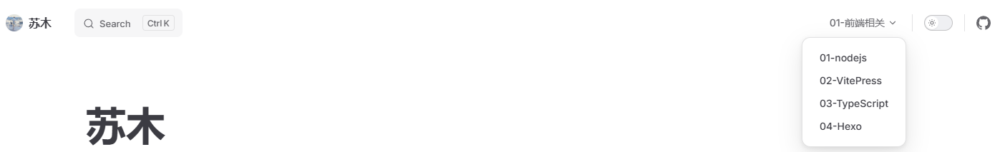
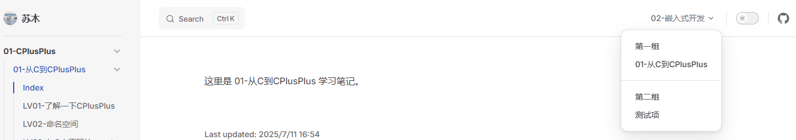
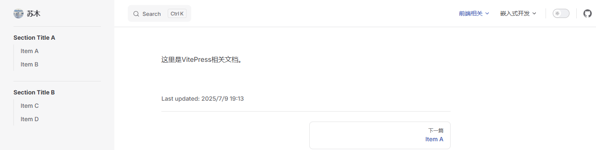
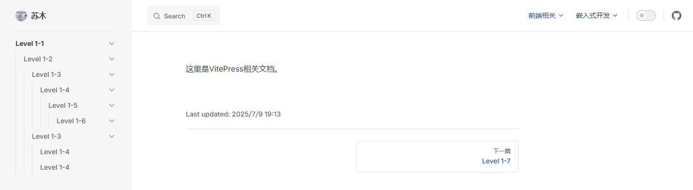
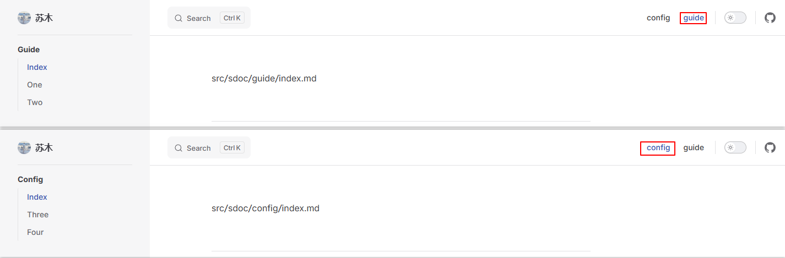

vitepress简洁到导航栏和侧边栏需要手动编写，导航栏就写几个就行，当文档多起来后，侧边栏写起来就很难受了。能自动生成吗？当然可以啦。

<!-- more -->

## 一、语法格式？

首先肯定要先了解导航栏和侧边栏的数据结构，先看文档。

### 1. 导航栏

> 这里参考官方文档的：[导航栏 | VitePress](https://vitejs.cn/vitepress/reference/default-theme-nav)

#### 1.1 数据结构

导航栏的数据结构定义在 [vitepress/types/default-theme.d.ts at main · vuejs/vitepress · GitHub](https://github.com/vuejs/vitepress/blob/main/types/default-theme.d.ts#L165) ：

```typescript
export type NavItem = NavItemComponent | NavItemWithLink | NavItemWithChildren
```

这个表示 NavItem 是一个 TypeScript 的联合类型(Union Type)，表示 NavItem 可以是NavItemComponent、NavItemWithLink、NavItemWithChildren三种类型中的任意一种。

##### 1.1.1 [NavItemComponent](https://github.com/vuejs/vitepress/blob/main/types/default-theme.d.ts#L167)

[NavItemComponent](https://github.com/vuejs/vitepress/blob/main/types/default-theme.d.ts#L167) 定义如下：

```typescript
export interface NavItemComponent {
  component: string
  props?: Record<string, any> // `?` 表示这是可选属性
}

// component: string类型，指定要使用的Vue组件名称或路径
// props    ：Record<string, any> (键为string，值为任意类型的对象)类型，用于向组件传递任意数量和类型的props

```

##### 1.1.2 [NavItemWithLink](https://github.com/vuejs/vitepress/blob/main/types/default-theme.d.ts#L172)

[NavItemWithLink](https://github.com/vuejs/vitepress/blob/main/types/default-theme.d.ts#L172) 是表示带有URL的导航栏项：

```javascript
export interface NavItemWithLink {
  text: string   // 导航显示的文本
  link: string   // 导航链接URL
  items?: never  // never类型，表示禁止含有子项

  /**
   * `activeMatch` is expected to be a regex string. We can't use actual
   * RegExp object here because it isn't serializable
   */
  activeMatch?: string
  rel?: string
  target?: string
  noIcon?: boolean
}
```

从这个数据类型来看，这个是禁止含有子项。也就是说，导航栏要想能够点击后跳转到对应的链接，就不能带有子项。

##### 1.1.3 [NavItemWithChildren](https://github.com/vuejs/vitepress/blob/main/types/default-theme.d.ts#L192)

[NavItemWithChildren](https://github.com/vuejs/vitepress/blob/main/types/default-theme.d.ts#L192) 是表示带有子项的导航栏项：

```typescript
export interface NavItemWithChildren {
  text?: string
  items: (NavItemComponent | NavItemChildren | NavItemWithLink)[]

  /**
   * `activeMatch` is expected to be a regex string. We can't use actual
   * RegExp object here because it isn't serializable
   */
  activeMatch?: string
}
```

- text是导航显示的文本，这里是个可选项，要是不填写的话也没问题，会显示 `...` 

- items 是一个数组类型（由`[]`表示）数组中的每个元素可以是这三种类型之一（由`|`表示联合类型）：`NavItemComponent`组件形式的导航项、`NavItemChildren`带子项的导航分组、`NavItemWithLink`带链接的基础导航项。这种类型用于定义导航菜单中可以包含的各种子项类型。

带有子项的导航栏组是没有link属性的，这就表示不能通过它跳转到对应的URL。

##### 1.1.4 [NavItemChildren](https://github.com/vuejs/vitepress/blob/main/types/default-theme.d.ts#L187) 

[NavItemChildren](https://github.com/vuejs/vitepress/blob/main/types/default-theme.d.ts#L187) 定义如下，这个表示带子项的导航分组：

```typescript
export interface NavItemChildren {
  text?: string            // 分组标题文本
  items: NavItemWithLink[] // 这个导航栏项包含的子项
}
```

#### 1.2 使用实例

##### 1.2.1 `NavItemWithLink`带链接的基础导航项

```typescript
export default defineConfig({
  //......
  themeConfig: {
    // https://vitepress.dev/reference/default-theme-config
    nav: [
      { text: '01-前端相关', link: '/sdoc/01-前端相关/' },
    ],
  }
})
```

点击后显示 `/sdoc/01-前端相关/index.md`文件内容，导航栏如下所示：


##### 1.2.2 `NavItemWithChildren`带子项的导航项

```typescript
export default defineConfig({
  //......
  themeConfig: {
    // https://vitepress.dev/reference/default-theme-config

    nav: [
      {
        text: '01-前端相关',
        items: [
          { text: '01-nodejs', link: '/sdoc/01-前端相关/01-nodejs/' },
          { text: '02-VitePress', link: '/sdoc/01-前端相关/02-VitePress/' },
          { text: '03-TypeScript', link: '/sdoc/01-前端相关/03-TypeScript/' },
          { text: '04-Hexo', link: '/sdoc/01-前端相关/04-Hexo/' },
        ],
      }, // 产生下拉列表，带有子项，此时无法添加link属性，一级导航栏无链接可跳转。
    ],
  }
})
```

这个带有点击后显示01-nodejs、02-VitePress、03-TypeScript、04-Hexo四个子项，每个子项都带有link属性，点击后跳转到对应目录下的index.md文档，生成的导航栏如下所示：




##### 1.3.3 再嵌套一层？

还能继续嵌套：

```javascript
export default defineConfig({
  //......
  themeConfig: {
    nav: [
      {
        text: '02-嵌入式开发',
        items: [
          {
            text: '第一组',
            items: [
              { text: '01-从C到CPlusPlus', link: '...' },
            ]
          },
          {
            text: '第二组',
            items: [
              { text: '测试项', link: '...' },
            ]
          },
        ],
      }, // 显示二级目录深度，产生下拉列表，此时无法添加link属性，一级目录非超链接，无法点击。
    ],
  }
})

```

导航栏效果如下：



这个时候就到最大嵌套层级了。

### 2. 侧边栏

#### 2.1 数据结构

侧边栏的数据结构定义在  [vitepress/types/default-theme.d.ts at main · vuejs/vitepress · GitHub](https://github.com/vuejs/vitepress/blob/main/types/default-theme.d.ts#L230) ：

```typescript
export type Sidebar = SidebarItem[] | SidebarMulti
```

这个也是一个联合体，

- `SidebarItem[]` - 简单数组形式：由多个`SidebarItem`对象组成的数组，适用于简单的单层或有限层级的侧边栏结构。
- `SidebarMulti` - 复杂映射形式。

##### 2.1.1 [SidebarItem](https://github.com/vuejs/vitepress/blob/main/types/default-theme.d.ts#L236)

```typescript
export type SidebarItem = {
  text?: string
  link?: string
  items?: SidebarItem[]
  collapsed?: boolean
  base?: string
  docFooterText?: string

  rel?: string
  target?: string
}
```

collapsed主要是控制侧边栏项是否可以折叠，为true的时候表示默认展开，false默认折叠，当没有这个属性时，默认展开但是不可折叠。

##### 2.1.2 [SidebarMulti](https://github.com/vuejs/vitepress/blob/main/types/default-theme.d.ts#L232)

```typescript
export interface SidebarMulti {
  [path: string]: SidebarItem[] | { items: SidebarItem[]; base: string }
}
```

#### 2.2 使用实例

##### 2.2.1 基本用法

```typescript
sidebar: [
  {
    text: 'Section Title A',
    items: [
      { text: 'Item A', link: '/item-a' },
      { text: 'Item B', link: '/item-b' },
    ]
  },
  {
    text: 'Section Title B',
    items: [
      { text: 'Item C', link: '/item-c' },
      { text: 'Item D', link: '/item-d' },
    ]
  }
],
```

会得到这样的效果：



每个 `link` 都应指定以 `/` 开头的实际文件的路径。如果在链接末尾添加斜杠，它将显示相应目录的 `index.md`。

##### 2.2.2 嵌套用法

可以进一步将侧边栏项目嵌入到 6 级深度，从根级别上计数。需要注意，深度超过 6 级将被忽略，并且不会在侧边栏上显示。

```typescript
sidebar: [
  {
    text: 'Level 1-1',
    collapsed: true,
    items: [
      { 
        text: 'Level 1-2',
        collapsed: true,
        items: [
          {
            text: 'Level 1-3', 
            collapsed: true,
            items: [
              {
                text: 'Level 1-4', 
                collapsed: true,
                items: [
                  {
                    text: 'Level 1-5', 
                    collapsed: true,
                    items: [
                       {
                        text: 'Level 1-6', 
                        collapsed: true,
                        items: [
                            {
                              text: 'Level 1-7', 
                              link: '...',
                            }
                        ]
                      } 
                    ]
                  }
                ]
              }
            ]
          },
          {
            text: 'Level 1-3',
            collapsed: true, 
            items: [
              {
                text: 'Level 1-4', 
                link: '...'
              },
              {
                text: 'Level 1-4', 
                link: '...'
              }
            ]
          }
        ]
      },
    ]
  },
],
```

我们会得到如下结构的侧边栏：



##### 2.2.3 多侧边栏

这个时候就要配合导航栏来演示了，因为要切换到对应的目录去，这里我们创建如下目录结构：

```shell
src
├── .vitepress/
├── examples/
├── index.md
├── public/
└── sdoc/
    ├── config
    │   ├── index.md
    │   ├── one.md
    │   └── two.md
    ├── guide
    │   ├── four.md
    │   ├── index.md
    │   └── three.md
    └── index.md
```

导航栏设置如下：

```typescript
nav: [
  { text: 'config', link: '/sdoc/config/' },
  { text: 'guide', link: '/sdoc/guide/' },
],
```

这样可以方便的切换到这两个目录去演示侧边栏。然后，更新配置以定义每个部分的侧边栏。这一次，应该**传递一个对象**而不是数组。侧边栏设置如下：

```typescript
sidebar: {
  // 当用户位于 `/sdoc/guide` 目录时，会显示此侧边栏
  '/sdoc/guide/': [
    {
      text: 'Guide',
      items: [
        { text: 'Index', link: '/sdoc/guide/' },
        { text: 'One', link: '/sdoc/guide/one' },
        { text: 'Two', link: '/sdoc/guide/two' }
      ]
    }
  ],
  // 当用户位于 `/sdoc/config` 目录时，会显示此侧边栏
  '/sdoc/config/': [
    {
      text: 'Config',
      items: [
        { text: 'Index', link: '/sdoc/config/' },
        { text: 'Three', link: '/sdoc/config/three' },
        { text: 'Four', link: '/sdoc/config/four' }
      ]
    }
  ]
},
```

然后我们会得到如下效果：



## 二、自动生成

一个一个写也太麻烦了，我们可以typescript或者javascript编写一个自动获取目录层级的插件，生成导航栏和侧边栏对应的数据结构。

### 1. 导航栏

#### 1.1 getNavData.mts

```typescript
import fs from 'fs'
import path from 'path'
import type { DefaultTheme } from 'vitepress'

/**
 * 清理目录名称 - 去除数字前缀 (如 "01-测试目录" -> "测试目录")
 */
function cleanDirName(dirName: string): string {
  // 匹配以数字和-开头的模式
  return dirName.replace(/^\d+-/, '')
}

// 深度限制常量
const MAX_DEPTH = 3
const MIN_DEPTH = 1

/**
 * @brief 递归扫描目录结构生成导航项
 * @param dirPath 要扫描的目录路径
 * @param baseLink 基础链接路径
 * @param excludeDirs 要排除的目录名数组
 * @param currentDepth 当前递归深度
 * @param maxDepth 最大递归深度
 * @return DefaultTheme.NavItem[] 生成的导航项数组
 */
function scanDirectory(
  dirPath: string,
  baseLink: string,
  excludeDirs: string[] = [],
  currentDepth: number = MIN_DEPTH,
  maxDepth: number = MAX_DEPTH
): DefaultTheme.NavItem[] {
  try {
    return fs.readdirSync(dirPath, { withFileTypes: true })
      .filter(dirent => {
        if (!dirent.isDirectory()) return false
        
        // 一次性读取目录内容避免重复IO
        const dirContents = fs.readdirSync(dirPath)
        return !dirContents.includes(`${dirent.name}.md`)
      })
      .map(dirent => {
        const originalName = dirent.name
        const displayName = cleanDirName(originalName)
        const fullPath = path.join(dirPath, originalName)
        const link = path.posix.join(baseLink, originalName, '/')
        
        // 检查子目录
        const children = currentDepth < maxDepth
          ? scanDirectory(
              fullPath, 
              link, 
              excludeDirs,
              currentDepth + 1,
              maxDepth
            )
          : []
        
        if (children.length > 0) {
          const navItem: DefaultTheme.NavItemWithChildren = {
            text: displayName,
            items: children as (DefaultTheme.NavItemWithLink | DefaultTheme.NavItemChildren)[]
          }
          return navItem
        } else {
          const navItem: DefaultTheme.NavItemWithLink = {
            text: displayName,
            link
          }
          return navItem
        }
      })
  } catch (err) {
    console.error(`Error reading directory ${dirPath}:`, err)
    return []
  }
}

/**
 * 生成导航栏数据
 * @param baseDir 基础目录路径
 * @param baseLink 基础链接路径
 * @param debug 是否调试模式
 * @returns 导航栏数据
 */
interface NavDataOptions {
  /** 目录名称，如 'sdoc' */
  dirName: string
  /** 是否调试模式 */
  debug?: boolean
  /** 要排除的目录名列表 */
  excludeDirs?: string[]
  /**
   * 最大递归深度 (1-3)
   * - 1: 只扫描当前目录
   * - 2: 当前目录+1层子目录 
   * - 3: 当前目录+2层子目录
   */
  maxDepth?: number
}

const DEFAULT_EXCLUDED_DIRS = ['.git', '.github', '.vscode', '.idea']

export function getNavData(
  options: NavDataOptions
): DefaultTheme.NavItem[] {
  const { dirName, debug = false, excludeDirs = [], maxDepth } = options
  
  // Set default maxDepth and validate range
  if (maxDepth === undefined) {
    options.maxDepth = MAX_DEPTH
  } else if (maxDepth > MAX_DEPTH) {
    console.warn(`Warning: maxDepth cannot exceed ${MAX_DEPTH}. Using maxDepth=${MAX_DEPTH} instead.`)
    options.maxDepth = MAX_DEPTH
  } else if (maxDepth < MIN_DEPTH) {
    console.warn(`Warning: maxDepth cannot be less than ${MIN_DEPTH}. Using maxDepth=${MIN_DEPTH} instead.`)
    options.maxDepth = MIN_DEPTH
  }
  const finalExcludeDirs = excludeDirs?.length ? excludeDirs : DEFAULT_EXCLUDED_DIRS
  const baseDir = path.join(__dirname, '..', dirName)
  const baseLink = `/${dirName}`
  const navData = scanDirectory(
    baseDir, 
    baseLink, 
    finalExcludeDirs,
    MIN_DEPTH, // currentDepth starts at MIN_DEPTH (current directory)
    options.maxDepth // pass through maxDepth option
  )
  
  if (debug) {
    console.log('Generated nav data:')
    console.log(JSON.stringify(navData, null, 2))
  }
  
  return navData
}

```

#### 1.2 config.mts

```typescript
import { defineConfig } from 'vitepress'
import { getNavData } from './getNavData.mts'

// https://vitepress.dev/reference/site-config
export default defineConfig({
  themeConfig: {
    nav: getNavData({
      dirName: 'sdoc',
      maxDepth: 3,
      debug: true
    }),
  }
})

```

### 2. 侧边栏

这里就不详细写了，可以看这里：[site-vitepress/src/.vitepress/getNavSidebar.mts at master · docs-site/site-vitepress · GitHub](https://github.com/docs-site/site-vitepress/blob/master/src/.vitepress/getNavSidebar.mts)


