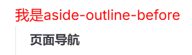
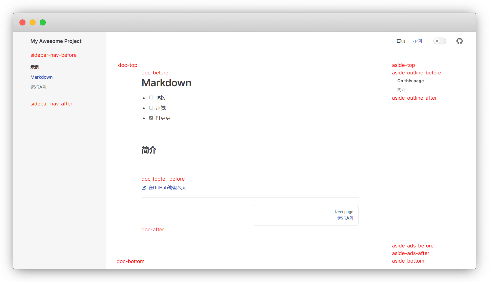
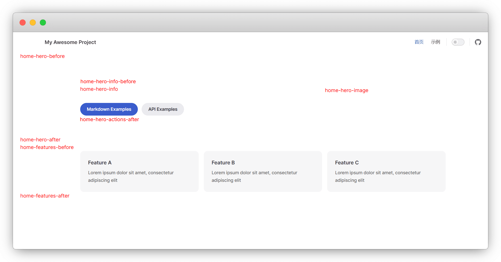
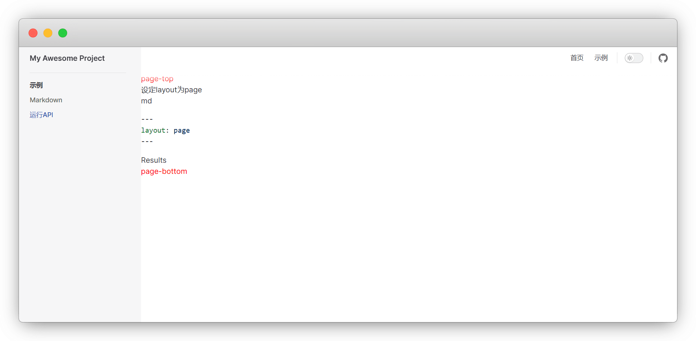
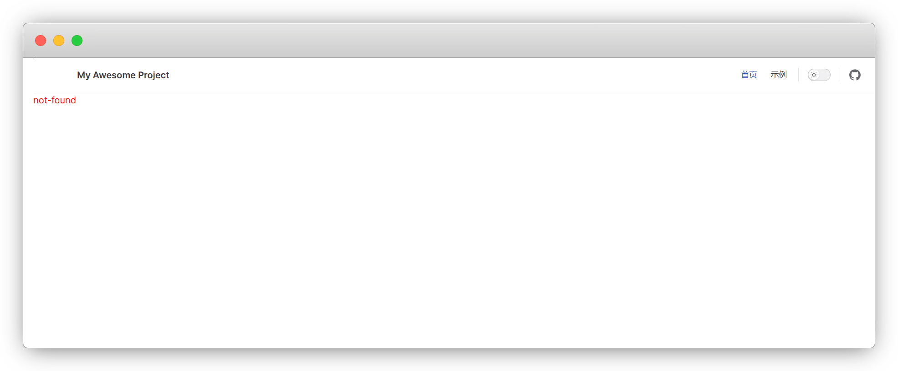
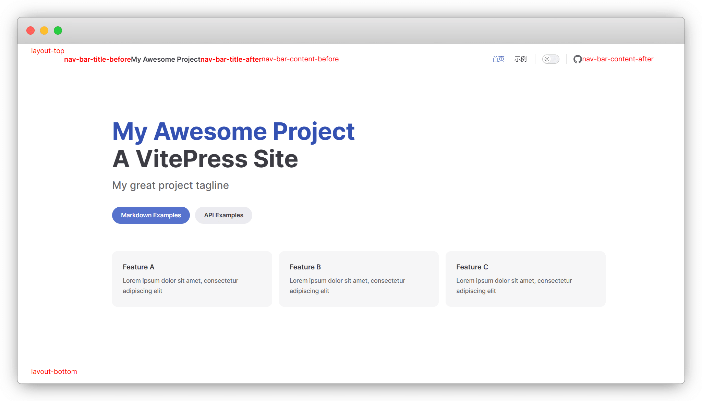

<!-- more -->

# 布局插槽

## 一、简介

Vitepress基于Vue3用到了 `<slot>` 插槽，在 `<Layout/>` 布局组件中预留了一些插槽，可以对页面布局进行自定义修改

但其实也是使用组件。

> tip 插槽与组件的区别
>
> * 插槽：有固定的孔位，适用于需要频繁显示的内容，比如：广告
>
> * 组件：无固定的孔位，适用于单次或少次显示内容，比如：视频播放


## 二、示例

开始前，请确保安装了 `vue` （一般都是安装的有的，因为vitepress也依赖vue）

```sh [npm]
npm i vue
```


一般使用上就是： `Layout` 赋值 和 `h函数` 渲染


|  方式  |   来源   |             类型              |    插槽位置    |
| :----: | :------: | :---------------------------: | :------------: |
| Layout | 内置框架 |             静态              |   写在组件中   |
| h函数  | Vue框架  | 动态，可以添加逻辑，传递props | 写在配置文件中 |


### 1. Layout

我们来做一个简单的示例。在 `.vitepress/theme/components` 目录新建一个 `MyComponent.vue` 组件

```bash
docs
├─ .vitepress
│  └─ config.mts
│  └─ theme
│  │   ├─ components
│  │   │   └─ MyComponent.vue    <-- 插槽组件
│  │   └─ index.ts
└─ index.md
```

复制下面代码并保存


```vue
<script setup lang="ts">
import DefaultTheme from 'vitepress/theme'
const { Layout } = DefaultTheme
</script>

<template>
    <Layout>
        <!-- 插槽 --> 
        <template #aside-outline-before>
          <!-- 这里写内容，下面是一个简单示例 -->
          <div class="title">我是aside-outline-before</div>
        </template>
    </Layout>
</template>

<style>
.title {
    color: red;
}
</style>
```


在 `.vitepress/theme/index.ts` 中引入生效


```typescript
// .vitepress/theme/index.ts
import DefaultTheme from 'vitepress/theme'
import MyComponent from './components/MyComponent.vue'

export default {
  extends: DefaultTheme,
  Layout: MyComponent,
}
```

会得到下面的效果：



但是这样只能单个使用，不适用组件多的情况。我们可以按照单组件的模板，将插槽组件集中在一起。在`.vitepress/theme/components` 目录新建一个 `MyLayout.vue` 布局组件

```bash
docs
├─ .vitepress
│  └─ config.mts
│  └─ theme
│  │   ├─ components
│  │   │   └─ MyLayout.vue    <-- 布局组件
│  │   └─ index.ts
└─ index.md
```

将需要的组件导入，书写格式如下：

```vue
<!-- .vitepress/theme/MyLayout.vue -->
<script setup lang="ts">
import DefaultTheme from 'vitepress/theme'
// 组件1、2、3
import MyComponent from "./MyComponent.vue";
import MyComponent2 from "./MyComponent2.vue";
import MyComponent3 from "./MyComponent3.vue";
</script>

<template>
  <DefaultTheme.Layout v-bind="$attrs">

    <!-- doc-footer-before插槽1个组件 -->
    <template #doc-footer-before>
      <MyComponent />
    </template>

    <!-- layout-top插槽2个组件 -->
    <template #layout-top>
      <MyComponent2 />
      <MyComponent3 />
    </template>

  </DefaultTheme.Layout>
</template>

<style scoped>
</style>
```


最后在 `.vitepress/theme/index.ts` 中引入生效


```typescript
// .vitepress/theme/index.ts
import DefaultTheme from 'vitepress/theme'
import MyLayout from './components/MyLayout.vue' // 导入布局组件

export default {
  extends: DefaultTheme,
  Layout: MyLayout, // 应用布局组件
}
```

### 2. h函数

由于h函数是Vue渲染层的底层 API，不需要写入 `<slot>` 插槽。直接导入现成的vue组件，在 `.vitepress/theme/index.ts` 中引入生效

```typescript
// .vitepress/theme/index.ts
import DefaultTheme from 'vitepress/theme'
import { h } from 'vue' // h函数
// 组件1、2、3、4
import MyComponent from "./MyComponent.vue";
import MyComponent2 from "./MyComponent2.vue";
import MyComponent3 from "./MyComponent3.vue";
import MyComponent3 from "./MyComponent4.vue";

export default {
  extends: DefaultTheme,
  Layout() {
    return h(DefaultTheme.Layout, null, {

      // 指定组件使用aside-outline-before插槽
      'aside-outline-before': () => h(MyComponent),

      // 指定组件使用doc-before插槽
      'doc-before': () => h(MyComponent2),

      // 指定多个组件同时使用layout-top插槽
      'layout-top': () => [
        h(MyComponent3),
        h(MyComponent4),
        ],

    })
  }
}
```

## 三、插槽表

不同的页面，可使用的插槽不同

### 1. doc

当 [Frontmatter](https://vitepress.yiov.top/frontmatter.html) 配置 `layout: doc` (默认)时插槽及位置

- doc-top
- doc-bottom
- doc-footer-before
- doc-before
- doc-after
- sidebar-nav-before
- sidebar-nav-after
- aside-top
- aside-bottom
- aside-outline-before
- aside-outline-after
- aside-ads-before
- aside-ads-after



### 2. home

当 [Frontmatter](https://vitepress.yiov.top/frontmatter.html) 配置 `layout: home` (默认)时插槽及位置

- home-hero-before
- home-hero-info
- home-hero-image
- home-hero-after
- home-features-before
- home-features-after



### 3. page

当 [Frontmatter](https://vitepress.yiov.top/frontmatter.html) 配置 `layout: page` (默认)时插槽及位置

- page-top
- page-bottom



### 4. 404

在未找到 (404) 页面上

- not-found



### 5. Always

所有布局均可使用

- layout-top
- layout-bottom
- nav-bar-title-before
- nav-bar-title-after
- nav-bar-content-before
- nav-bar-content-after
- nav-screen-content-before
- nav-screen-content-after



## 四、使用演示

### 1. 返回顶部

主要是移动端不方便，虽然大纲栏有 `Return to top`，但是得点一下。这里我们参考 [@wf0/monaco-editor-translate](https://github.com/wf0/monaco-editor-translate/blob/master/docs/.vitepress/theme/components/backTop.vue) 的 backTop 组件，加了一个下滑进度条显示。在 `theme/components` 文件夹，新建 `backtotop.vue` 组件


```bash
docs
├─ .vitepress
│  └─ config.mts
│  └─ theme
│  │   ├─ components
│  │   │   └─ back2top.vue
│  │   └─ index.ts
└─ index.md
```

在 `back2top.vue` 填入如下代码，保存

```vue [backtotop.vue]
<script setup>
import { onBeforeUnmount, onMounted, ref, computed } from "vue";

const showBackTop = ref(false); // 初始状态设为false
const scrollProgress = ref(0);

// 圆形进度条计算
const radius = 42;
const circumference = computed(() => 2 * Math.PI * radius);

function scrollToTop() {
  window.scrollTo({
    top: 0,
    behavior: "smooth",
  });
}

// 使用更高效的节流函数
function throttle(fn, delay = 50) {
  let timer = null;
  return function(...args) {
    if (!timer) {
      timer = setTimeout(() => {
        fn.apply(this, args);
        timer = null;
      }, delay);
    }
  };
}

const updateScrollProgress = () => {
  const { scrollY, innerHeight } = window;
  const { scrollHeight } = document.documentElement;
  const totalScroll = scrollHeight - innerHeight;
  scrollProgress.value = totalScroll > 0 ? Math.min(scrollY / totalScroll, 1) : 0;
};

const handleScroll = throttle(() => {
  // 当滚动超过100px时显示，否则隐藏
  const shouldShow = window.scrollY > 100;
  showBackTop.value = shouldShow;
  updateScrollProgress();
});

onMounted(() => {
  window.addEventListener("scroll", handleScroll);
  updateScrollProgress();
});

onBeforeUnmount(() => {
  window.removeEventListener("scroll", handleScroll);
});
</script>

<template>
  <Transition name="fade">
    <div class="back-top-container" v-show="showBackTop">
      <svg class="progress-ring" viewBox="0 0 100 100">
        <circle class="progress-ring-background" cx="50" cy="50" r="42" />
        <circle 
          class="progress-ring-circle" 
          cx="50" 
          cy="50" 
          r="42"
          :style="{'stroke-dashoffset': circumference - (scrollProgress * circumference)}"
        />
      </svg>
      <div 
        class="vitepress-backTop-main" 
        title="返回顶部" 
        @click="scrollToTop()"
      >
        <svg class="icon" viewBox="0 0 1024 1024" xmlns="http://www.w3.org/2000/svg">
          <path d="M634.847397 613.032044l-255.376295 0L379.471103 446.11443 181.752995 446.11443 511.080559 56.145741l329.327564 390.023948-205.561749 0L634.846374 613.032044 634.847397 613.032044zM634.847397 613.032044" fill="#FFF"/>
          <path d="M379.397425 689.408549c0-22.313192 18.099217-40.399105 40.411385-40.399105l177.258123 0c22.313192 0 40.385802 18.085914 40.385802 40.399105l0 0c0 22.318308-18.072611 40.403199-40.385802 40.403199L419.80881 729.811748C397.495618 729.812771 379.397425 711.726857 379.397425 689.408549L379.397425 689.408549z" fill="#FFF"/>
          <path d="M382.052904 817.972647c0-22.312168 18.099217-40.398082 40.411385-40.398082l177.258123 0c22.313192 0 40.385802 18.085914 40.385802 40.398082l0 0c0 22.319331-18.072611 40.404222-40.385802 40.404222L422.464289 858.376868C400.151098 858.376868 382.052904 840.291978 382.052904 817.972647L382.052904 817.972647z" fill="#FFF"/>
        </svg>
      </div>
    </div>
  </Transition>
</template>

<style scoped>
.back-top-container {
  position: fixed;
  bottom: 20px;
  right: 20px;
  width: 50px;
  height: 50px;
  z-index: 999;
}

.vitepress-backTop-main {
  position: absolute;
  top: 50%;
  left: 50%;
  transform: translate(-50%, -50%);
  cursor: pointer;
  width: 35px;
  height: 35px;
  border-radius: 50%;
  background-color: #3eaf7c;
  padding: 8px;
  box-shadow: 0 2px 8px rgba(0, 0, 0, 0.15);
  display: flex;
  align-items: center;
  justify-content: center;
  z-index: 2;
  transition: background-color 0.2s ease;
}

.vitepress-backTop-main:hover {
  background-color: #71cda3;
}

.progress-ring {
  position: absolute;
  width: 100%;
  height: 100%;
  transform: rotate(-90deg);
  z-index: 1;
}

.progress-ring-background {
  fill: none;
  stroke: rgba(62, 175, 124, 0.15);
  stroke-width: 3;
}

.progress-ring-circle {
  fill: none;
  stroke: #3eaf7c;
  stroke-width: 3;
  stroke-dasharray: 264; /* 2 * π * 42 */
  stroke-linecap: round;
  transition: stroke-dashoffset 0.15s ease-out;
}

.icon {
  width: 24px;
  height: 24px;
}

.fade-enter-active,
.fade-leave-active {
  transition: opacity 0.3s ease;
}

.fade-enter-from,
.fade-leave-to {
  opacity: 0;
}
</style>

```

此处的使用的是 [doc-footer-before](#doc) 插槽，配置方式是放在布局中：

```vue
<!-- .vitepress/theme/MainLayout.vue -->
<script setup lang="ts">
import DefaultTheme from 'vitepress/theme'
// 组件1
import backtotop from "./backtotop.vue";
</script>

<template>
  <DefaultTheme.Layout v-bind="$attrs">

    <!-- doc-footer-before插槽 -->
    <template #doc-footer-before>
      <backtotop />
    </template>

  </DefaultTheme.Layout>
</template>

<style scoped>
</style>
```