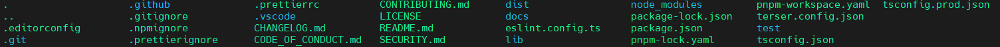
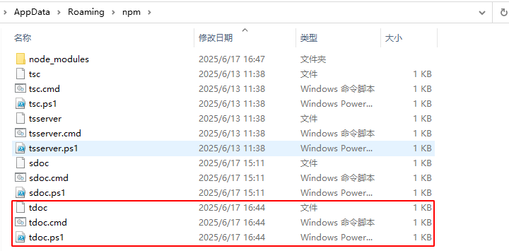
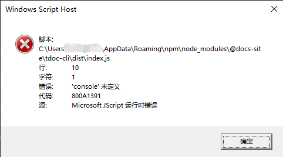
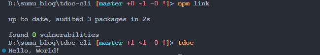
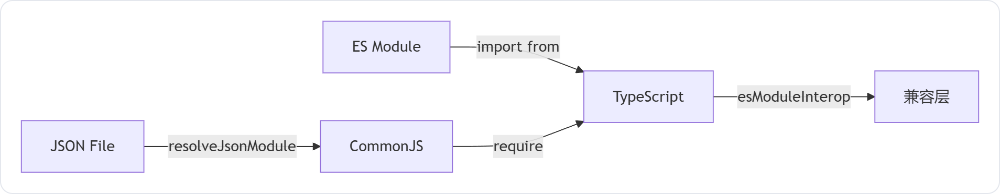

Hello，World！哈哈哈，这里是我的第一个TypeScript项目工程。

<!-- more -->

## 一、前言

### 1. 参考项目

#### 1. [jooy2/vitepress-sidebar](https://github.com/jooy2/vitepress-sidebar)

起因是自己看到说vitepress生成静态网页更快，所以就去看了，默认主题真的好简洁，挺喜欢的，但是，就是它的插件和主题并不像hexo、vuepress那么多，就连一个侧边栏都要自己手写，之后在网上看到有大佬写脚本生成侧边栏，直接解决了这个痛点，后来看了下大概的原理，大概就是扫描指定目录，获取目录和文件，过滤不需要的文件和目录，然后排序，最后生成符合vitepress侧边栏数据类型的对象，说起来很简单，但是对于我一个搞嵌入式的人来说，前端多少有些难度了，但是还是想折腾一把，就当学习了。首先就从Hello World开始吧。先看一下自动侧边栏那个插件项目：[GitHub - jooy2/vitepress-sidebar: 🔌 VitePress auto sidebar generator plugin. Easy to use and supports advanced customization.](https://github.com/jooy2/vitepress-sidebar)，它的一级目录结构如下：



像里面的`.git`、`.github`、`.vscode`等一下常用的目录和文件一看知道，它有什么用，怎么创建的，但是还有一些文件，之前是没接触过的，后面就来一个一个了解。

#### 2. [vuejs/vitepress](https://github.com/vuejs/vitepress)

[vuejs/vitepress](https://github.com/vuejs/vitepress)是 Vite & Vue动力静态站点生成器。也是一个cli工具，可以作为参考。

### 2. cli是什么？

CLI（command-line interface，命令行界面）是指可在用户提示符下键入可执行指令的界面，比如前端常用的脚手架，[yo](https://yeoman.io/)、[vue cli](https://cli.vuejs.org/zh/guide/)、[react cli](https://github.com/facebook/create-react-app) 等。它通常不支持鼠标，用户通过键盘输入指令，计算机接收到指令后，予以执行。像我们平常经常使用的 Git, npm 等都是CLI工具。

命令行界面（CLI）没有图形用户界面（GUI）那么方便用户操作。因为，命令行界面的软件通常需要用户记忆操作的命令，但是，由于其本身的特点，命令行界面要较图形用户界面节约计算机系统的资源。在熟记命令的前提下，使用命令行界面往往要较使用图形用户界面的操作速度要快。所以，图形用户界面的操作系统中，都保留着可选的命令行界面。


## 二、Hello，World!

### 1. npm项目

#### 1. 初始化项目

ts文件最后要被编译成js文件，我们运行js文件可以用nodejs，这样的话，我们可以创建一个npm项目，后面也方便管理要用到的依赖包。我们执行以下命令：

```shell
npm init -y # -y表示全部执行默认操作，也可以不加-y表示交互模式
```

后续是要发布到npm的，由于前面已经了解过命名空间了，我们这里直接选择当时创建的 [docs-site](https://www.npmjs.com/org/docs-site) 组织，项目命名为 [tdoc-cli](https://github.com/docs-site/tdoc-cli)，所以，执行以下命令初始化：

```shell
npm init --scope=docs-site
```

然后输入一些参数，就可以得到下面的`package.json`：

```json
{
  "name": "@docs-site/tdoc-cli",
  "version": "0.0.0",
  "description": "sumu's document processing cli tool. This is a TypeScript project.",
  "main": "src/index.ts",
  "scripts": {
    "test": "echo \"Error: no test specified\" && exit 1"
  },
  "repository": {
    "type": "git",
    "url": "git+https://github.com/docs-site/tdoc-cli.git"
  },
  "keywords": [
    "TypeScript",
    "cli"
  ],
  "author": "sumu",
  "license": "ISC",
  "bugs": {
    "url": "https://github.com/docs-site/tdoc-cli/issues"
  },
  "homepage": "https://github.com/docs-site/tdoc-cli#readme"
}

```

#### 1.2 生成package-lock.json

然后执行一下 `npm install`生成一下package-lock.json文件。

```shell
npm install
```

#### 1.3 添加文档

然后就是添加一个README.md文档，还可以添加一些LICENSE、CHANGELOG.md这些用于对项目的说明和修改记录的文档。

#### 1.4 创建index.ts

我们把源文件放到src目录下：

```shell
mkdir src
```

然后创建index.ts文件即可，创建后输入以下内容：

```typescript
console.log("Hello, World!");
```

#### 1.5 项目结构

```shell
tdoc-cli
├── .git
├── .gitignore
├── LICENSE
├── package-lock.json
├── package.json
├── README.md
└── src
    └── index.ts
```

### 2. 编译与运行

> Tips：后面会经常提到`npx` ，它是一种工具，可让我们运行 Node.js 包而无需全局安装它们。

#### 2.1 原生运行 TypeScript

> Tips：[Node.js 中文网 — 原生运行 TypeScript](https://nodejs.cn/en/learn/typescript/run-natively)

自 V22.6.0 以来，Node.js 通过 "类型剥离" 为某些 TypeScript 语法提供了实验性支持。我们可以直接在 Node.js 中编写有效的 TypeScript 代码，而无需先对其进行转译。[`--experimental-strip-types`](https://nodejs.cn/docs/latest-v22.x/api/cli.html#--experimental-strip-types) 标志告诉 Node.js 在运行 TypeScript 代码之前从中剥离类型注释。

```shell
node --experimental-strip-types src/index.ts
```

现在可以在 Node.js 中直接运行 TypeScript 代码，而无需先对其进行转译，并使用 TypeScript 捕获与类型相关的错误。但是好像会报个警告：

```shell
D:\sumu_blog\tdoc-cli [master +2 ~0 -0 !]> node --experimental-strip-types src/index.ts
Hello, World!
(node:18256) ExperimentalWarning: Type Stripping is an experimental feature and might change at any time
(Use `node --trace-warnings ...` to show where the warning was created)
```

#### 2.2 使用运行器运行TypeScript

> Tips：[Node.js 中文网 — 使用运行器运行 TypeScript](https://nodejs.cn/en/learn/typescript/run)

如果想要比内置支持更高级的 TypeScript 处理（或者使用的是 v22.7.0 之前的 Node.js），我们有 2 个选项：使用运行器（它可以为我们处理大部分复杂性），或者通过 [transpilation](https://nodejs.cn/en/learn/typescript/transpile) 自行处理所有问题。

##### 2.2.1 [`ts-node` ](https://nodejs.cn/en/learn/typescript/run#使用-ts-node-运行-typescript-代码)

[ts-node](https://typestrong.org/ts-node/) 是 Node.js 的 TypeScript 执行环境。它允许我们直接在 Node.js 中运行 TypeScript 代码，而无需先编译它。默认情况下，`ts-node` 执行类型检查，除非启用 `transpileOnly`。虽然 `ts-node` 可以在运行时捕获类型错误，但仍建议在发布代码之前先使用 `tsc` 对其进行类型检查。

要使用 `ts-node`，需要先安装它：

```bash
npm i -D ts-node
```

然后我们可以像这样运行 TypeScript 代码：

```bash
npx ts-node src/index.ts
```

##### 2.2.2 [`tsx` ](https://nodejs.cn/en/learn/typescript/run#使用-tsx-运行-typescript-代码)

[tsx](https://tsx.is/) 是 Node.js 的另一个 TypeScript 执行环境。它允许我们直接在 Node.js 中运行 TypeScript 代码，而无需先编译它。但请注意，它不会对我们的代码进行类型检查。因此，我们建议在交付之前先使用 `tsc` 对代码进行类型检查，然后使用 `tsx` 运行它。

要使用 `tsx`，需要先安装它：

```bash
npm i -D tsx
```

然后可以通过npx像这样运行 TypeScript 代码：

```bash
npx tsx src/index.ts
```

不想使用npx的话，还可以通过 `node` 使用 `tsx`，可以通过 `--import` 注册 `tsx`：

```bash
node --import=tsx src/index.ts
```

#### 2.3 转译运行TypeScript

##### 2.3.1 `tsc`

> Tips：
>
> [Node.js 中文网 — 使用转译运行 TypeScript 代码](https://nodejs.cn/en/learn/typescript/transpile)
>
> [TypeScript 中文网: 文档 - 5 分钟了解 TypeScript 工具](https://ts.nodejs.cn/docs/handbook/typescript-tooling-in-5-minutes.html)

运行 TypeScript 代码的最常见方法是先将其编译为 JavaScript。我们可以使用 TypeScript 编译器 `tsc` 执行此操作。它 是 TypeScript 的命令行工具，它负责将 TypeScript 代码编译成标准的 JavaScript 代码。

在开发过程中，类型检查是 TypeScript 的一个重要特性，`tsc` 可以通过静态分析代码，帮助开发者发现潜在的错误。可以安装到项目中，不过后来感觉不是很方便，也可以直接全局安装：

```shell
npm install -D typescript # 局部安装到当前项目
npm install -g typescript # 全局安装
```

##### 2.3.2 怎么编译？

如果是局部安装的tsc工具，不能直接使用，可以通过npm run命令来实现，我们在package.json添加脚本：

```json
  "scripts": {
    "test": "echo \"Error: no test specified\" && exit 1",
    "bin:b": "tsc src/index.ts --outDir dist"
  },
```

其中`--outDir`可以指定输出目录，然后执行以下命令：

```shell
npm run bin:b
```

如果是全局安装的哈，就可以直接执行：

```shell
tsc src/index.ts --outDir dist
```

或者就是使用npx：

```shell
npx tsc src/index.ts --outDir dist
```

就会在dist目录下生成 index.js 文件。

> Tips：相关的编译选项可以看这里 [tsc CLI 选项 - TypeScript 中文文档](https://nodejs.cn/typescript/project-config/compiler-options/#compiler-options)

##### 2.3.3 怎么运行？

生成index.js文件后，我们可以通过node命令运行：

```shell
node ./dist/index.js
```

然后就能看到打印出了Hello, World!。

## 三、tdoc命令

接下来，我们创建一个简单的tdoc的命令，当我们在cmd输入tdoc -v的时候可以打印出package.json中的版本号以及依赖的版本号。

### 1. `package.json`——`bin`

先来了解一下 [package.json - bin](https://npm.nodejs.cn/cli/v11/configuring-npm/package-json#bin) ，这个 bin 字段通常用于创建全局命令。许多包都有一个或多个可执行文件，他们希望将它们安装到 PATH 中。npm 使这非常容易（事实上，它使用此功能来安装 "npm" 可执行文件。）

要使用它，需要在 package.json 中提供一个 `bin` 字段，它是命令名称到本地文件名的映射。全局安装此软件包时，该文件将链接到全局 bins 目录中，或者将创建一个 cmd（Windows 命令文件）来执行 `bin` 字段中的指定文件，因此它可以由 `name` 或 `name.cmd` 运行（在 Windows PowerShell 上）。

当此包作为依赖安装在另一个包中时，该文件将被链接到该包可以直接通过 `npm exec` 或通过 `npm run` 调用它们时在其他脚本中的名称可用的位置。

例如， myapp 可能有这个：

```json
{
  "bin": {
    "myapp": "bin/cli.js"
  }
}
```

因此，当我们安装 myapp 时，如果是类 unix 的操作系统，它会创建一个从 `cli.js` 脚本到`/usr/local/bin/myapp` 的符号链接，如果是 Windows，它通常会在 `C:\Users\{Username}\AppData\Roaming\npm\myapp.cmd` 创建一个运行 `cli.js` 脚本的 cmd 文件。

如果我们有一个可执行文件，并且它的名称应该是包的名称，那么可以将其作为字符串提供。例如：

```json
{
  "name": "my-program",
  "version": "1.2.5",
  "bin": "path/to/program"
}
```

将与此相同：

```json
{
  "name": "my-program",
  "version": "1.2.5",
  "bin": {
    "my-program": "path/to/program"
  }
}
```

需要注意，请确保我们在 `bin` 中引用的文件以 `#!/usr/bin/env node` 开头，否则脚本将在没有 node 可执行文件的情况下启动！

### 2. tdoc命令创建

#### 2.1 新增bin属性

我们来修改一下 `package.json`：

```json
{
  "bin" : {
	"tdoc": "./dist/index.js"
  },
}
```

然后在`package.json`所在目录，通过下面的命令本地安装到全局：

```shell
npm link
```

就会看到这里出现了我们的tdoc命令：



我们来执行一下：

```shell
tdoc
```

然后就会报错或者弹出用其他软件打开之类的弹窗：



#### 2.2 问题解决

其实上面都说了，要确保我们在 `bin` 中引用的文件以 `#!/usr/bin/env node` 开头，否则脚本将在没有 node 可执行文件的情况下启动！但是我们得到的index.js是编译出来的，我试过可以直接添加到ts文件里，但是感觉也不是很合适。那怎么办？

可以参考一下[vuejs/vitepress](https://github.com/vuejs/vitepress/blob/main/package.json)，这个项目是这样做的，来看一下`package.json`：

```json
"bin": {
    "vitepress": "bin/vitepress.js"
  },
```

顺着这个再看一下`bin/vitepress.js`：

```javascript
#!/usr/bin/env node
// @ts-check

import module from 'node:module'
//......
import('../dist/node/cli.js')
```

看到这里就懂了，是创建了一个js文件，在里面导入我们实际的js文件。所以，这里我们创建一个`bin/tdoc-cli.js`文件：

```javascript
#!/usr/bin/env node
import('../dist/index.js');
```

然后`package.json`修改为：

```json
{
  "bin" : {
	"tdoc": "./bin/tdoc-cli.js"
  },
}
```

然后我们重新`npm link`，然后执行就没问题了：



### 3. 显示版本

#### 3.1 [tj/commander.js](https://github.com/tj/commander.js) 

接下来就是实现`tdoc -v`显示版本了，这个需要处理命令行参数，我们可以使用 [tj/commander.js](https://github.com/tj/commander.js) ，它是一个完整的 [node.js](http://nodejs.org/) 命令行解决方案。说明文档可以看这里： [开发文档 | Commander 中文网](https://commander.nodejs.cn/docs/)，要想使用的话我们通过以下命令安装：

```shell
npm install -D commander
```

#### 3.2 index.ts

##### 3.2.1 功能实现

我们修改`index.ts`文件如下：

```typescript
import { Command } from 'commander'
import pkg from '../package.json'

const program = new Command(pkg.name);

function getVersionInfo(): string {
  const depsInfo = Object.entries(pkg.devDependencies)
    .map(([name, version]) => `  ${name}: ${version}`)
    .join('\n');
  return `${pkg.name}: ${pkg.version}\n\ndevDependencies:\n${depsInfo}`;
}

program.version(
  getVersionInfo(),
  '-v, --version',
  '显示版本信息和依赖包'
);

program.parse(); // 参数处理

```

然后编译，会直接报错。

##### 3.2.2 编译问题

- （1）第一个问题

先看第一个问题，因为后面的问题可能是第一个问题引起的：

```shell
node_modules/commander/typings/index.d.ts:335:6 - error TS2583: Cannot find name 'Map'. Do you need to change your target library? Try changing the 'lib' compiler option to 'es2015' or later.

335   ): Map<string, T[]>;
```

TypeScript 编译器在当前的编译环境中无法识别 `Map` 类型。这是因为 `Map` 是 ES2015（也称为 ES6）中引入的内置对象。所以我们这里修改编译命令如下：

```json
"bin:b": "tsc ./src/index.ts --outDir dist --lib esnext",
```

主要是添加了[lib](https://www.typescriptlang.org/tsconfig/#lib)选项，这里**显式指定 TypeScript 编译器使用哪些内置库声明文件**，`esnext` 也并不是某个具体 ES 版本（如 ES2025），而是 **流动的最新标准集合**。

（2）第二个问题

然后重新编译，还是有问题：

```shell
src/index.ts:12:17 - error TS2732: Cannot find module '../package.json'. Consider using '--resolveJsonModule' to import module with '.json' extension.

12 import pkg from '../package.json'
```

TypeScript 编译器无法解析 JSON 文件导入，根本原因是 **编译器未启用 JSON 模块解析功能**。当你尝试导入 `package.json` 这类 JSON 文件时：

```typescript
import pkg from '../package.json'
```

编译器会报错，因为默认配置下 TypeScript 不允许直接导入 JSON 文件。这个时候TypeScript 需要显式启用 `resolveJsonModule` 选项才能识别 JSON 导入，我们继续修改编译命令：

```json
"bin:b": "tsc ./src/index.ts --outDir dist --lib esnext --resolveJsonModule",
```

[resolveJsonModule](https://www.typescriptlang.org/tsconfig/#resolveJsonModule)就是启用导入 .json 文件。

- （3）第三个问题

然后我们重新编译，继续报错：

```shell
src/index.ts:12:8 - error TS1259: Module '"D:/sumu_blog/tdoc-cli/package"' can only be default-imported using the 'esModuleInterop' flag

12 import pkg from '../package.json'
          ~~~

  package.json:1:1
    1 {
      ~
    This module is declared with 'export =', and can only be used with a default import when using the 'esModuleInterop' flag. 
```

这个问题是因为TypeScript 编译器拒绝 JSON 文件的默认导入语法，根本原因是 **CommonJS 模块与 ES 模块的导出机制冲突**。当尝试使用 ES 模块的默认导入语法：

```ts
import pkg from '../package.json'  // 默认导入
```

导入一个本质是 CommonJS 模块（使用 `export =` 语法）的 JSON 文件时，需要特殊兼容处理。

JSON 文件被解析为 CommonJS 模块（使用 `export =` 导出），而 ES 模块的 `import from` 语法期望默认导出（`export default`），前面我们通过 `resolveJsonModule` 导入的 JSON 文件会被特殊处理为 CommonJS 模块，我们可以修改编译命令：

```json
"bin:b": "tsc ./src/index.ts --outDir dist --lib esnext --resolveJsonModule --esModuleInterop",
```

[esModuleInterop](https://www.typescriptlang.org/tsconfig/#esModuleInterop)选项可以生成兼容代码来转换模块系统差异。然后再编译就没问题了。 模块系统差异示意图：



##### 3.2.3 生成目录问题

增加版本显示功能后，dist目录结构变成这样了：

```shell
.
+--- package.json
+--- src
|   +--- index.js
```

搜了一下，大概是因为启用了 `--resolveJsonModule` 选项，这会导致：

（1）如果 `index.ts` 中存在导入 `package.json` 的语句（如 `import pkg from '../package.json'`）

（2）TypeScript 会自动将引用的 JSON 文件复制到输出目录（`dist`），并保持相对路径关系。

我们可以通过 `--rootDir` 指定源文件根目录：

```bash
tsc ./src/index.ts --outDir dist --rootDir ./src --lib esnext --resolveJsonModule --esModuleInterop
```

其中`--rootDir ./src` 显式声明源文件根目录，输出时自动剥离 `src` 路径层级。然后重新编译就可以了。

### 4. CommonJs和Es Module

#### 4.1 解决什么问题？

早期`JavaScript`模块这一概念，都是通过`script`标签引入`js`文件代码。当然这写基本简单需求没有什么问题，但当我们的项目越来越庞大时，我们引入的`js`文件就会越多，这时就会出现以下问题：

- js文件作用域都是顶层，这会造成变量污染
- js文件多，变得不好维护
- js文件依赖问题，稍微不注意顺序引入错，代码全报错

为了解决以上问题`JavaScript`社区出现了`CommonJs`，`CommonJs`是一种模块化的规范，包括现在的`NodeJs`里面也采用了部分`CommonJs`语法在里面。它解决了什么问题？

- 解决变量污染问题，每个文件都是独立的作用域，所以不存在变量污染
- 解决代码维护问题，一个文件里代码非常清晰
- 解决文件依赖问题，一个文件里可以清楚的看到依赖了那些其它文件

ES 模块，也称为 ECMAScript 模块，是 JavaScript 的原生模块化标准，于 2015 年引入。也可以解决上面的问题。由于ES 模块是 JavaScript 的原生模块化标准，提供严格的作用域隔离和静态导入等现代功能，所以ES 模块也会更受青睐。

#### 4.2 都有什么特点？

##### 4.2.1 CommonJS 模块

CommonJS 模块是一种流行的模块化标准，在 Node.js 中广泛使用。它先于 ES 模块出现，并有着自己独特的特点：

- **动态加载：** CommonJS 模块采用 `require()` 函数动态加载模块，这意味着模块在运行时被查找和执行。
- **单例：** 每一次调用 `require()` 都会返回同一模块实例，呈现出单例模式。
- **全局作用域：** CommonJS 模块在全局作用域内运行，这可能会导致变量冲突和命名空间污染。

##### 4.2.2 ES 模块

- **静态导入：** ES 模块利用 `import` 语句静态导入模块，这消除了运行时查找模块的开销。
- **严格作用域隔离：** 模块中的导入和导出是严格作用域隔离的，避免了变量冲突和耦合问题。
- **Tree shaking：** Tree shaking 是 ES 模块的杀手锏，可以移除未使用的代码，从而优化代码包大小。

#### 4.3 代码示例

为了进一步理解差异，让我们来看看 ES 模块和 CommonJS 模块的代码示例：

**ES 模块：**

```javascript
// foo.js
export const foo = 'bar';

// main.js
import { foo } from './foo.js';

console.log(foo); // 输出: "bar"
```

**CommonJS 模块：**

```javascript
// foo.js
module.exports = 'bar';

// main.js
const foo = require('./foo.js');

console.log(foo); // 输出: "bar"
```

在 ES 模块中，我们使用 `export` 和 `import` 语句导出和导入模块，而 CommonJS 模块中则使用 `module.exports` 和 `require()` 函数。看到这里，大概就可以理解为什么上面编译的时候要开启esModuleInterop了。

## 四、ts项目配置

有没有觉得上面的编译命令越来越长了？

```json
"scripts": {
    "bin:b": "tsc ./src/index.ts --outDir dist --rootDir ./src --lib esnext --resolveJsonModule --esModuleInterop",
  },
```

能不能有个专门的文件来配置？当然可以啦，我们先来看 tsconfig.json文件，它是什么？有什么用？这里我们可以参考：[项目配置 - TypeScript 中文文档](https://nodejs.cn/typescript/project-config/)

### 1. tsconfig.json

#### 1.1 什么是 tsconfig.json

目录中存在 `tsconfig.json` 文件表明该目录是 TypeScript 项目的根目录。`tsconfig.json` 文件**指定编译项目所需的根文件和编译器选项**。对于JavaScript 项目可以改用 `jsconfig.json` 文件，它的作用几乎相同，但默认启用了一些与 JavaScript 相关的编译器标志。

项目通过使用 tsconfig.json 或 jsconfig.json进行编译：

- 通过在没有输入文件的情况下调用 tsc，在这种情况下，编译器会从当前目录开始搜索 `tsconfig.json` 文件，并继续沿父目录链向上。
- 通过在没有输入文件和 `--project`（或只是 `-p`）命令行选项的情况下调用 tsc，该选项指定包含 `tsconfig.json` 文件的目录的路径，或包含配置的有效 `.json` 文件的路径。

在命令行上指定输入文件时，`tsconfig.json` 文件将被忽略。

#### 1.2 一般格式

`tsconfig.json`文件的格式，是一个 JSON 对象，最简单的情况可以只放置一个空对象`{}`。下面是一个示例。

```json
{
  "compilerOptions": {
    "outDir": "./dist",
    "allowJs": true,
    "target": "es5"
  },
  "include": ["./src/**/*"]
}
```

- `include`：指定哪些文件需要编译。
- `allowJs`：指定源目录的 JavaScript 文件是否原样拷贝到编译后的目录。
- `outDir`：指定编译产物存放的目录。
- `target`：指定编译产物的 JS 版本。

#### 1.3 怎么生成？

`tsconfig.json`文件可以不必手写，使用 tsc 命令的`--init`参数自动生成。

```shell
tsc --init
```

通过命令生成的`tsconfig.json`文件，里面会有一些默认配置。配置含义我们可以查阅：[TypeScript: TSConfig 参考 - 所有 TSConfig 选项的文档](https://www.typescriptlang.org/zh/tsconfig/)

我们也可以使用别人预先写好的 tsconfig.json 文件，npm 的`@tsconfig`名称空间下面有很多模块，都是写好的`tsconfig.json`样本，比如 `@tsconfig/recommended`和`@tsconfig/node16`。这些模块需要安装，以`@tsconfig/deno`为例。

```shell
npm install --save-dev @tsconfig/deno
```

安装以后，就可以在`tsconfig.json`里面引用这个模块，相当于继承它的设置，然后进行扩展。

### 2. tsconfig.prod.json

当运行`tsc`命令的时候，默认会使用当前目录下的`tsconfig.json`文件，但是要是想用其他的就可以通过`tsc`的`-p`或者`--project`参数来指定配置文件。所以还会看到有些项目有 `tsconfig.prod.json`文件，在这个文件中可以用`extends`来继承另一个配置，然后覆盖或者添加选项，例如：

```json
{
  "extends": "./tsconfig.json",
  "exclude": ["test/**/*.test.ts", "docs-dist/*", "docs/.vitepress/*"]
}
```

extends后面就是要继承的文件，exclude就是要排除的目录及文件。需要注意的是，在使用`tsc -p`来指定配置文件的时候，配置文件必须是要存在的，不然会报错。

### 3. 使用实例

#### 3.1 `tsconfig.json`

我们创建一个 `tsconfig.json` 文件，直接通过`tsc init`生成一个默认的，默认配置如下：

```json
{
  "compilerOptions": {
    "target": "es2016",
    "module": "commonjs",
    "esModuleInterop": true,
    "forceConsistentCasingInFileNames": true,
    "strict": true,
    "skipLibCheck": true
  }
}
```

但是默认的的话，对vscode来说，自动的语法检查会先按照这个文件进行检查，所以这样就可能有些问题，不在意的话可以不管，最后编译没问题就行。我们再定义一个`tsconfig.prod.json`：

```json
{
	"extends": "./tsconfig.json",      // 继承基础配置
	"compilerOptions": {
		"target": "ES2020",              // 编译目标ES版本
		"lib": ["esnext"],               // 使用的库声明
		"rootDir": "./src",              // 源代码目录
		"resolveJsonModule": true,       // 允许导入JSON模块
		"outDir": "./dist",              // 输出目录
		"sourceMap": false,              // 生成sourcemap用于调试
		"esModuleInterop": true,         // 支持CommonJS/ES模块互操作
		"strict": true,                  // 启用所有严格类型检查
	},
	"include": [                       // 包含的文件
		"src/**/*.ts"
	], 
	"exclude": [                       // 排除的文件
		"node_modules"
	] 
}
```

#### 3.2 `package.json`

修改`package.json`如下：

```json
{
  //......
  "scripts": {
    "test": "echo \"Error: no test specified\" && exit 1",
    "build": "tsc --project tsconfig.prod.json",
    "start": "node ./dist/index.js"
  },
  //......
}
```

#### 3.4 编译运行

和上面一样，执行`npm run build`或者全局安装了`tsc`的话，直接执行`tsc`也行。运行的话就是`node ./dist/index.js`或者`npm run start`。

## 五、Prettier - Code formatter

### 1. Prettier 是什么？

直接看官网把：[Prettier 中文网 · Prettier 是一个“有态度”的代码格式化工具](https://www.prettier.cn/)，Prettier 是一种前端代码格式化工具，支持javascript、jsx、typescript、css,less和scss、html、vue、angular、json、markdown等多种前端技术语言格式化。

> Tips：这里有一个配置文档可以参考：[什么是 Prettier？ · Prettier 中文网](https://prettier.nodejs.cn/docs/)

### 2. VSCode中使用

我们可以直接在vscode扩展中搜索安装这个扩展：

```txt
名称: Prettier - Code formatter
ID: esbenp.prettier-vscode
说明: Code formatter using prettier
版本: 11.0.0
发布者: Prettier
VS Marketplace 链接: https://marketplace.visualstudio.com/items?itemName=esbenp.prettier-vscode
```

怎么配置？我们直接在工程中创建 `.vscode`目录，然后创建两个文件：

- `.vscode/extensions.json`：这个文件可以用于**管理项目推荐的扩展插件**。它可以帮助团队统一开发环境，确保所有协作者使用相同的工具链。

```json
{
  "recommendations": ["esbenp.prettier-vscode"]
}
```

- `.vscode/settings.json`：这个配置文件针对工作区生效。

```json
{
  "files.autoSave": "afterDelay", // 文件自动保存
  "editor.formatOnSave": true, // 保存时格式化代码
  "editor.wordWrap": "on",
  "editor.defaultFormatter": "esbenp.prettier-vscode",
  "[javascript]": {
    "editor.defaultFormatter": "esbenp.prettier-vscode"
  },
  "editor.tabSize": 2,        // json、js、ts等文件常见的还是2个空格
  "prettier.embeddedLanguageFormatting": "off",
  "prettier.enable": true
}
```

我们还需要创建vscode的代码格式化规则文件，在工程目录创建即可，这个会在后面说明。

### 3. 项目中使用

#### 3.1 prettier依赖包

如果想在项目中使用prettier，这种方式可以直接格式化整个项目或者是整个目录。建议项目中一定要安装prettier和统一好格式化规则。首先下载prettier依赖，为项目添加格式化依赖。例如：

```shell
npm install --save-dev prettier
```

#### 3.2 检查目录及子目录文件格式化情况

我们执行下面的命令可以检查指定目录和子目录的文件格式化情况：

```shell
npx prettier . --check
```

npx 随 npm 提供，可以让我们直接运行本地安装的工具。在执行命令前记得先安装prettier依赖包，不然npx会下载最新版的prettier格式化代码。后续可以在npm项目的`package.json`中编写执行脚本来使用。执行后会有以下打印信息，这里面就是扫描到的没有处理过的文件：

```shell
D:\sumu_blog\ts-demo [master +2 ~2 -0 !]> npx prettier . --check
Checking formatting...
[warn] .prettierrc
[warn] .vscode/extensions.json
[warn] .vscode/settings.json
[warn] index.js
[warn] package-lock.json
[warn] package.json
[warn] src/index.ts
[warn] tsconfig.json
[warn] Code style issues found in 8 files. Run Prettier with --write to fix.
```

可以看到它扫描了很多的文件。其中`index.js`文件是我们用来测试的文件。

#### 3.3 格式目录及子目录下的文件

想要格式化那些文件，可以执行：

```shell
npx prettier . --write
npx prettier ./index.js --write
```

### 4. 配置文件

怎么自定义格式化风格？我们需要为Prettier编写配置文件，来规定我们项目代码的格式化风格，配置文件写法有点多，我这里是用 JSON 编写 `.prettierrc` 文件，当工程目录下存在有 `.prettierrc`  时，就可以使用这个文件中的配置来格式化，包括vscode中的插件也是使用的这个配置文件。

> 多种配置文件风格可参考：[prettier-configuration File](https://www.prettier.cn/docs/configuration.html)或者[配置文件 · Prettier 中文网](https://prettier.nodejs.cn/docs/configuration)

可以简单先写一个，默认的tab键是2个空格，我们可以在`.prettierrc` 中定义一个来做测试：

```json
{
  "tabWidth": 4
}
```

关于有哪些配置项可以看这里：[选项 · Prettier 中文网](https://prettier.nodejs.cn/docs/options)，这里是我目前在用的：

```json
{
  "tabWidth": 2,
  "singleQuote": true,
  "quoteProps": "as-needed",
  "trailingComma": "none",
  "bracketSpacing": true,
  "bracketSameLine": false,
  "arrowParens": "always",
  "insertPragma": false,
  "requirePragma": false,
  "proseWrap": "never",
  "htmlWhitespaceSensitivity": "strict",
  "endOfLine": "lf"
}
```

### 5. 忽略文件

> Tips：可以参考[忽略代码 · Prettier 中文网](https://prettier.nodejs.cn/docs/ignore)

默认情况下，prettier 会忽略版本控制系统目录（".git"、".jj"、".sl"、".svn" 和 ".hg"）和 `node_modules`（除非指定了 [`--with-node-modules` CLI 选项](https://prettier.nodejs.cn/docs/cli#--with-node-modules)）中的文件。如果 ".gitignore" 文件存在于运行它的同一目录中，**Prettier 还将遵循 ".gitignore" 文件中指定的规则**。

我们可以使用 `.prettierignore` 完全忽略（即不重新格式化）某些文件和文件夹。`.prettierignore` 使用 `.gitignore` 语法。例如，如下所示的`.prettierignore`：

```txt
dist/

# IDEs
.idea/
.vscode/

# Project files

# For development
.gitignore
.prettierignore
.prettierrc
node_modules/

package.json
package-lock.json

tsconfig.json
```

这个时候我们再检查，就会排除掉一些文件了：

```shell
Checking formatting...
[warn] index.js
[warn] src/index.ts
[warn] Code style issues found in 2 files. Run Prettier with --write to fix.
```

这个时候发现就只能扫描到2个文件了。

## 六、EditorConfig

### 1. 简介

要为在代码库中工作的每个人强制实施一致的编码风格，我们可以将 `.editorconfig` 文件添加到解决方案或项目中。 EditorConfig 文件设置遵循 [EditorConfig.org](https://editorconfig.org/) 维护的文件格式规范。许多代码编辑器和应用程序都支持 EditorConfig 文件，包括 Visual Studio，VSCode，还有VIM。 有一些ide不需要安装插件就可以直接使用，有些则需要安装插件，具体的可以看官网。一般来说，EditorConfig 文件的优先级都要大于ide的配置。

> Tips：[使用 EditorConfig 定义一致的编码样式 - Visual Studio (Windows) | Microsoft Learn](https://learn.microsoft.com/zh-cn/visualstudio/ide/create-portable-custom-editor-options?view=vs-2022)

### 2. 在vscode中使用

vscode需要安装插件：

```txt
名称: EditorConfig for VS Code
ID: EditorConfig.EditorConfig
说明: EditorConfig Support for Visual Studio Code
版本: 0.17.4
发布者: EditorConfig
VS Marketplace 链接: https://marketplace.visualstudio.com/items?itemName=EditorConfig.EditorConfig
```

Github仓库是这个：[GitHub - editorconfig/editorconfig-vscode: EditorConfig extension for Visual Studio Code](https://github.com/editorconfig/editorconfig-vscode)

### 3. 配置文件

配置文件为 `.editorconfig`，在其中设置好要遵守的代码规范，放在项目的根目录下，就能够在几乎所有的主流 IDE 和编辑器中复用了，可以将 .editorconfig 文件也提交到版本控制系统中，就不需要针对不同 IDE 和编辑器再单独进行设置了。在vscode中支持以下配置：

- `indent_style`
- `indent_size`
- `tab_width`
- `end_of_line` (on save)
- `insert_final_newline` (on save)
- `trim_trailing_whitespace` (on save)

一个示例如下：

```ini
# http://editorconfig.org
# 表示是最顶层的配置文件，发现值为true时，才会停止查找.editorconfig文件
root = true                  

# Unix-style newlines with a newline ending every file
[*]
# 设置编码格式，值为latin1、utf-8、utf-8-bom、utf-16be和utf-16le
charset = utf-8              
# 设置换行符，值为 lf、cr和crlf
end_of_line = lf             
# 如果设置为true，则文件最后一行也会确保以换行符结尾，会强制换行到下一行
insert_final_newline = true  

# 用大括号展开符号匹配多个文件，设置所有以 .js, .ts 结尾的文件
[*.{js,ts}]
indent_style = space
indent_size = 2

# Makefile使用制表符(tab)缩进
[Makefile]
indent_style = tab
indent_size = 4
```

## 七、Terser 压缩与混淆

### 1. 压缩和混淆是什么？

#### 1.1 为什么要压缩和混淆？

了解一下这两个概念：

- **压缩**：删除 Javascript 代码中所有注释、跳格符号、换行符号及无用的空格，从而压缩 JS 文件大小。
- **混淆**：经过编码将变量和函数原命名改为毫无意义的命名，以防止他人窥视和窃取 Javascript 源代码。

所以就很清楚了，就是为了减小体积，加快访问速度，网络传输的时候，体积更小的JS文件会减少带宽占用，对于用户来说也更省流量。还可以避免一些安全问题。

#### 1.2 有哪些工具？

压缩和混淆工具就多了，常用的有：

- UglifyJS

[UglifyJS](https://github.com/mishoo/UglifyJS)是一个非常流行的JavaScript压缩工具，可以将JS文件混淆、压缩，并且支持 ES6+ 语法。它具有比较高的压缩率和速度，是前端开发者经常使用的工具之一。然而，UglifyJS的压缩效果可能不如其他一些现代工具。

- Terser

[Terser](https://github.com/terser/terser)是ECMAScript编译器，也可以作为JS压缩工具使用。相比于UglifyJS，Terser更加现代，支持ES6+语法，并且具有更强的压缩能力。Terser可以移除注释、空格和未使用的代码，同时保留了可读性更好的变量名。此外，Terser还可以与Webpack等构建工具集成。它是UglifyJS的替代品，具有更好的压缩效果和更快的压缩速度。

- Closure Compiler

[Google Closure Compiler](https://github.com/google/closure-compiler)是由Google开发的JavaScript压缩工具，具有非常强大的优化能力。它可以做更多的代码优化，包括变量重命名、死代码移除等，从而进一步减小JS文件的体积。需要注意的是，Closure Compiler是基于Java开发的，因此需要安装Java环境才能使用。

### 2. Terser

#### 2.1 Terser简介

这里来学习一下Terser，Terser 是 JavaScript 代码的行业标准压缩器。它压缩变量名称、删除空格和注释、并且删除未使用的代码。我们可以通过 [命令行](https://terser.nodejs.cn/docs/cli-usage) 或 [Node.JS API](https://terser.nodejs.cn/docs/api-reference) 使用它。但是，它每次好像只能处理一个js文件，无法直接进行多个文件处理，需要自己处理，这有个项目可以参考：[jooy2/terser-glob](https://github.com/jooy2/terser-glob)

> Tips：[Terser 中文网](https://terser.nodejs.cn/)

#### 2.2 terser依赖安装

```shell
npm install --save-dev terser 
```

#### 2.3 基本用法

> Tips：[CLI 用法 | Terser 中文网](https://terser.nodejs.cn/docs/cli-usage/)

```shell
terser [input files] [options]
```

例如把 index.js 压缩并输出到 output.min.js：

```shell
terser ./dist/index.js --compress --mangle --output ./dist/output.min.js
```

由于是局部安装，所以要放在package.json中才能用，这个我们后面再说。

### 3. 怎么配置Terser

> Tips：
>
> - [API 参考 | Terser 中文网](https://terser.nodejs.cn/docs/api-reference/#minify-options-structure)
> - [选项 | Terser 中文网](https://terser.nodejs.cn/docs/options/)

#### 3.1 配置文件类型

Terser 支持将配置项放在单独的配置文件中，便于管理。之前看到Terser 支持两种配置文件格式：**JavaScript 文件 (`terser.config.js`)** 和 **JSON 文件 (`terser.config.json`)**，额，但是吧，我自己尝试的时候，js文件疯狂报错。留一个问题在这里吧，后面搞明白了再说。在官网的文档中又看到：


这里貌似只写了JSON文件，所以，后面还是用JSON文件配置吧。

##### 3.1.1 terser.config.js

我们可以创建一个名为 terser.config.js 的文件, 具体配置如下:

```javascript
// terser.config.js
module.exports = {
  compress: {
    drop_console: true,   // 去除console.*语句
    drop_debugger: true,  // 去除debugger语句
    passes: 2,            // 多次压缩迭代，效果更明显
    unused: true,         // 删除未使用的代码
    dead_code: true,      // 删除无效的代码分支
  },
  mangle: {
    toplevel: true,       // 混淆顶级变量和函数名
    properties: false,    // 默认不混淆属性名，避免破坏外部接口
  },
  output: {
    comments: false,      // 删除所有注释
    beautify: false,      // 不进行格式化排版，压缩为一行
  },
  sourceMap: {
    filename: "output.min.js",
    url: "output.min.js.map"
  }
};

```

（1）**支持动态逻辑**（条件判断、环境变量等）

（2）**支持非 JSON 类型**（正则表达式、函数等）

（3）**可添加注释**说明配置项

（4）**必须通过 CommonJS 导出** (`module.exports`)

##### 3.1.2 terser.config.json

```json
{
  "compress": {
    "drop_console": true,
    "drop_debugger": true,
    "passes": 2,
    "unused": true,
    "dead_code": true
  },
  "mangle": {
    "toplevel": true,
    "properties": false
  },
  "output": {
    "comments": false,
    "beautify": false
  },
  "sourceMap": {
    "filename": "output.min.js",
    "url": "output.min.js.map"
  }
}
```

（1）**纯静态配置**（无逻辑）

（2）**只支持 JSON 兼容类型**（字符串、布尔值、数组、对象）

（3）**不支持注释**（JSON 标准不允许注释）

（4）严格遵循 JSON 语法（双引号、无尾随逗号）

#### 3.2 常用配置项

- compress 压缩选项

<table>
	<thead>
		<tr>
			<th align="center">选项名</th>
			<th align="center">说明</th>
			<th align="center">推荐值</th>
		</tr>
	</thead>
	<tbody>
		<tr>
			<td>drop_console</td>
			<td>移除所有console.*语句</td>
			<td>true</td>
		</tr>
		<tr>
			<td>drop_debugger</td>
			<td>移除所有debugger语句</td>
			<td>true</td>
		</tr>
		<tr>
			<td>passes</td>
			<td>重复压缩次数，数值越高效果越好</td>
			<td>2~3</td>
		</tr>
		<tr>
			<td>unused</td>
			<td>删除未使用的变量或函数</td>
			<td>true</td>
		</tr>
		<tr>
			<td>dead_code</td>
			<td>删除死代码</td>
			<td>true</td>
		</tr>
	</tbody>
</table>

- mangle 混淆选项

<table>
	<thead>
		<tr>
			<th align="center">选项名</th>
			<th align="center">说明</th>
			<th align="center">推荐值</th>
		</tr>
	</thead>
	<tbody>
		<tr>
			<td>toplevel</td>
			<td>混淆顶级函数和变量名</td>
			<td>true</td>
		</tr>
		<tr>
			<td>properties</td>
			<td>是否混淆对象属性名</td>
			<td>false（慎用）</td>
		</tr>
		<tr>
			<td>reserved</td>
			<td>不被混淆的变量或函数名（保留关键字）</td>
			<td>按需配置</td>
		</tr>
	</tbody>
</table>

- sourceMap 源码映射选项（用于生成 source map 文件，便于调试）

<table>
	<thead>
		<tr>
			<th align="center">选项名</th>
			<th align="center">说明</th>
		</tr>
	</thead>
	<tbody>
		<tr>
			<td>filename</td>
			<td>指定输出js文件名</td>
		</tr>
		<tr>
			<td>url</td>
			<td>source map 文件的名称</td>
		</tr>
	</tbody>
</table>

#### 3.3 怎么使用配置文件？

terser.config.js 和 terser.config.json 文件的使用方式是一样的：

```shell
terser ./dist/index.js -o ./dist/output.min.js -c terser.config.js
terser ./dist/index.js -o ./dist/output.min.js -c terser.config.json
```

为了方便管理，可以在项目的 package.json 中添加一个 npm script：

```json
  "scripts": {
	// ......
    "minify": "terser ./dist/index.js -o ./dist/output.min.js --config-file terser.config.json",
    "minify:t": "node ./dist/output.min.js -v"
  },
```

但是用js文件会报错：

```shell
D:\sumu_blog\ts-demo [master ≡ +1 ~2 -0 !]> npm run minify

> ts-demo@1.0.0 minify
> terser ./dist/index.js -o ./dist/output.min.js --config-file terser.config.js

SyntaxError: Unexpected token 'm', "module.exp"... is not valid JSON
    at JSON.parse (<anonymous>)
    at run_cli (D:\sumu_blog\ts-demo\node_modules\terser\dist\bundle.min.js:32899:24)
```

前面已经说了，官网的这个配置项似乎也并没有说可以用js文件，这里先这个样子吧，后面就还是用json文件了。

#### 3.4 使用demo

我们用这个配置文件尝试一下：

```json
{
  "compress": {
    "drop_console": true,
    "drop_debugger": true,
    "passes": 2,
    "unused": true,
    "dead_code": true
  },
  "mangle": {
    "toplevel": true,
    "properties": false
  },
  "output": {
    "comments": false,
    "beautify": false
  },
  "sourceMap": {
  }
}
```

这个文件会移除所有的`console.*`语句，所以执行压缩后的文件的话，原本打印的Hello,World!就不会再打印了，例如下面的文件：

```javascript
"use strict";
/** =====================================================
 * Copyright © hk. 2022-2025. All rights reserved.
 * File name  : index.ts
 * Author     : 苏木
 * Date       : 2025-06-13
 * Version    :
 * Description:
 * ======================================================
 */
function testPrettier(input) {
    try {
        if (input > 0) {
            return 'Positive';
        }
        else if (input < 0) {
            throw new Error('Negative');
        }
        return 'Zero';
    }
    catch (err) {
        console.error(err);
        return 'Error';
    }
}
const message = 'Hello, World!';
console.log(message);
console.log(testPrettier(5));
```

压缩后就是：

```javascript
"use strict";function r(r){try{if(r>0)return"Positive";if(r<0)throw new Error("Negative");return"Zero"}catch(r){return"Error"}}const t="Hello, World!";
```

## 八、ESLint 

### 1. 什么是ESLint？

[ESLint](https://zh-hans.eslint.org/) 是一个根据方案识别并报告 ECMAScript/JavaScript 代码问题的工具，其目的是使代码风格更加一致并避免错误。在很多地方它都与 JSLint 和 JSHint 类似，除了：

- ESLint 使用 [Espree](https://github.com/eslint/espree) 对 JavaScript 进行解析。
- ESLint 在代码中使用 AST 评估方案。
- ESLint 完全是插件式的，每个规则都是一个插件，你可以在运行时中添加更多插件。

>Tips：
>
>- [Find and fix problems in your JavaScript code - ESLint - Pluggable JavaScript Linter](https://eslint.org/)
>
>- [检测并修复 JavaScript 代码中的问题。 - ESLint - 插件化的 JavaScript 代码检查工具](https://zh-hans.eslint.org/)

### 2. 项目中安装ESLint包

在项目中安装 ESLint 包，这个依赖包是eslint的核心代码：

```shell
npm i -D eslint
```

但是我们现在用的是Typescript，还需要再安装两个依赖包：

```shell
# @typescript-eslint/parser：ESLint的解析器，用于解析typescript，从而检查和规范Typescript代码
# @typescript-eslint/eslint-plugin：这是一个ESLint插件，包含了各类定义好的检测Typescript代码的规范
npm i -D @typescript-eslint/parser @typescript-eslint/eslint-plugin
```

或者这里也可以不装，后面初始化的时候选择完一些配置项后，会提示安装的。

### 3. 配置文件

> 参考资料：
>
> - [配置文件 - ESLint - 插件化的 JavaScript 代码检查工具](https://zh-hans.eslint.org/docs/latest/use/configure/configuration-files#配置文件格式)
> - [ESLint 使用教程（一）：从零配置 ESLint_eslint教程-CSDN博客](https://blog.csdn.net/m0_37890289/article/details/143591974)
> - [在TS项目中，如何优雅的使用ESLint和Prettier构建代码工作流-CSDN博客](https://blog.csdn.net/React_Community/article/details/123343586)

#### 3.1 创建配置文件

我们通过以下命令启动初始化配置向导：

```shell
npx eslint --init
```

然后会进入命令行交互步骤，选择适合我们工程的参数即可创建对应的初始配置文件：

```shell
D:\sumu_blog\ts-demo [master ≡ +1 ~2 -0 !]> npx eslint --init
You can also run this command directly using 'npm init @eslint/config@latest'.

> ts-demo@1.0.0 npx
> create-config

@eslint/create-config: v1.9.0

√ What do you want to lint? · javascript
√ How would you like to use ESLint? · problems
√ What type of modules does your project use? · esm
√ Which framework does your project use? · none
√ Does your project use TypeScript? · no / yes
√ Where does your code run? · node
The config that you've selected requires the following dependencies:

eslint, @eslint/js, globals, typescript-eslint
√ Would you like to install them now? · No / Yes
√ Which package manager do you want to use? · npm
☕️Installing...

up to date, audited 135 packages in 2s

40 packages are looking for funding
  run `npm fund` for details

found 0 vulnerabilities
Successfully created D:\sumu_blog\ts-demo\eslint.config.mjs file.
```

这个过程中会提示我们需要那些依赖，可以直接选择yes进行安装。然后就会创建一个初始的用于Typescript工程（上面选则的这个）的配置文件：

```javascript
import js from '@eslint/js';
import globals from 'globals';
import tseslint from 'typescript-eslint';
import { defineConfig } from 'eslint/config';

export default defineConfig([
  {
    files: ['**/*.{js,mjs,cjs,ts,mts,cts}'],
    plugins: { js },
    extends: ['js/recommended']
  },
  {
    files: ['**/*.{js,mjs,cjs,ts,mts,cts}'],
    languageOptions: { globals: globals.node }
  },
  tseslint.configs.recommended
]);

```

#### 3.2 常用规则配置

> Tips：
>
> - [配置规则 - ESLint - 插件化的 JavaScript 代码检查工具](https://zh-hans.eslint.org/docs/latest/use/configure/rules)
>
> - [规则参考 - ESLint - 插件化的 JavaScript 代码检查工具](https://zh-hans.eslint.org/docs/latest/rules/)

（1）[semi](https://zh-hans.eslint.org/docs/latest/rules/semi)：这一规则控制代码中是否需要分号。选项 always 表示总是需要分号，never 表示从不使用分号。

（2）[indent](https://zh-hans.eslint.org/docs/latest/rules/indent)：一规则控制代码的缩进方式。选项 2 表示使用两个空格缩进，4 表示使用四个空格。

#### 3.3 一个简单的配置规则

```typescript
import js from '@eslint/js';
import globals from 'globals';
import tseslint from 'typescript-eslint';
import { defineConfig } from 'eslint/config';

export default defineConfig([
  // 配置对象 1: 基础规则集
  {
    files: ['**/*.{js,mjs,cjs,ts,mts,cts}'],
    plugins: { js },
    extends: ['js/recommended']
  },
  // 配置对象 2: 环境配置
  {
    files: ['**/*.{js,mjs,cjs,ts,mts,cts}'],
    languageOptions: { globals: globals.node }
  },
  // 配置对象 3: TypeScript支持
  tseslint.configs.recommended,
  // 配置对象 4: 自定义规则覆盖
  {
    files: ['**/*.{js,mjs,cjs,ts,mts,cts}'],
    rules: {
      semi: ['error', 'always'], // 强制使用分号
      indent: ['error', 2] // 强制使用2个空格缩进
    }
  }
]);

```

为什么使用多个独立配置对象？

（1）**职责分离原则**：每个配置对象负责单一功能。

（2）**文件作用域控制**：每个配置对象可独立控制应用范围，可为不同文件类型设置不同规则（如单独配置测试文件）。

（3）**配置合并机制**：ESLint 会**深度合并**数组中的配置对象，后面的配置会覆盖前面的同名设置。

（4）**模块化设计**：可直接导入外部配置（如 `tseslint.configs.recommended`），保持配置可复用性。

（5）**类型安全**：每个配置对象有明确的类型定义，避免单一巨大对象导致的配置混乱。

#### 3.4 使用配置文件

我们可以定义如下命令：

```json
  "scripts": {
    //......
    "eslint:fix": "eslint --fix -c eslint.config.mjs ./src/index.ts"
  },
```

然后执行 `npm run eslint:fix`即可按照定义的规则处理代码。

### 4. 与 prettier 结合？

这里有个问题，就是上面eslint中有控制缩进的参数，假设我们配置为4，但是prettier中配置为2，当我们格式化完代码，再使用eslint来处理，我们的代码缩进又会变成4个空格，这怎么办？我们要明确这两个工具有什么用：

- eslint中包含三类规则：代码质量检查、代码错误检查、代码风格检查
- prettier包含：代码风格检查

eslint的代码格式做的不够彻底，需要prettier进行增强。并且prettier支持更多的文件格式的格式化。但是它们代码风格部分会冲突，我们就需要对冲突部分进行处理了。这里我们安装两个依赖：

```shell
npm i -D eslint-config-prettier eslint-plugin-prettier
```

- [prettier/eslint-config-prettier](https://github.com/prettier/eslint-config-prettier)：解决ESLint中的样式规范和prettier中样式规范的冲突，以prettier的样式规范为准，使ESLint中的样式规范自动失效
- [prettier/eslint-plugin-prettier](https://github.com/prettier/eslint-plugin-prettier)：将 Prettier 的规则集成到 ESLint 中，通过 ESLint 检查 Prettier 格式问题。

我们修改一下上面的eslint.config.mjs：

```javascript
import js from '@eslint/js';
import globals from 'globals';
import tseslint from 'typescript-eslint';
import { defineConfig } from 'eslint/config';

import eslintConfigPrettier from "eslint-config-prettier/flat";
import eslintPluginPrettierRecommended from 'eslint-plugin-prettier/recommended';

export default defineConfig([
  // 配置对象 1: 基础规则集
  {
    files: ['**/*.{js,mjs,cjs,ts,mts,cts}'],
    plugins: { js },
    extends: ['js/recommended']
  },
  // 配置对象 2: 环境配置
  {
    files: ['**/*.{js,mjs,cjs,ts,mts,cts}'],
    languageOptions: { globals: globals.node }
  },
  // 配置对象 3: TypeScript支持
  tseslint.configs.recommended,
  // 配置对象 4: 自定义规则覆盖 (移除了与 Prettier 冲突的格式化规则)
  {
    files: ['**/*.{js,mjs,cjs,ts,mts,cts}'],
		rules: {
      semi: ['error', 'always'], // 强制使用分号
      indent: ['error', 4] // 强制使用2个空格缩进
    }
  },
  // 配置对象 5: 禁用与 Prettier 冲突的规则
  eslintConfigPrettier,
  // 配置对象 6: Prettier 集成 - 使用 Prettier 规则并覆盖其他格式化规则
  eslintPluginPrettierRecommended,
]);
```

这里将indent配置为4，但是.prettierrc中配置为2，最后执行命令后就会发现使用的是.prettierrc中的2个空格。

## 九、总结

在这一部分，了解了Typescript项目工程的创建和配置，代码格式化、代码压缩和混淆、代码检查相关的内容。但是都是简单了解一下，看到别人的项目工程的时候知道这些文件都是做什么的，后续有必要的话再深入学习。

> 参考资料：
>
> [使用 typescript 快速开发一个 cli - Jason Long - 博客园](https://www.cnblogs.com/JasonLong/p/14075724.html)
>
> [(2 封私信) TypeScript：TypeScript项目实战：构建一个CLI工具 - 知乎](https://zhuanlan.zhihu.com/p/710543838)
