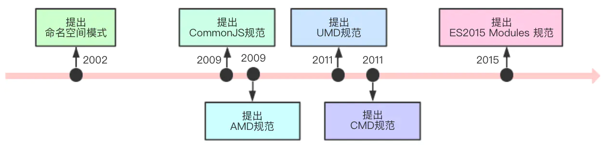

前面我们知道，模块化就是将系统分离成独立功能的模块，这样我们需要什么功能，就加载什么功能。模块化可以避免命名空间的冲突（减少命名空间的污染）、更好的分离，实现按需加载、提高可代码的复用性、提高了代码的维护性。随着Javascript的发展，出现了几种模块化的规范。

<!-- more -->

## 一、概述

JS模块化大致发展过程：CommonJS（服务端）&rarr; AMD（浏览器）&rarr; CMD &rarr; ES6 Module模块化



具体想要了解一下，还是因为自己在优化我自己用vitepress生成的站点的时候遇到的一系列和模块相关的问题，接触到了CommonJS、ESM等概念，但是又不是很懂。然后在网上看到了这个问题：[javascript - CommonJS 与 Node.js 的关系？](https://segmentfault.com/q/1010000023000050)，其实我也挺好奇的，然后找到了一篇帖子（[《编程时间简史系列》JavaScript 模块化的历史进程](https://segmentfault.com/a/1190000023017398#item-1)），当做笔记吧。

> 为什么 JavaScript 有这么多模块化方案？
>
> 自从 1995 年 5 月，*Brendan Eich* 写下了第一行 JavaScript 代码起，JavaScript 已经诞生了 25 年。
>
> 但这门语言早期仅仅作为轻量级的脚本语言，用于在 Web 上与用户进行少量的交互，并没有依赖管理的概念。
>
> 随着 AJAX 技术得以广泛使用，Web 2.0 时代迅猛发展，浏览器承载了愈来愈多的内容与逻辑，JavaScript 代码越来越复杂，全局变量冲突、依赖管理混乱等问题始终萦绕在前端开发者们的心头。此时，JavaScript 亟需一种在其他语言中早已得到良好应用的功能 —— 模块化。
>
> 其实，JavaScript 本身的标准化版本 ECMAScript 6.0 (ES6/ES2015) 中，已经提供了模块化方案，即 `ES Module`。但目前在 Node.js 体系下，最常见的方案其实是 `CommonJS`。再加上大家耳熟能详的 `AMD`、`CMD`、`UMD`，模块化的事实标准如此之多。
>
> 那么为什么有如此之多的模块化方案？它们又是在怎样的背景下诞生的？为什么没有一个方案 “一统江湖”？


## 二、发展历程

### 1. 萌芽初现：从 YUI Library 和 jQuery 说起

时间回到 2006 年 1 月，当时还是国际互联网巨头的 Yahoo（雅虎），开源了其内部使用已久的组件库 **YUI Library**。

YUI Library 采用了类似于 Java 命名空间的方式，来隔离各个模块之间的变量，避免全局变量造成的冲突。其写法类似于：

```javascript
YUI.util.module.doSomthing();
```

这种写法无论是封装还是调用时都十分繁琐，而且当时的 IDE 对于 JavaScript 来说智能感知非常弱，开发者很难知道他需要的某个方法存在于哪个命名空间下，经常需要频繁地查阅开发手册，导致开发体验十分不友好。

在 YUI 发布之后不久，*John Resig* 发布了 **jQuery**。当时年仅 23 岁的他，不会知道自己这一时兴起在 BarCamp 会议上写下的代码，将占据未来十几年的 Web 领域。

**jQuery** 使用了一种新的组织方式，它利用了 JavaScript 的 IIFE（立即执行函数表达式）和闭包的特性，将所依赖的外部变量传给一个包装了自身代码的匿名函数，在函数内部就可以使用这些依赖，最后在函数的结尾把自身暴露给 `window`。这种写法被很多后来的框架所模仿，其写法类似于：

```javascript
(function(root){
    // balabala
    root.jQuery = root.$ = jQuery;
})(window);
```

这种写法虽然灵活性大大提升，可以很方便地添加扩展，但它并未解决根本问题：**所需依赖还是得外部提前提供，还是会增加全局变量。**

从以上的尝试中，可以归纳出 JavaScript 模块化需要解决哪些问题：

（1）如何给模块一个唯一标识？

（2）如何在模块中使用依赖的外部模块？

（3）如何安全地（不污染模块外代码）包装一个模块？

（4）如何优雅地（不增加全局变量）把模块暴露出去？

围绕着这些问题，JavaScript 模块化开始了一段曲折的探索之路。

### 2. 探索之路：CommonJS 与 Node.js 的诞生

让我们来到 2009 年 1 月，此时距离 ES6 发布尚有 5 年的时间，但前端领域已经迫切地需要一套真正意义上的模块化方案，以解决全局变量污染和依赖管理混乱等问题。

Mozilla 旗下的工程师 *Kevin Dangoor*，在工作之余，与同事们一起制订了一套 JavaScript 模块化的标准规范，并取名为 **ServerJS**。

**ServerJS** 最早用于服务端 JavaScript，旨在为配合自动化测试等工作而提供模块导入功能。

这里插一句题外话，其实早期 1995 年，Netsacpe（网景）公司就提供了有在服务端执行 JavaScript 能力的产品，名为 **Netscape Enterprise Server**。但此时服务端能做的 JavaScript 还是基于浏览器来实现的，本身没有脱离其自带的 API 范围。直到 2009 年 5 月，**Node.js** 诞生，赋予了其文件系统、I/O 流、网络通信等能力，才真正意义上的成为了一门服务端编程语言。

2009 年年初，*Ryan Dahl* 产生了创造一个跨平台编程框架的想法，想要基于 Google（谷歌）的 **Chromium V8** 引擎来实现。经过几个月紧张的开发工作，在 5 月中旬，**Node.js** 首个预览版本的开发工作已全部结束。同年 8 月，欧洲 JSConf 开发者大会上，**Node.js** 惊艳亮相。

但在此刻，**Node.js** 还没有一款包管理工具，外部依赖依然要手动下载到项目目录内再引用。欧洲 JSConf 大会结束后，*Isaac Z. Schlueter* 注意到了 *Ryan Dahl* 的 **Node.js**，两人一拍即合，决定开发一款包管理工具，也就是后来大名鼎鼎的 **Node Package Manager**（即 **npm**）。

在开发之初，摆在二人面前的第一个问题就是，**采用何种模块化方案？**。二人将目光锁定在了几个月前（2009 年 4 月）在华盛顿特区举办的美国 JSConf 大会上公布的 **ServerJS**。此时的 **ServerJS** 已经更名为 **CommonJS**，并重新制订了标准规范，即**Modules/1.0**，展现了更大的野心，企图一统所有编程语言的模块化方案。

具体来说，**Modules/1.0**标准规范包含以下内容：

（1）模块的标识应遵循一定的书写规则。

（2）定义全局函数 `require(dependency)`，通过传入模块标识来引入其他依赖模块，执行的结果即为别的模块暴漏出来的 API。

（3）如果被 `require` 函数引入的模块中也包含外部依赖，则依次加载这些依赖。

（4）如果引入模块失败，那么 `require` 函数应该抛出一个异常。

（5）模块通过变量 `exports` 来向外暴露 API，`exports` 只能是一个 `object` 对象，暴漏的 API 须作为该对象的属性。

由于这个规范简单而直接，**Node.js** 和 **npm** 很快就决定采用这种模块化的方案。至此，第一个 JavaScript 模块化方案正式登上了历史舞台，成为前端开发中必不可少的一环。

需要注意的是，**CommonJS** 是一系列标准规范的统称，它包含了多个版本，从最早 **ServerJS** 时的 *Modules/0.1*，到更名为 **CommonJS** 后的 *Modules/1.0*，再到现在成为主流的 *Modules/1.1*。这些规范有很多具体的实现，且不只局限于 JavaScript 这一种语言，只要遵循了这一规范，都可以称之为 **CommonJS**。其中，**Node.js** 的实现叫做 **Common Node Modules**。**CommonJS** 的其他实现，感兴趣的朋友可以阅读本文最下方的参考链接。

值得一提的是，**CommonJS** 虽然没有进入 ECMAScript 标准范围内，但 **CommonJS** 项目组的很多成员，也都是 TC39（即制订 ECMAScript 标准的委员会组织）的成员。这也为日后 ES6 引入模块化特性打下了坚实的基础。

### 3. 分道扬镳：CommonJS 历史路口上的抉择

在推出 *Modules/1.0* 规范后，**CommonJS** 在 **Node.js** 等环境下取得了很不错的实践。

但此时的 **CommonJS** 有两个重要问题没能得到解决，所以迟迟不能推广到浏览器上：

（1）由于外层没有 `function` 包裹，被导出的变量会暴露在全局中。

（2）在服务端 `require` 一个模块，只会有磁盘 I/O，所以同步加载机制没什么问题；但如果是浏览器加载，一是会产生开销更大的网络 I/O，二是天然异步，就会产生时序上的错误。

因此，社区意识到，要想在浏览器环境中也能顺利使用 **CommonJS**，势必重新制订新的标准规范。但新的规范怎么制订，成为了激烈争论的焦点，分歧和冲突由此诞生，逐步形成了三大流派：

- *Modules/1.x* 派：这派的观点是，既然 *Modules/1.0* 已经在服务器端有了很好的实践经验，那么只需要将它移植到浏览器端就好。在浏览器加载模块之前，先通过工具将模块转换成浏览器能运行的代码了。我们可以理解为他们是“保守派”。
- *Modules/Async* 派：这派认为，既然浏览器环境于服务器环境差异过大，那么就不应该继续在 *Modules/1.0* 的基础上小修小补，应该遵循浏览器本身的特点，放弃 `require` 方式改为回调，将同步加载模块变为异步加载模块，这样就可以通过 ”下载 -> 回调“ 的方式，避免时序问题。我们可以理解为他们是“激进派”。
- *Modules/2.0* 派：这派同样也认为不应该沿用 *Modules/1.0*，但也不向激进派一样过于激进，认为 `require` 等规范还是有可取之处，不应该随随便便放弃，而是要尽可能的保持一致；但激进派的优点也应该吸收，比如 `exports` 也可以导出其他类型、而不仅局限于 `object` 对象。我们可以理解为他们是“中间派”。

其中保守派的思路跟今天通过 **babel** 等工具，将 JavaScript 高版本代码转译为低版本代码如出一辙，主要目的就是为了兼容。有了这种想法，这派人马提出了 *Modules/Transport* 规范，用于规定模块如何转译。**browserify** 就是这一观点下的产物。

激进派也提出了自己的规范 *Modules/AsynchronousDefinition*，奈何这一派的观点并没有得到 **CommonJS** 社区的主流认可。

中间派同样也有自己的规范 *Modules/Wrappings*，但这派人马最后也不了了之，没能掀起什么风浪。

激进派、中间派与保守派的理念不和，最终为 **CommonJS** 社区分裂埋下伏笔。

### 4. 百家争鸣：激进派 —— AMD 的崛起

激进派的 *James Burke* 在 2009 年 9 月开发出了 **RequireJS** 这一模块加载器，以实践证明自己的观点。

但激进派的想法始终得不到 **CommonJS** 社区主流认可。双方的分歧点主要在于执行时机问题，*Modules/1.0* 是延迟加载、且同一模块只执行一次，而 *Modules/AsynchronousDefinition* 却是提前加载，加之破坏了就近声明（就近依赖）原则，还引入了 `define` 等新的全局函数，双方的分歧越来越大。

最终，在 *James Burke*、*Karl Westin* 等人的带领下，激进派于同年年底宣布离开 **CommonJS** 社区，自立门户。

激进派在离开社区后，起初专注于 **RequireJS** 的开发工作，并没有过多的涉足社区工作，也没有此草新的标准规范。

2011 年 2 月，在 **RequireJS** 的拥趸们的共同努力下，由 *Kris Zyp* 起草的 *Async Module Definition*（简称 **AMD**）标准规范正式发布，并在 **RequireJS** 社区的基础上建立了 **AMD** 社区。

**AMD** 标准规范主要包含了以下几个内容：

（1）模块的标识遵循 *CommonJS Module Identifiers*。

（2）定义全局函数 `define(id, dependencies, factory)`，用于定义模块。`dependencies` 为依赖的模块数组，在 `factory` 中需传入形参与之一一对应。

（3）如果 `dependencies` 的值中有 `require`、`exports` 或`module`，则与 **CommonJS** 中的实现保持一致。

（4）如果 `dependencies` 省略不写，则默认为 `['require', 'exports', 'module']`，`factory` 中也会默认传入三者。

（5）如果 `factory` 为函数，模块可以通过以下三种方式对外暴漏 API：`return` 任意类型；`exports.XModule = XModule`、`module.exports = XModule`。

（6）如果 `factory` 为对象，则该对象即为模块的导出值。

其中第三、四两点，即所谓的 *Modules/Wrappings*，是因为 **AMD** 社区对于要写一堆回调这种做法颇有微辞，最后 **RequireJS** 团队妥协，搞出这么个部分兼容支持。

因为 **AMD** 符合在浏览器端开发的习惯方式，也是第一个支持浏览器端的 JavaScript 模块化解决方案，**RequireJS** 迅速被广大开发者所接受。

但有 **CommonJS** 珠玉在前，很多开发者对于要写很多回调的方式颇有微词。在呼吁高涨声中，**RequireJS** 团队最终妥协，搞出个 *Simplified CommonJS wrapping*（简称 **CJS**）的兼容方式，即上文的第三、四两点。但由于背后实际还是 **AMD**，所以只是写法上做了兼容，实际上并没有真正做到 **CommonJS** 的延迟加载。

与 **CommonJS** 规范有众多实现不同的是，**AMD** 只专注于 JavaScript 语言，且实现并不多，目前只有 **RequireJS** 和 **Dojo Toolkit**，其中后者已经停止维护。

### 5. 一波三折：中间派 —— CMD 的衰落

由于 **AMD** 的提前加载的问题，被很多开发者担心会有性能问题而吐槽。

例如，如果一个模块依赖了十个其他模块，那么在本模块的代码执行之前，要先把其他十个模块的代码都执行一遍，不管这些模块是不是马上会被用到。这个性能消耗是不容忽视的。

为了避免这个问题，上文提到，中间派试图保留 **CommonJS** 书写方式和延迟加载、就近声明（就近依赖）等特性，并引入异步加载机制，以适配浏览器特性。

其中一位中间派的大佬 *Wes Garland*，本身是 **CommonJS** 的主要贡献者之一，在社区中很受尊重。他在 **CommonJS** 的基础之上，起草了 *Modules/2.0*，并给出了一个名为 **BravoJS** 的实现。

另一位中间派大佬 *@khs4473* 提出了 *Modules/Wrappings*，并给出了一个名为 **FlyScript** 的实现。

但 *Wes Garland* 本人是学院派，理论功底十分扎实，但写出的作品却既不优雅也不实用。而实战派的 *@khs4473* 则在与 *James Burke* 发生了一些争论，最后删除了自己的 GitHub 仓库并停掉了 **FlyScript** 官网。

到此为止，中间一派基本已全军覆灭，空有理论，没有实践。

让我们前进到 2011 年 4 月，国内阿里巴巴集团的前端大佬玉伯（本名王保平），在给 **RequireJS** 不断提出建议却被拒绝之后，萌生了自己写一个模块加载器的想法。

在借鉴了 **CommonJS**、**AMD** 等模块化方案后，玉伯写出了 **SeaJS**，不过这一实现并没有严格遵守 *Modules/Wrappings* 的规范，所以严格来说并不能称之为 *Modules/2.0*。在此基础上，玉伯提出了 *Common Module Definition*（简称 **CMD**）这一标准规范。

**CMD** 规范的主要内容与 **AMD** 大致相同，不过保留了 **CommonJS** 中最重要的延迟加载、就近声明（就近依赖）特性。

随着国内互联网公司之间的技术交流，**SeaJS** 在国内得到了广泛使用。不过在国外，也许是因为语言障碍等原因，并没有得到非常大范围的推广。

### 6. 兼容并济：UMD 的统一

2014 年 9 月，美籍华裔 *Homa Wong* 提交了 **UMD** 第一个版本的代码。

**UMD** 即 *Universal Module Definition* 的缩写，它本质上并不是一个真正的模块化方案，而是将 **CommonJS** 和 **AMD** 相结合。

**UMD** 作出了如下内容的规定：

（1）优先判断是否存在 `exports` 方法，如果存在，则采用 **CommonJS** 方式加载模块；

（2）其次判断是否存在 `define` 方法，如果存在，则采用 **AMD** 方式加载模块；

（3）最后判断 `global` 对象上是否定义了所需依赖，如果存在，则直接使用；反之，则抛出异常。

这样一来，模块开发者就可以使自己的模块同时支持 **CommonJS** 和 **AMD** 的导出方式，而模块使用者也无需关注自己依赖的模块使用的是哪种方案。

### 7. 姗姗来迟：钦定的 ES6/ES2015

时间前进到 2016 年 5 月，经过了两年的讨论，ECMAScript 6.0 终于正式通过决议，成为了国际标准。

在这一标准中，首次引入了 `import` 和 `export` 两个 JavaScript 关键字，并提供了被称为 **ES Module** 的模块化方案。

在 JavaScript 出生的第 21 个年头里，JavaScript 终于迎来了属于自己的模块化方案。

但由于历史上的先行者已经占据了优势地位，所以 **ES Module** 迟迟没有完全替换上文提到的几种方案，甚至连浏览器本身都没有立即作出支持。

2017 年 9 月上旬，**Chrome** 61.0 版本发布，首次在浏览器端原生支持了 **ES Module**。

2017 年 9 月中旬，**Node.js** 迅速跟随，发布了 8.5.0，以支持原生模块化，这一特性被称之为 **ECMAScript Modules**（简称 **MJS**）。不过到目前为止，这一特性还处于试验性阶段。

不过随着 **babel**、**Webpack**、**TypeScript** 等工具的兴起，前端开发者们已经不再关心以上几种方式的兼容问题，习惯写哪种就写哪种，最后由工具统一转译成浏览器所支持的方式。

因此，预计在今后很长的一段时间里，几种模块化方案都会在前端开发中共存。

## 三、尾声

本文以时间线为基准，从作者、社区、理念等几个维度谈到了 JavaScript 模块化的几大方案。

其实模块化方案远不止提到的这些，但其他的都没有这些流行，这里也就不费笔墨。

文中并没有提及各个模块化方案是如何实现的，也没有给出相关的代码示例，感兴趣的朋友可以自行阅读下方的参考阅读链接。

下面我们再总结梳理一下时间线：

| 时间    | 事件                                                         |
| ------- | ------------------------------------------------------------ |
| 1995.05 | *Brendan Eich* 开发 JavaScript。                             |
| 2006.01 | Yahoo 开源 **YUI Library**，采用命名空间方式管理模块。       |
| 2006.01 | *John Resig* 开发 **jQuery**，采用 IIFE + 闭包管理模块。     |
| 2009.01 | *Kevin Dangoor* 起草 **ServerJS**，并公布第一个版本 *Modules/0.1*。 |
| 2009.04 | *Kevin Dangoor* 在美国 JSConf 公布 **CommonJS**。            |
| 2009.05 | *Ryan Dahl* 开发 **Node.js**。                               |
| 2009.08 | *Ryan Dahl* 在欧洲 JSConf 公布 **Node.js**。                 |
| 2009.08 | *Kevin Dangoor* 将 **ServerJS** 改名为 **CommonJS**，并起草第二个版本 *Modules/1.0*。 |
| 2009.09 | *James Burke* 开发 **RequireJS**。                           |
| 2010.01 | *Isaac Z. Schlueter* 开发 **npm**，实现了基于 **CommonJS** 模块化方案的 **Common Node Modules**。 |
| 2010.02 | *Kris Zyp* 起草 **AMD**，**AMD/RequireJS** 社区成立。        |
| 2011.01 | 玉伯开发 **SeaJS**，起草 **CMD**，**CMD/SeaJS** 社区成立。   |
| 2014.08 | *Homa Wong* 开发 **UMD**。                                   |
| 2015.05 | ES6 发布，新增特性 **ES Module**。                           |
| 2017.09 | **Chrome** 和 **Node.js** 开始原生支持 **ES Module**。       |

注：文章中的所有人物、事件、时间、地点，均来自于互联网公开内容，由源文作者进行搜集整理，其中如有谬误之处，还请多多指教。

## 参考阅读

> 参考资料：
>
> - [《编程时间简史系列》JavaScript 模块化的历史进程 - 编程时间简史 - SegmentFault 思否](https://segmentfault.com/a/1190000023017398)
>
> - [javascript - CommonJS 与 Node.js 的关系？ - SegmentFault 思否](https://segmentfault.com/q/1010000023000050)
>
> - [一文彻底搞懂JS前端5大模块化规范及其区别 - Echoyya、 - 博客园](https://www.cnblogs.com/echoyya/p/14577243.html)
>
> - [《Wikipedia - YUI Library》](https://link.segmentfault.com/?enc=2L2M39bYWP3RGltb4cDjUA%3D%3D.JWoSvfWPo49SBWIdUVxriacSu5taM%2B3WZ6a5YP0QURCuh5w0JXMfwE61fm4r7d16)
> - [《Wikipedia - jQuery》](https://link.segmentfault.com/?enc=YB9g%2BPQO7eGFrGV4zaZCCQ%3D%3D.WuDzLPjsJc%2BXTWGK%2FZfg%2Bq8eex8h%2FOV5U6t63PWbQV9ioMgrfQi9KUD6nU0IBuAT)
> - [《Wikipedia - List of server-side JavaScript implementations》](https://link.segmentfault.com/?enc=2z2KeLfqil86m%2BlXS3gBwA%3D%3D.By8fubJIzJTMipBbCY6PxrvKWWUokWFXpjiurC1OIzN%2BtVQwbWmZpCR0QRI6BuD%2BL0YxEmSWQYoCDFTCSSekd6BEYhcgkVYmq%2B9x12IVUIU%3D)
> - [《Wikipedia - CommonJS》](https://link.segmentfault.com/?enc=Iu1gS2o%2BBAp%2BmZgNgyI39g%3D%3D.wO79hZ6mC318Xkf%2BHwaeSrgigpkKaANdW4DFWrN9AuKBASBpNEjItCjnKgKZ5Mst)
> - [《Wikipedia - Asynchronous Module Definition》](https://link.segmentfault.com/?enc=xloB1aWpPREg91q9%2F06IPA%3D%3D.O6T5yeh4Jb5eYzp75YwzLyQxvkdi%2FwGkua6ZRI47ItS58r3xygZA2hY1LPl7IIjVTafKlRTrd5KqX6KVoPXJQQ%3D%3D)
> - [《CommonJS Project History》](https://link.segmentfault.com/?enc=MBZmdtGd8MakLi1nZmZXxg%3D%3D.I62LsafQzD6OqXsUXy%2FTX7D9zntNXBLsdGU4cwH4YC2y%2BJ9Co2dpR%2BYNwvNMfAAr)
> - [《RequireJS Project History》](https://link.segmentfault.com/?enc=TKCJIX0d8WSoT0vot%2Bxyjw%3D%3D.pSloVMc8dED71tQ%2FTGbJxGeUiB7uu1YOMhedH8DPVXK9yIqsOnbEpFUL8ulgTUIW)
> - [《JavaScript Modules: A Brief History》](https://link.segmentfault.com/?enc=ToK0iOH%2BAAp46k6e3kPsWA%3D%3D.XGE9gMnbXLEQYKFMclY1vcygbmomHQ9HCzqOgD5r3LbGW8DIqbvlVNYY641kDydqchtCwQBgxadfoHwfY5urmbZzQSvjPI%2FaatcQghttkoQ%3D)
> - [《浅析 JS 模块规范：AMD，CMD，CommonJS》](https://link.segmentfault.com/?enc=6ZhbYL7lYKdbT1u64VXWRg%3D%3D.zrISNw9f1g6fWGpLCOt%2F1sm4PyILMtzvZa4G2dJM5p5o9L5rGc%2FFH89Syjp8MzpO)
> - [《JavaScript Module Loader - CommonJS，RequireJS，SeaJS 归纳笔记》](https://link.segmentfault.com/?enc=6XHV%2BS89q7I970mHEapa2A%3D%3D.dYxdqteujeq%2FiotXL4nvs0AE%2B8qHGffI%2BcRK34DJjjl0OCPHWXutaTb765KyeryFeJnaJIHOwkNvrUwQB%2BJkEw%3D%3D)
> - [前端模块化开发那点历史 · Issue #588 · seajs/seajs](https://github.com/seajs/seajs/issues/588)