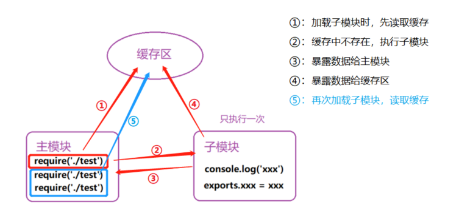
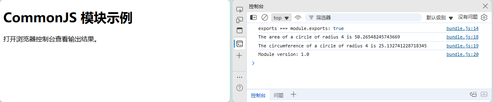
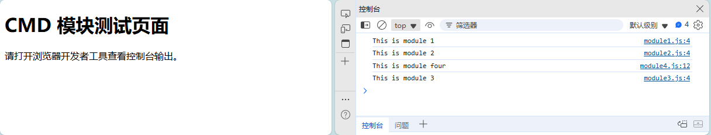

这一部分来简单了解下之前提到的五大模块化规范。

<!-- more -->

## 一、CommonJS

### 1. 简介

CommonJS 是一个旨在为 JavaScript 提供模块化规范的项目，它主要应用于服务器端（如 Node.js）和桌面应用程序开发中。该规范定义了模块的导入导出方式，使得代码可以被组织成独立且可重用的模块。最初提出来是在浏览器以外的地方使用，并且当时命名为 `ServerJS`，后来为了体现它的广泛性，更名为 `CommonJS`，也可以简称为 `CJS`

它主要包括了模块（modules）、包（packages）、系统（system）、二进制（binary）、控制台（console）、编码（encodings）、文件系统（filesystems）、套接字（sockets）、单元测试（unit testing）等部分。

- 每个文件都可以作为一个模块（这里的文件指的是js文件）
- 服务器端（Node.js）：模块的加载是运行时同步加载的
- 浏览器端：模块需要提前编译打包处理，不然浏览器不能识别require语法

后面可能会接触到以下名词：

- Node 是 CommonJS 在服务端一个具有代表性的实现
- Browserify 是 CommonJS 在浏览器端的一种实现
- webpack 具备对 CommonJS 的支持与转换


> 参考资料：
>
> - 官网：[http://www.commonjs.org/](http://www.commonjs.org/)
>
> - [CommonJS 模块 | Node.js v24 文档](https://nodejs.cn/api/modules.html#模块commonjs-模块)

### 2. 模块定义与引用

#### 2.1 模块导出

##### 2.1.1 基本语法

```javascript
// 方式一
module.exports = value

// 方式二
exports.属性 = 值
exports.方法 = 函数
```

在 CommonJS 规范中，每个模块都有一个 `module` 对象，它包含了一个 `exports` 属性，用于定义模块的公共接口。有两种主要的导出方式：

- **module.exports**：这是推荐的方式，可以直接导出单个值（对象、函数、变量等）。

- **exports**：这是一个指向 `module.exports` 的引用，只能用于添加属性。

需要注意的是，`exports` 只是对 `module.exports` 的引用，如果直接给 `exports` 赋值，会破坏这种引用关系，若直接改变exports 的指向，则返回空对象。

##### 2.1.2 简单示例

例如，假设一个名为 `circle.js` 的内容：

```js
const { PI } = Math;

// 定义一个 Circle 对象，包含 area 和 circumference 方法
const Circle = {
  area: (r) => PI * r ** 2,
  circumference: (r) => 2 * PI * r
};

// 使用 module.exports 导出 Circle 实例
module.exports = Circle;

// 验证 exports 是 module.exports 的引用（在模块加载时）
console.log('exports === module.exports:', exports === module.exports);
```

直接通过`node ./circle.js`运行可以得到：

```bash
D:\sumu_blog\commonjs-demo> node .\circle.js
exports === module.exports: true
```

#### 2.2 模块引用

##### 2.2.1 基本语法

```javascript
var xxx=require(XXX)
```

- XXX是 Node 的核心模块，比如 `http`、`path` 等：直接返回核心模块，并停止查找

- XXX是以 `./`、`../`、`/` 开头的：

（1）将 X 作为一个文件在对应的目录下查找：

（2）如果有后缀名，就按照后缀名的格式去查找

（3）如果没有后缀名，会按照下面的顺序去查找：直接查找文件本身&rarr;查找 `XXX.js`&rarr;查找 `XXX.json`&rarr;查找 `XXX.node`

- XXX并不是路径也不是核心模块：会根据 `module.path` 一级一级的查找 `node_modules` 中是否包含 XXX，找不到会抛出异常 not found

##### 2.2.2 模块分类

（1）自定义模块：开发者自己编写的功能文件即为自定义模块

- 若子模块没有暴露数据时，返回空对象
- 自定义模块必须加`./`，否则nodejs查找模块默认在`node_modules`目录中查找
- 主模块：整个项目的启动模块，有且仅有一个，对其他模块进行整合调度

（2）第三方模块：第三方程序员或公司开发的模块，先安装再使用，npm 安装，require 使用

（3）系统模块：nodejs开发团队提供的功能模块 ，直接引入使用即可，无需安装

>**模块初始化：当一个模块被多次引入时，只执行一次，将暴露对象exports直接写入缓存，后续就直接读取缓存**



##### 2.2.3 简单示例

模块导出时，我们编写了circle.js文件，我们这里创建`foo.js`文件，引入上面的模块并打印相关信息：

```javascript
const circle = require('./circle.js');

console.log(`The area of a circle of radius 4 is ${circle.area(4)}`);
console.log(`The circumference of a circle of radius 4 is ${circle.circumference(4)}`);
console.log(`Module version: ${circle.version}`);
```

我们运行可以得到：

```bash
D:\sumu_blog\commonjs-demo> node .\foo.js
exports === module.exports: true
The area of a circle of radius 4 is 50.26548245743669
The circumference of a circle of radius 4 is 25.132741228718345
Module version: 1.0
```

#### 2.3 完整实例

##### 2.3.1 目录结构

```bash
commonjs-demo
├── circle.js    
├── foo.js       
└── index.html   

0 directories, 3 files
```

##### 2.3.2 文件内容

- circle.js

```javascript
const { PI } = Math;

// 定义一个 Circle 对象，包含 area 和 circumference 方法
const Circle = {
  area: (r) => PI * r ** 2,
  circumference: (r) => 2 * PI * r
};

// 使用 module.exports 导出 Circle 实例
module.exports = Circle;

// 验证 exports 是 module.exports 的引用（在模块加载时）
console.log('exports === module.exports:', exports === module.exports);

```

- foo.js

```javascript
// foo.js
const circle = require('./circle.js');

console.log(`The area of a circle of radius 4 is ${circle.area(4)}`);
console.log(`The circumference of a circle of radius 4 is ${circle.circumference(4)}`);
console.log(`Module version: ${circle.version}`);

```

##### 2.3.2 node环境

CommonJS就是用于服务端，所以这里可以直接通过node运行：

```bash
D:\sumu_blog\commonjs-demo> node .\foo.js
exports === module.exports: false
The area of a circle of radius 4 is 50.26548245743669
The circumference of a circle of radius 4 is 25.132741228718345
Module version: undefined
```

##### 2.3.3 浏览器端

上面都是在node中运行的，我们想要在浏览器端运行呢？我们编写一个index.html：

```html
<!DOCTYPE html>
<html lang="zh-CN">
<head>
    <meta charset="UTF-8">
    <meta name="viewport" content="width=device-width, initial-scale=1.0">
    <title>CommonJS 示例</title>
</head>
<body>
    <h1>CommonJS 模块示例</h1>
    <p>打开浏览器控制台查看输出结果。</p>
    
    <!-- 以下代码不会在浏览器中正常运行 -->
    <script src="foo.js"></script>
</body>
</html>
```

通过vscode的扩展LiveServer启动后，会在控制台看见报错：

```bash
Uncaught ReferenceError: require is not defined
    at foo.js:1:16
```

直接在浏览器中引入 CommonJS 模块（使用 require 语法）不会正常工作，因为浏览器不原生支持 CommonJS 规范。要在浏览器中运行此脚本，需要使用 Browserify 或 Webpack 等工具进行打包。我这里使用Browserify 

- 安装 Browserify: 

```bash
npm install -g browserify
```

- 打包: 

```bash
browserify foo.js -o bundle.js
```

- 在 HTML 中引入打包后的文件:

```html
<script src="bundle.js"></script>
```

然后重新启动，打开浏览器控制台就可以看到如下效果：



### 3. 模块的使用


在 CommonJS 规范中，`module.exports` 和 `exports` 是用于导出模块的主要方式。而在 ES6 模块系统中，使用 `export` 和 `import` 来实现模块的导出和导入。下面是它们的基本使用方法及示例。

#### 3.1 使用 module.exports 导出

`module.exports` 可以导出任何类型的值，包括函数、对象、基本类型等。假设我们有一个名为 `utils.js` 的模块：

```javascript
// utils.js
const PI = 3.14159;

function add(x, y) {
    return x + y;
}

function subtract(x, y) {
    return x - y;
}

class Calculator {
    multiply(x, y) {
        return x * y;
    }
    
    divide(x, y) {
        if (y !== 0) {
            return x / y;
        } else {
            throw new Error("Division by zero is not allowed.");
        }
    }
}

// 导出变量、函数和类
module.exports = {
    PI,
    add,
    subtract,
    Calculator
};
```

在另一个文件中引入并使用：

```javascript
// main.js
const { PI, add, subtract, Calculator } = require('./utils');

console.log(PI); // 3.14159
console.log(add(2, 3)); // 5
console.log(subtract(5, 3)); // 2

const calc = new Calculator();
console.log(calc.multiply(2, 3)); // 6
console.log(calc.divide(6, 3)); // 2
```

#### 3.2 使用 exports 导出

除了 `module.exports`，CommonJS 还提供了 `exports` 对象来导出模块中的函数、变量或类。需要注意的是，`exports` 是 `module.exports` 的一个引用，因此在使用时有一些限制。我们创建一个名为 `mathUtils.js` 的模块：

```javascript
// mathUtils.js
const PI = 3.14159;

function add(x, y) {
    return x + y;
}

function subtract(x, y) {
    return x - y;
}

class Calculator {
    multiply(x, y) {
        return x * y;
    }
    
    divide(x, y) {
        if (y !== 0) {
            return x / y;
        } else {
            throw new Error("Division by zero is not allowed.");
        }
    }
}

// 使用 exports 导出变量、函数和类
exports.PI = PI;
exports.add = add;
exports.subtract = subtract;
exports.Calculator = Calculator;
```

在另一个文件中引入并使用：

```javascript
// app.js
const { PI, add, subtract, Calculator } = require('./mathUtils');

console.log(PI); // 3.14159
console.log(add(2, 3)); // 5
console.log(subtract(5, 3)); // 2

const calc = new Calculator();
console.log(calc.multiply(2, 3)); // 6
console.log(calc.divide(6, 3)); // 2
```

以上两个示例展示了如何使用 `module.exports` 和 `exports` 来导出函数、变量和类，并在其他模块中使用它们。

### 4. 总结

（1）**同步加载**方式，适用于服务端，因为模块都放在服务器端，对于服务端来说模块加载较快，不适合在浏览器环境中使用，因为同步意味着阻塞加载。

（2）所有代码都运行在模块作用域，不会污染全局作用域。

（3）模块可以多次加载，但只会在第一次加载时运行一次，然后运行结果就被缓存了，以后再加载，就直接读取缓存结果。

（4）模块加载的顺序，按照其在代码中出现的顺序。

## 二、AMD (Asynchronous Module Definition)

### 1. 简介

AMD 是一种异步加载模块的规范，适用于浏览器环境。模块的加载不影响它后面语句的运行。所有依赖这个模块的语句，都定义在一个回调函数中，等到加载完成之后，这个回调函数才会运行。主要解决 CommonJS 在浏览器环境下同步加载模块的问题。require.js 是目前 AMD 规范最热门的一个实现。我们在使用amd规范时一定要先引入这个脚本，这样在浏览器中才能正常加载对应模块。

本规范只定义了一个函数`define`，它是全局变量：

```javascript
/**
 * @param {string} id 模块名称
 * @param {string[]} dependencies 模块所依赖模块的数组
 * @param {function} factory 模块初始化要执行的函数或对象
 * @return {any} 模块导出的接口
 */
function define(id?, dependencies?, factory): any
```

>参考资料：
>
>- RequireJS 官网: [https://requirejs.org/](https://requirejs.org/)
>
>- AMD 规范: [https://github.com/amdjs/amdjs-api/wiki/AMD](https://github.com/amdjs/amdjs-api/wiki/AMD)

### 2. 模块定义与引用

#### 2.1 模块定义

##### 2.1.1 基本语法

模块必须采用**` define()`** 函数来定义。

- （1）定义没有依赖的模块

```javascript
define(function(require,exports.module){
  return 模块
}
```

若一个模块不依赖其他模块，可以直接定义在 define() 函数中，例如：

```javascript
// math.js
define(function (){
　var add = function (x,y){
　　return x+y;
　};
　return {
　　add: add
　};
});
```

- （2）定义有依赖的模块

```javascript
define(['module1','module2'],function(m1,m2){
  return 模块
}
```

若这个模块还依赖其他模块，那么 define() 函数的第一个参数，必须是一个数组，指明该模块的依赖性。例如

```javascript
// dataService.js
define(['math'], function (math) {
  function doSomething() {
    let result = math.add(2, 9);
    console.log(result);
  }
  return {
    doSomething
  };
});
```

当 require() 函数加载模块时，就会先加载 math.js 模块。

##### 2.1.2 简单示例

上面已经有了。

#### 2.2 模块引用

##### 2.2.1 基本语法

```javascript
require([dependencies], function){};
```

##### 2.2.2 简单示例

例如，在主文件中引用 `math.js` 模块：

```js
require(['math'], function(math) {
    console.log(math.add(2, 3)); // 输出 5
});
```

#### 2.3 加载非规范模块

理论上**require.js**加载的模块，必须是按照 **AMD 规范**用 **define()** 函数定义的模块。但实际上，虽然已经有一部分流行的函数库（比如 jQuery ）符合 AMD 规范，更多的库并不符合。那么require.js 如何能够加载非规范的模块呢？

这样的模块在用 require() 加载之前，要先用 **require.config()**方法，定义它们的一些特征。例如，underscore 和 backbone 这两个库，都没有采用 AMD 规范编写。如果要加载的话，必须先定义它们的特征：

```javascript
require.config({
　shim: {
　　'underscore': {
　　　exports: '_'
　　},
　　'backbone': {
　　　deps: ['underscore', 'jquery'],
　　　exports: 'Backbone'
　  }
　}
});

```

**require.config()** 接受一个配置对象，这个对象有一个 **`shim`** 属性，专门用来配置不兼容的模块。每个模块要定义：

- exports ：输出的变量名，表示这个模块外部调用时的名称；
- deps： 数组，表示该模块的依赖性。

如jQuery 的插件还可以这样定义：

```javascript
shim: {
　'jquery.scroll': {
　　deps: ['jquery'],
　　exports: 'jQuery.fn.scroll'
　}
}
```


### 3. 完整实例

#### 3.1 目录结构

```bash
amd-demo
├── dataService.js
├── index.html
├── main.js
└── math.js

0 directories, 4 files
```

#### 3.2 文件内容

- math.js：不依赖其他模块，导出一个add方法

```javascript
// math.js
define(function () {
  var add = function (x, y) {
    return x + y;
  };
  return {
    add: add
  };
});

```

- dataService.js：依赖于math.js，导出doSomething方法

```javascript
// dataService.js
define(['math'], function (math) {
  function doSomething() {
    let result = math.add(2, 9);
    console.log(result);
  }
  return {
    doSomething
  };
});
```

- main.js：主模块，配置依赖模块路径，并加载dataService模块。

```javascript
// main.js

(function () {
  // 先配置每个模块的路径
  require.config ({
    // baseUrl:'',    
    paths:{   
      dataService:'./dataService',
      math:'./math'
    }
  })
  // 这里再引入模块
  require(['dataService'], function (dataService) {
    dataService.doSomething()
  });
})();

```

- index.html：浏览器环境测试，一定要引入RequireJS。

```html
<!DOCTYPE html>
<html lang="zh-CN">
<head>
    <meta charset="UTF-8">
    <title>AMD 模块测试</title>
</head>
<body>
    <h1>AMD 模块测试页面</h1>
    <p>请打开浏览器开发者工具查看控制台输出。</p>

    <!-- 引入 RequireJS -->
    <script src="https://cdnjs.cloudflare.com/ajax/libs/require.js/2.3.6/require.min.js"></script>
    
    <!-- 主入口点 -->
    <script src="./main.js"></script>
</body>
</html>

```

#### 3.3 浏览器端

我们启动预览可以看到如下效果：


#### 3.4 node环境

AMD最初是为浏览器设计的，而 Node.js 默认使用 CommonJS 模块系统。为了让 AMD 模块在 Node.js 中运行，我们需要使用像 `requirejs` 这样的库，它可以模拟 AMD 加载机制在 Node 环境中运行。

- 初始化npm项目

```bash
npm init -y
```

- 安装requirejs库

```bash
npm i requirejs
```

- 修改main.js：

```javascript
// main.js
const requirejs = require('requirejs');

// 配置 RequireJS
requirejs.config({
  // 在 Node 环境中，我们需要指定 baseUrl
  baseUrl: __dirname,
  paths: {
    dataService: './dataService',
    math: './math'
  },
  // 在 Node 环境中，我们需要指定 Node 选项
  nodeRequire: require
});

// 加载模块并执行
requirejs(['dataService'], function(dataService) {
  dataService.doSomething();
});

```

这样修改后，浏览器端刷新会报错：

```bash
main.js:1  Uncaught SyntaxError: Identifier 'requirejs' has already been declared (at main.js:1:1)
```

- 运行main.js

```bash
D:\sumu_blog\amd-demo> node main.js
11
```

#### 3.5 兼容两个环境

想要兼容的话，就要用到后面会学习到的UMD规范，这个后面再说。

### 4. 总结

#### 4.1 优点

（1）**异步加载，非阻塞**：AMD 最显著的优点是其异步加载机制。模块的加载不会阻塞浏览器渲染线程，允许页面在模块加载的同时继续解析和渲染，从而提升了页面的响应速度和用户体验。

（2）**并行加载**：多个模块可以并行加载，而不是像 CommonJS 那样必须按顺序同步加载。这进一步减少了整体加载时间，尤其是在网络延迟较高的情况下优势明显。

（3）**兼容 CommonJS**：AMD 允许输出的模块兼容 CommonJS 规范。这意味着开发者可以在一定程度上复用 CommonJS 风格的模块，或者让 AMD 模块在 CommonJS 环境中运行（通常需要额外的适配层或构建步骤）。

（4）**适合浏览器环境**：由于其异步特性，AMD 特别适合在浏览器环境中使用，解决了 CommonJS 在浏览器中同步加载模块带来的性能问题。

#### 4.2 缺点

（1）**前置依赖声明繁琐**：在定义模块时，必须明确列出所有依赖的模块（前置依赖）。这不仅增加了代码的复杂度，也使得维护变得更加困难。开发者需要手动管理依赖列表，并确保它们与 `factory` 函数中的参数一一对应。

（2）**模块预执行影响性能**：AMD/RequireJS 的模块化加载流程是：模块加载 → 全部模块预执行 → 主逻辑中调用模块。这意味着即使某些模块在当前页面并未被使用，它们也会在加载完成后被预先执行。这种不必要的预执行会消耗额外的 CPU 资源和内存，降低程序的整体运行效率。

（3）**语法相对复杂**：与 ES6 模块等现代标准相比，AMD 的语法较为冗长和复杂。例如，定义一个模块需要使用 `define` 函数，并且要处理依赖数组和工厂函数，这对初学者不够友好。

综上所述，AMD 在特定历史时期和浏览器环境下发挥了重要作用，但随着技术的发展，其缺点也日益凸显，逐渐被更先进的模块化方案所替代。


## 三、CMD (Common Module Definition)

### 1. 简介

CMD 是通用模块加载，要解决的问题与 AMD 一样，只不过是对依赖模块的执行时机不同，CMD 强调模块的依赖在运行时才会被加载，它采用了按需加载的方式，模块定义时可以明确指定其依赖关系，而模块在执行时才会加载依赖的模块。CMD 模块化的核心特性是“依赖就近，延迟执行”。[Sea.js](https://seajs.github.io/seajs/docs/) 是 CMD 规范的一个实现代表库，在使用CMD规范的模块时要引入这个库。

>[GitHub - seajs/seajs: A Module Loader for the Web](https://github.com/seajs/seajs)

### 2. 模块定义与引用

#### 2.1 模块定义

##### 2.1.1 基本语法

模块必须采用 **`define()`** 函数来定义，接收一个 factory 参数，可以是一个函数，也可以是一个对象或字符串。

- factory 是函数时有三个参数，function(require, exports, module)：`require`：函数用来获取其他模块提供的接口**require(模块标识ID)**、`exports`： 对象用来向外提供模块接口、`module` ：对象，存储了与当前模块相关联的属性和方法。

（1）定义没有依赖的模块

```javascript
define(function() {
  // 模块代码
  return {
    // 导出的内容
  };
});
```

（2）定义有依赖的模块

```javascript
define(['dependency1', 'dependency2'], function(dep1, dep2) {
  // 模块代码
  return {
    // 导出的内容
  };
});
```

（1）dependency1, dependency2: 模块所依赖的其他模块名称数组。

（2）dep1, dep2: 对应依赖模块的引用，按数组中的顺序传入factory 函数。

- factory 为对象、字符串时，表示模块的接口就是该对象、字符串。比如可以定义一个 JSON 数据模块：

```javascript
// 定义 foo.js
define({"foo": "bar"});

// 导入使用
define(function(require, exports, module) {
  var obj = require('foo.js')
  console.log(obj)   // {foo: "bar"}
});

```

##### 2.1.2 简单示例

例如，定义一个 `math.js` 模块：

```js
define(function(require, exports, module) {
    var add = function(x, y) {
        return x + y;
    };

    exports.add = add;
});
```

#### 2.2 模块引用

CMD 规范支持两种模块引用方式：异步加载和同步加载。

##### 2.2.1 seajs.use异步加载

使用 `seajs.use()` 方法来异步加载和执行模块。这是在页面主入口处加载模块的推荐方式。

```javascript
seajs.use([dependencies], callback);
```

- dependencies: 要加载的模块标识符数组。
- callback: 当所有模块加载并执行完毕后调用的回调函数。

例如，在主文件中异步引用 `math.js` 模块：

```js
seajs.use('./math', function(math) {
    console.log(math.add(2, 3)); // 输出 5
});
```

##### 2.2.2 require.async 进行异步加载

在模块内部，CMD 规范还提供了 `require.async()` 方法来实现异步加载模块。这对于按需加载大型模块或在条件满足时才加载模块非常有用。

```javascript
require.async(dependency, callback);
```

- dependency: 要异步加载的模块标识符。
- callback: 当模块加载并执行完毕后调用的回调函数。

例如，在一个模块中根据条件异步加载 `math.js` 模块：

```js
// dataService.js
define(function(require, exports, module) {
    // 某个条件
    if (someCondition) {
        // 异步加载 math 模块
        require.async('./math', function(math) {
            let result = math.add(2, 9);
            console.log(result);
        });
    }
});
```

##### 2.2.3 同步加载

在模块内部，可以通过 `require()` 函数同步加载依赖模块。这种方式遵循“依赖就近”的原则，在需要时才加载依赖。

```javascript
var module = require(dependency);
```

- dependency: 要加载的模块标识符。

例如，在一个模块中同步引用 `math.js` 模块：

```js
// dataService.js
define(function(require, exports, module) {
    // 同步加载 math 模块
    var math = require('./math');
    
    function doSomething() {
        let result = math.add(2, 9);
        console.log(result);
    }
    
    exports.doSomething = doSomething;
});
```

##### 2.2.4 简单示例

每种方式都写了自己的简单示例。

#### 2.3 完整实例

##### 2.3.1 目录结构

```bash
cmd-demo 
├── index.html        
├── main.js
├── module1.js        
├── module2.js        
├── module3.js        
└── module4.js        

0 directories, 6 files
```

##### 2.3.2 文件内容

- module1.js

```javascript
// module1.js 不依赖其他模块 module.exports 方式导出
define(function (require, exports, module) {
  function one() {
    console.log("This is module 1");
  }
  module.exports = { one };
})
```

- module2.js
```javascript
// module2.js 不依赖其他模块 module.exports 方式导出
define(function (require, exports, module) {
  function two() {
    console.log("This is module 2");
  }
  module.exports = { two };
})
```

- module3.js
```javascript
// module3.js 不依赖其他模块 exports 方式导出
define(function (require, exports, module) {
  function three() {
    console.log("This is module 3");
  }
  exports.moduleThree = { three };
})
```

- module4.js
```javascript
// module4.js 依赖模块2和3，自身用 exports 方式导出
define(function (require, exports, module) {
  // 同步引入
  let moduleTwo = require("./module2");
  moduleTwo.two();

  // 异步引入
  require.async("./module3", function(module3) {
    module3.moduleThree.three();
  })
  function four() {
    console.log("This is module four");
  }
  exports.moduleFour = { four };
})
```

- main.js

```javascript
// main.js 主模块
define(function (require, exports, module) {
  let moduleOne = require("./module1");
  moduleOne.one();

  let moduleFour = require("./module4");
  moduleFour.moduleFour.four();
})
```

- index.html

```html
<!DOCTYPE html>
<html lang="zh-CN">
<head>
    <meta charset="UTF-8">
    <title>CMD 模块测试</title>
</head>
<body>
    <h1>CMD 模块测试页面</h1>
    <p>请打开浏览器开发者工具查看控制台输出。</p>

    <!-- 引入 sea.js -->
    <script src="https://cdnjs.cloudflare.com/ajax/libs/seajs/3.0.3/sea.js"></script>
    
    <!-- 主入口点 -->
    <script>
      seajs.use("./main.js")
    </script>
</body>
</html>
```

##### 2.3.3 浏览器端

启动后可以看到如下信息：



### 3. 总结

AMD 与 CMD 的区别：AMD 是**提前执行**，CMD 是**延迟执行**。AMD 是**依赖前置**，CMD 是**依赖就近**。

```js
// AMD 
define(['./a', './b'], function (a, b) {  // 在定义模块时 就要声明其依赖的模块
  a.doSomething()
  // ....
  b.doSomething()
  // ....
})

// CMD
define(function (require, exports, module) {
  var a = require('./a')
  a.doSomething()
  // ... 

  var b = require('./b') // 可以在用到某个模块时 再去require
  b.doSomething()
  // ... 
})

```

## 四、UMD (Universal Module Definition)

### 1. 简介

UMD 是一种通用的模块定义规范，旨在兼容多种模块系统（CommonJS、AMD、全局变量）。允许同一个代码库在不同环境下使用不同的模块系统。通常由构建工具自动生成。UMD实现过程如下：

（1）先判断是否支持Node.js模块（exports是否存在），存在则使用Node.js模块模式。

（2）再判断是否支持AMD（define是否存在），存在则使用AMD方式加载模块。

（3）前两个都不存在，则将模块公开到全局（window或global）。

>参考资料：
>
>- UMD GitHub 仓库: [https://github.com/umdjs/umd](https://github.com/umdjs/umd)

### 2. 模块定义与引用

#### 2.1 模块定义

##### 2.1.1 基本结构

UMD 模块通常采用立即执行函数表达式（IIFE）的形式，内部判断当前环境支持哪种模块系统。

##### 2.1.2 简单示例

例如，定义一个简单的 UMD 模块：

```js
(function (root, factory) {
    if (typeof define === 'function' && define.amd) {
        // AMD
        define(['jquery'], factory);
    } else if (typeof module === 'object' && module.exports) {
        // CommonJS
        module.exports = factory(require('jquery'));
    } else {
        // Browser globals
        root.MyModule = factory(root.jQuery);
    }
}(typeof self !== 'undefined' ? self : this, function ($) {
    // 模块逻辑
    var MyModule = {};
    MyModule.doSomething = function() {
        // ...
    };
    return MyModule;
}));
```

### 3. 总结

UMD规范只是一种通用的写法，是在amd和cjs两个流行而不统一的规范情况下，才催生出umd来统一规范的，umd前后端均可通用。

## 五、ES6 模块

### 1. 简介

ES6 模块是 ECMAScript 2015 标准的一部分，是 JavaScript 官方的模块系统。ES6 模块的设计思想，是尽量的静态化，使得`编译时`就能确定模块的依赖关系，以及输入和输出的变量。

- 支持静态分析，便于优化和 tree-shaking。
- 浏览器和 Node.js 都逐渐原生支持。

ES6 中，**import**引用模块，使用**export**导出模块。默认情况下，Node.js默认是不支持**import**语法的，通过[**babel**](https://www.babeljs.cn/docs/)项目将 ES6 模块 编译为 ES5 的 CommonJS。因此[**babel**](https://www.babeljs.cn/docs/)实际上是将**import/export**翻译成Node.js支持的**require/exports**。

> 参考资料：
>
> - MDN Web Docs - import: [https://developer.mozilla.org/zh-CN/docs/Web/JavaScript/Reference/Statements/import](https://developer.mozilla.org/zh-CN/docs/Web/JavaScript/Reference/Statements/import)
>
> - MDN Web Docs - export: [https://developer.mozilla.org/zh-CN/docs/Web/JavaScript/Reference/Statements/export](https://developer.mozilla.org/zh-CN/docs/Web/JavaScript/Reference/Statements/export)

### 2. 模块定义与引用

#### 2.1 模块导出

##### 2.1.1 基本语法

```javascript
// 命名导出
export const variable = value;
export function functionName() {}
export { variable, functionName };

// 默认导出
export default value;
```

##### 2.1.2 简单示例

例如，定义一个 `math.js` 模块：

```js
// math.js
export const PI = 3.14159;

export function add(x, y) {
    return x + y;
}

export default function multiply(x, y) {
    return x * y;
}
```

#### 2.2 模块引用

##### 2.2.1 基本语法

```javascript
// 导入命名导出
import { variable, functionName } from 'module';

// 导入默认导出
import defaultValue from 'module';

// 导入所有导出
import * as moduleName from 'module';
```

##### 2.2.2 简单示例

例如，在主文件中引用 `math.js` 模块：

```js
// main.js
import multiply, { PI, add } from './math.js';

console.log(PI); // 3.14159
console.log(add(2, 3)); // 5
console.log(multiply(2, 3)); // 6
```

### 3. 总结

这里只是简单了解一下，后续学习typescript会继续再学习。

## 六、模块化规范总结

<table>
	<thead>
		<tr>
			<th style="text-align: center"></th>
			<th style="text-align: center">CommonJS</th>
			<th style="text-align: center">AMD</th>
			<th style="text-align: center">CMD</th>
			<th style="text-align: center">ES6</th>
		</tr>
	</thead>
	<tbody>
		<tr>
			<td style="text-align: center">引用模块</td>
			<td style="text-align: center">require</td>
			<td style="text-align: center">require</td>
			<td style="text-align: center">require</td>
			<td style="text-align: center">import</td>
		</tr>
		<tr>
			<td style="text-align: center">暴露接口</td>
			<td style="text-align: center">module.exports || exports</td>
			<td style="text-align: center">define函数返回值 return</td>
			<td style="text-align: center">exports</td>
			<td style="text-align: center">export</td>
		</tr>
		<tr>
			<td style="text-align: center"><strong>加载方式</strong></td>
			<td style="text-align: center"><strong>运行时加载，同步加载</strong></td>
			<td style="text-align: center"><strong>并行加载，提前执行，异步加载</strong></td>
			<td style="text-align: center"><strong>并行加载，按需执行，异步加载</strong></td>
			<td style="text-align: center"><strong>编译时加载，异步加载</strong></td>
		</tr>
		<tr>
			<td style="text-align: center">实现模块规范</td>
			<td style="text-align: center">NodeJS</td>
			<td style="text-align: center">RequireJS</td>
			<td style="text-align: center">SeaJS</td>
			<td style="text-align: center">原生JS</td>
		</tr>
		<tr>
			<td style="text-align: center">适用</td>
			<td style="text-align: center">服务器</td>
			<td style="text-align: center">浏览器</td>
			<td style="text-align: center">浏览器</td>
			<td style="text-align: center">服务器/浏览器</td>
		</tr>
	</tbody>
</table>

## 七、"require"与"import"的区别

### 1. 写法上的区别

**`require/exports`** 的用法只有以下三种简单的写法：

```js
const fs = require('fs')
exports.fs = fs
module.exports = fs
```

**`import/export`** 的写法就多种多样：

```js
import fs from 'fs'
import {default as fs} from 'fs'
import * as fs from 'fs'
import {readFile} from 'fs'
import {readFile as read} from 'fs'
import fs, {readFile} from 'fs'

export default fs
export const fs
export function readFile
export {readFile, read}
export * from 'fs'
```

### 2. 输入值的区别

**`require`**输入的变量，基本类型数据是赋值，引用类型为浅拷贝，可修改

**`import`**输入的变量都是只读的，如果输入 **a** 是一个对象，允许改写对象属性。

```js
import {a} from './xxx.js'

a = {}; // Syntax Error : 'a' is read-only;

a.foo = 'hello'; // 合法操作
```

### 3. 执行顺序

**`require`**：不具有提升效果，到底加载哪一个模块，只有运行时才知道。

```js
const path = './' + fileName;
const myModual = require(path);
```

`import`：具有提升效果，会提升到整个模块的头部，首先执行。`import`的执行早于`foo`的调用。本质就是`import`命令是编译阶段执行的，在代码运行之前。

```js
foo();

import { foo } from 'my_module';
```

`import()`函数：ES2020提案引入，支持动态加载模块。`import()`函数接受一个参数，指定所要加载的模块的位置，参数格式同`import`命令，两者区别主要是`import()`为动态加载。可用于`按需加载`、`条件加载`、`动态的模块路径`等。

它是运行时执行，也就是说，什么时候运行到这一句，就会加载指定的模块，返回一个 Promise 对象。`import()`加载模块成功以后，该模块会作为一个对象，当作`then`方法的参数。可以使用对象解构赋值，获取输出接口。

```js
// 按需加载
button.addEventListener('click', event => {
  import('./dialogBox.js')
  .then({export1, export2} => {   // export1和export2都是dialogBox.js的输出接口，解构获得
    // do something...
  })
  .catch(error => {})
});

// 条件加载
if (condition) {
  import('moduleA').then(...);
} else {
  import('moduleB').then(...);
}


// 动态的模块路径
import(f()).then(...);    // 根据函数f的返回结果，加载不同的模块。
```

### 4. 使用表达式和变量

**`require`**：很显然是可以使用表达式和变量的

```javascript
let a = require('./a.js')
a.add()

let b = require('./b.js')
b.getSum()
```

`import`静态执行，不能使用表达式和变量，因为这些都是只有在运行时才能得到结果的语法结构。

```javascript
// 报错
import { 'f' + 'oo' } from 'my_module';

// 报错
let module = 'my_module';
import { foo } from module;

// 报错
if (x === 1) {
  import { foo } from 'module1';
} else {
  import { foo } from 'module2';
}
```

> 而require/exports 和 import/export 本质上的区别，实际上也就是CommonJS规范与ES6模块化的区别
>
> 1、浏览器在不做任何处理时，默认是不支持import和require
> 2、babel会将ES6模块规范转化成Commonjs规范
> 3、webpack、gulp以及其他构建工具会对Commonjs进行处理，使之支持浏览器环境
> 它们有三个重大差异。
>
> 1. CommonJS 模块输出的是一个值的拷贝，ES6 模块输出的是值的引用。
> 2. CommonJS 模块是运行时加载，ES6 模块是编译时输出接口。
> 3. CommonJS 模块的`require()`是`同步`加载模块，ES6 模块的`import`命令是`异步`加载，有一个独立的模块依赖的解析阶段。

导致第二个差异是因为 CommonJS 加载的是一个对象（即module.exports属性），该对象只有在脚本运行完才会生成。而 ES6 模块不是对象，它的对外接口只是一种静态定义，在代码静态解析阶段就会生成

**CommonJS**：**`运行时加载`**

- 只能在运行时确定模块的依赖关系，以及输入和输出的变量，一个模块就是一个对象，输入时必须查找对象属性。

```js
// CommonJS模块
let { stat, exists, readfile } = require('fs');

// 等同于
let _fs = require('fs');
let stat = _fs.stat;
let exists = _fs.exists;
let readfile = _fs.readfile;
```

**ES6** ：**`编译时加载`**或者静态加载

- **ES6 模块不是对象**，而是通过`export`命令显式指定输出的代码，再通过`import`命令输入。
- 可以在编译时就完成模块加载，引用时只加载需要的方法，其他方法不加载。效率要比 CommonJS 模块的加载方式高。

```js
import { stat, exists, readFile } from 'fs';
```


> 参考资料：
>
> - [JavaScript 高级深入浅出：四种模块化规范介绍 本文是 JavaScript 高级深入浅出的第 19 篇，本文将 - 掘金](https://juejin.cn/post/7069644953663569927)
