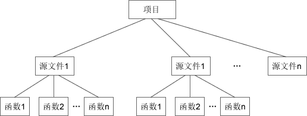
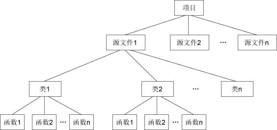
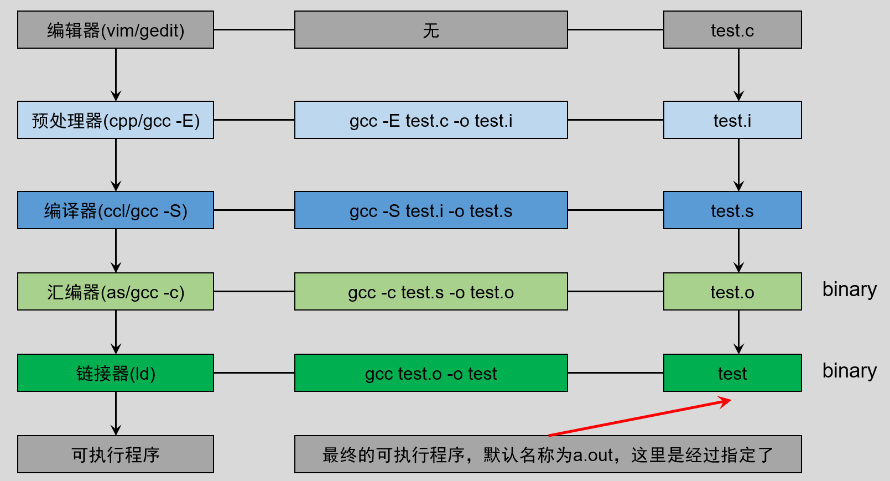

我们开始从C进入C++！

<!-- more -->

## 一、C和C++

C++读作“C加加”，是“C Plus Plus”的简称。顾名思义，C++ 是在C语言的基础上增加新特性，所以叫“C Plus Plus”，就像 iPhone 7S 和 iPhone 7、Win10 和 Win7 的关系。

C++ 和C语言虽然是两门独立的语言，但是它们却有着扯也扯不清的关系。从语法上看，C语言是 C++ 的一部分，C语言代码几乎不用修改就能够以 C++ 的方式编译。

早期并没有“C++”这个名字，而是叫做“带类的C”。“带类的C”是作为C语言的一个扩展和补充出现的，它增加了很多新的语法，目的是提高开发效率。

这个时期的 C++ 非常粗糙，仅支持简单的面向对象编程，也没有自己的编译器，而是通过一个预处理程序（名字叫 cfront），先将 C++ 代码”翻译“为C语言代码，再通过C语言编译器合成最终的程序。

随着 C++ 的流行，它的语法也越来越强大，已经能够很完善的支持面向过程编程、面向对象编程（OOP）和泛型编程，几乎成了一门独立的语言，拥有了自己的编译方式。

我们很难说 C++ 拥有独立的编译器，例如 Windows 下的微软编译器（cl.exe）、Linux 下的 [GCC](https://c.biancheng.net/gcc/) 编译器、Mac 下的 Clang 编译器（已经是 Xcode 默认编译器，立志超越 GCC），它们都同时支持C语言和 C++，统称为 C/C++ 编译器。对于C语言代码，它们按照C语言的方式来编译；对于 C++ 代码，就按照 C++ 的方式编译。

从表面上看，C、C++ 代码使用同一个编译器来编译，所以上面说“后期的 C++ 拥有了自己的编译方式”，而没有说“C++ 拥有了独立的编译器”。

C++ 支持面向过程编程、面向对象编程和泛型编程，而C语言仅支持面向过程编程。就面向过程编程而言，C++ 和C几乎是一样的，所以学习了C语言，也就学习了 C++ 的一半。

## 二、类和对象？

C++是一门面向对象的编程语言，理解 C++，首先要理解**类（Class）**和**对象（Object）**这两个概念。

### 1. 两个简单示例

C++ 中的类（Class）可以看做C语言中结构体（Struct）的升级版。结构体是一种构造类型，可以包含若干成员变量，每个成员变量的类型可以不同；可以通过结构体来定义结构体变量，每个变量拥有相同的性质。例如：

```c
#include <stdio.h>

// 定义结构体 Student
struct Student {
    // 结构体包含的成员变量
    char *name;
    int   age;
    float score;
};
// 显示结构体的成员变量
void display(struct Student stu)
{
    printf("%s的年龄是 %d, 成绩是 %f\n", stu.name, stu.age, stu.score);
}

int main()
{
    struct Student stu1;
    // 为结构体的成员变量赋值
    stu1.name = "小明";
    stu1.age = 15;
    stu1.score = 92.5;
    // 调用函数
    display(stu1);

    return 0;
}
```

运行结果：

```shell
小明的年龄是 15，成绩是 92.500000
```

C++ 中的类也是一种构造类型，但是进行了一些扩展，类的成员不但可以是变量，还可以是函数；通过类定义出来的变量也有特定的称呼，叫做“对象”。例如：

```cpp
#include <stdio.h>

// C++ 中的类也是一种构造类型，但是进行了一些扩展，类的成员不但可以是变量，还可以是函数；
// 通过类定义出来的变量也有特定的称呼，叫做“对象”

// 通过class关键字类定义类
class Student {
  public:
    // 类包含的变量
    char *name;
    int   age;
    float score;

    // 类包含的函数
    void say()
    {
        printf("%s的年龄是 %d, 成绩是 %f\n", name, age, score);
    }
};

int main()
{
    // 通过类来定义变量，即创建对象
    class Student stu1; // 也可以省略关键字class

    // 为类的成员变量赋值
    stu1.name = "小明"; // 这里并不规范但是这里只是引入类和对象的概念，先忽略，后面会写的规范一点，warning: ISO C++ forbids converting a string constant to ‘char*’ [-Wwrite-strings]
    stu1.age = 15;
    stu1.score = 92.5f;

    // 调用类的成员函数
    stu1.say();

    return 0;
}

```

运行结果与上例相同。

### 2. 几个基本概念

C语言中的 struct 只能包含变量，而 C++ 中的 class 除了可以包含变量，还可以包含函数。display() 是用来处理成员变量的函数，在C语言中，我们将它放在了 struct Student 外面，它和成员变量是分离的；而在 C++ 中，我们将它放在了 class Student 内部，使它和成员变量聚集在一起，看起来更像一个整体。

结构体和类都可以看做一种由用户自己定义的复杂数据类型，在C语言中可以通过结构体名来定义变量，在 C++ 中可以通过类名来定义变量。不同的是，通过结构体定义出来的变量还是叫变量，而通过类定义出来的变量有了新的名称，叫做**对象（Object）**。在第二段代码中，我们先通过 class 关键字定义了一个类 Student，然后又通过 Student 类创建了一个对象 stu1。变量和函数都是类的成员，创建对象后就可以通过点号`.`来使用它们。

可以将类比喻成图纸，对象比喻成零件，图纸说明了零件的参数（成员变量）及其承担的任务（成员函数）；一张图纸可以生产出多个具有相同性质的零件，不同图纸可以生产不同类型的零件。

类只是一张图纸，起到说明的作用，不占用内存空间；对象才是具体的零件，要有地方来存放，才会占用内存空间。

在 C++ 中，通过类名就可以创建对象，即将图纸生产成零件，这个过程叫做类的实例化，因此也称对象是类的一个**实例（Instance）**。

有些资料也将类的成员变量称为**属性（Property）**，将类的成员函数称为**方法（Method）**。

## 三、面向对象编程

来看一下什么叫面向对象编程（Object Oriented Programming，OOP）。

类是一个通用的概念，C++、Java、C#、PHP 等很多编程语言中都支持类，都可以通过类创建对象。可以将类看做是结构体的升级版，C语言的晚辈们看到了C语言的不足，尝试加以改善，继承了结构体的思想，并进行了升级，让程序员在开发或扩展大中型项目时更加容易。

因为 C++、Java、C#、PHP 等语言都支持类和对象，所以使用这些语言编写程序也被称为**面向对象编程**，这些语言也被称为面向对象的编程语言。C语言因为不支持类和对象的概念，被称为面向过程的编程语言。

在C语言中，我们会把重复使用或具有某项功能的代码封装成一个函数，将拥有相关功能的多个函数放在一个源文件，再提供一个对应的头文件，这就是一个模块。使用模块时，引入对应的头文件就可以。

而在 C++ 中，多了一层封装，就是类（Class）。类由一组相关联的函数、变量组成，我们可以将一个类或多个类放在一个源文件，使用时引入对应的类就可以。下面是C和C++项目组织方式的对比：

- C语言的项目组织方式



- C++的项目组织方式



类（Class）这一层封装，它有很多特性，极大地方便了中大型程序的开发，它让 C++ 成为面向对象的语言。面向对象编程在代码执行效率上绝对没有任何优势，它的主要目的是方便程序员组织和管理代码，快速梳理编程思路，带来编程思想上的革新。

## 四、如何编译和运行？

### 1. 如何生成可执行文件？

C和C++程序编程可执行程序的过程是一样的：



编写完成一个C/C++程序后，想要运行起来，必须要经过四个步骤：预处理、编译、汇编和链接。每个步骤都会生成对应的文件。

### 2. C++源文件后缀

C语言源文件的后缀非常统一，在不同的编译器下都是`.c`。C++ 源文件的后缀则有些混乱，不同的编译器支持不同的后缀，下表是一个简单的汇总：

| 编译器 | Microsoft Visual C++ |    GCC（GNU C++）    | Borland C++ |    UNIX    |
| :----: | :------------------: | :------------------: | :---------: | :--------: |
|  后缀  |     cpp、cxx、cc     | cpp、cxx、cc、c++、C |     cpp     | C、cc、cxx |

UNIX 是昂贵的商业操作系统，一开始可能几乎用不到；Microsoft Visual C++ 是微软的 C/C++ 编译器，VC 6.0、VS 都使用该编译器。多数还是推荐使用`.cpp`作为 C++ 源文件的后缀，这样更加通用和规范。

### 3. g++命令

在C语言中，我们使用`gcc`命令来编译和链接C程序。例如：

```shell
gcc main.c          # 编译单个源文件
gcc main.c module.c # 编译多个源文件
```

编译C++程序时，`gcc`命令也可以使用，不过要增加`-lstdc++`选项，否则会发生链接错误。例如：

```shell
gcc main.cpp -lstdc++            # 编译单个源文件
gcc main.cpp module.cpp -lstdc++ # 编译多个源文件
```

`gcc`命令在链接时默认使用C的库，只有添加了`-lstdc++`选项才会使用 C++ 的库。

不过 GCC 中还有一个`g++`命令，它专门用来编译 C++ 程序，广大 C++ 开发人员也都使用这个命令。`g++`命令和`gcc`命令的用法如出一辙，例如

```shell
g++ main.cpp            # 编译单个源文件
g++ main.cpp module.cpp # 编译多个源文件
g++ main.cpp -o demo    # 使用`-o`选项可以指定可执行文件的名称
```

要想理解`g++`命令，我们得从 GCC 的历史说起。

GCC 是由 GUN 组织开发的，最初只支持C语言，是一个单纯的C语言编译器，后来 GNU 组织倾注了更多的精力，使得 GCC 越发强大，增加了对 C++、Objective-C、Fortran、Java 等其他语言的支持，此时的 GCC 就成了一个编译器套件（套装），是所有编译器的总称。

在这个过程中，`gcc`命令也做了相应地调整，它不再仅仅支持C语言，而是默认支持C语言，增加参数后也可以支持其他的语言。也就是说，`gcc`是一个通用命令，它会根据不同的参数调用不同的编译器或链接器。

但是让用户指定参数是一种不明智的行为，不但增加了学习成本，还使得操作更加复杂，所以后来 GCC 又针对不同的语言推出了不同的命令，例如`g++`命令用来编译 C++，`gcj`命令用来编译 Java，`gccgo`命令用来编译Go语言。